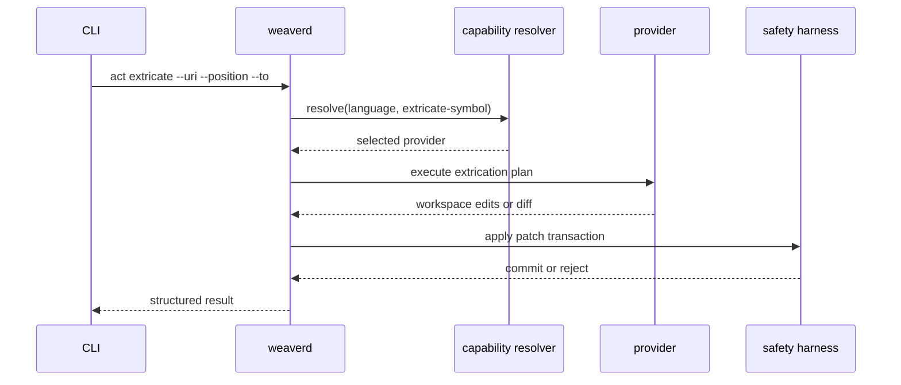

# Architectural decision record (ADR) 001: Plugin capability model and act extricate

## Status

Proposed.

## Date

2026-02-27.

## Context and problem statement

Weaver routes `act` operations through the daemon and currently implements
`act apply-patch` and `act refactor`. Additional `act` operations are visible
in routing but not implemented end-to-end. This creates a gap between command
surface and practical capability.

The existing `act refactor` flow already demonstrates a useful pattern:
providers generate edits, and Weaver applies those edits through the safety
harness. The safety harness enforces transactional writes, syntactic checks,
and semantic diagnostics checks before commit.

A new `act extricate` operation is needed to move a selected symbol into a new
module or file while preserving behaviour. The operation must support at least
Python and Rust, and the user-facing interface must remain stable regardless of
whether implementation uses a plugin, Language Server Protocol (LSP) calls, or
built-in orchestration.

Without a stable capability model, provider selection and operation semantics
remain implicit, which makes discovery, testing, and incremental rollout harder
than required.

## Decision drivers

- Preserve symbol meaning after transformation.
- Produce code that is immediately idiomatic, without mandatory repair passes.
- Keep provider details hidden behind a stable CLI contract.
- Reuse existing safety harness and transaction machinery.
- Support incremental language rollout without changing command shape.
- Keep capability policy controllable through configuration.

## Requirements

### Functional requirements

- Introduce a capability model for `act` refactoring intents.
- Add `act extricate` mapped to capability ID `extricate-symbol`.
- Support Python extrication through a plugin provider.
- Support Rust extrication through a built-in provider that can delegate
  selected sub-steps to rust-analyzer.
- Provide capability discovery output by language and operation.

### Technical requirements

- Define stable capability IDs:
  `rename-symbol`, `extricate-symbol`, `extract-method`, `replace-body`, and
  `extract-predicate`.
- Extend plugin manifests so providers can declare capabilities.
- Add capability-aware provider resolution using language, capability support,
  and policy overrides.
- Apply all final edits through the existing patch application pipeline.
- Validate transformations with syntax and diagnostics checks before commit.
- Ensure Rust extrication can use LSP `definition`, `references`, and
  `codeAction`, plus rust-analyzer extension endpoints when available.

## Options considered

### Option A: Capability-first model with mixed providers

Introduce a stable capability interface and let each language choose the most
appropriate implementation strategy. Python uses a Rope plugin for symbol move.
Rust uses built-in orchestration with selective rust-analyzer assistance.

### Option B: rust-analyzer-only strategy for Rust extrication

Attempt to implement Rust extrication solely as a chain of rust-analyzer
assists and code actions.

### Option C: tree-sitter-only strategy for Rust extrication

Implement Rust extrication only through syntax-level rewriting without semantic
queries from LSP.

### Option D: Post-fix workflow

Perform a naive move, then repeatedly apply diagnostics and quick fixes until
build and lint pass.

### Option E: Compatibility re-export default

Move the symbol and keep a re-export at the original location by default.

| Topic                       | Option A              | Option B | Option C | Option D      | Option E      |
| --------------------------- | --------------------- | -------- | -------- | ------------- | ------------- |
| Meaning preservation        | High, explicit checks | Medium   | Low      | Low to medium | Medium        |
| Determinism                 | High                  | Medium   | Medium   | Low           | High          |
| Implementation complexity   | Medium to high        | Medium   | High     | Low           | Low           |
| User-facing simplicity      | High                  | High     | High     | Medium        | Medium        |
| Long-term architectural fit | High                  | Medium   | Low      | Low           | Low to medium |

_Table 1: Comparison of candidate approaches for `act extricate`._

## Decision outcome / proposed direction

Adopt Option A.

Weaver will introduce a capability-first model where user intent is represented
as a capability ID, and provider choice is resolved internally. The first
increment adds `act extricate` for capability `extricate-symbol`.

For Python, Weaver will use a Rope-backed actuator plugin. For Rust, Weaver
will use a built-in orchestration flow that performs extraction planning,
semantic checks, and module/edit repairs using a combination of Weaver
infrastructure and rust-analyzer requests.

All final edits will continue to flow through the existing safety harness and
transaction model.

## Goals and non-goals

### Goals

- Make refactoring intent explicit through stable capability IDs.
- Add a reliable `act extricate` command for Python and Rust.
- Keep provider internals out of normal user workflows.
- Preserve existing safety and transactional guarantees.

### Non-goals

- Implement all capability IDs in all languages in this ADR.
- Expose provider-specific internals in the default CLI path.
- Guarantee support for symbols outside the first supported shape set.
- Replace the existing patch application and validation pipeline.

## Migration plan

1. Capability scaffolding

- Add capability ID types and registry definitions.
- Extend plugin manifest schema with capability declarations.
- Add resolver logic for language and capability selection.
- Expose capability discovery output.

1. Python provider rollout

- Extend Rope plugin with `extricate-symbol` handling.
- Map `uri`, `position`, and `to` arguments to Rope move operations.
- Emit unified diffs compatible with existing patch apply flow.

1. Rust provider rollout

- Add built-in extrication orchestration and overlay edit planning.
- Integrate LSP requests for definition, references, and code actions.
- Integrate rust-analyzer extension requests where available.
- Add meaning-preservation verification before final commit.

1. Hardening and expansion

- Add behavioural and end-to-end tests for Python and Rust.
- Add diagnostics and explanation output for capability resolution.
- Expand additional capabilities incrementally behind the same model.

## Known risks and limitations

- Rust support depends on rust-analyzer behaviour and extension availability in
  the active environment.
- Some symbol kinds may remain unsupported in initial rollout due to language
  edge cases.
- Cross-module moves may require strict policy choices for destination module
  layout.
- Multi-stage Rust edits require careful ordering to avoid transient conflicts.
- Capability and semantic capability layers can be confused if naming and
  diagnostics are not explicit.

## Outstanding decisions

- Which symbol kinds are explicitly in scope for version one of Rust
  extrication.
- Whether `workspace/executeCommand` support is required in the first Rust
  release.
- Exact defaults for module creation and formatting behaviour across languages.
- Whether a compatibility re-export mode should ship immediately or later.
- Final user-facing discovery command shape for capability reporting.

## Architectural rationale

The proposed model aligns with Weaver architecture by separating command intent
from implementation mechanism. This keeps the command surface stable while
allowing language-specific internals to evolve.

Routing decisions remain policy-driven and testable, and edit application
continues through the existing safety harness. This preserves reliability while
making room for capability growth without repeated CLI redesign.

Screen reader description: The following sequence diagram shows capability
resolution before provider execution, then a shared commit path through the
safety harness.

_Figure 1: Capability-first `act extricate` execution flow._
