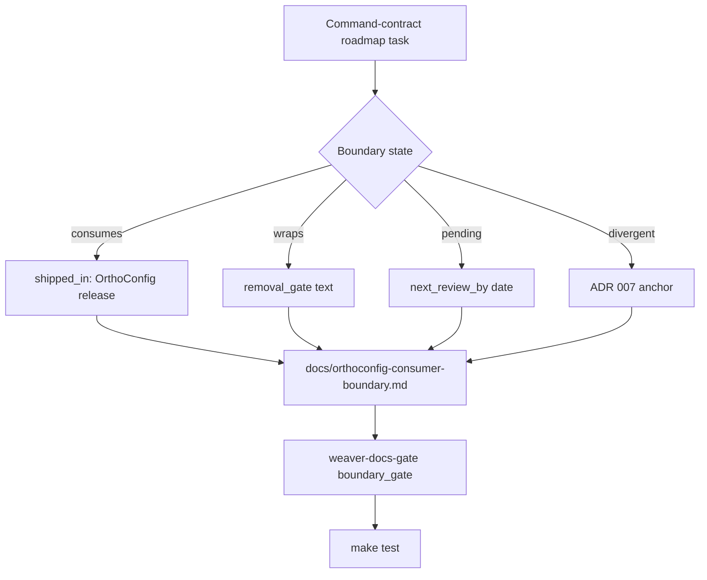

# Track the downstream consumer boundary (roadmap 12.1.1)

This ExecPlan (execution plan) is a living document. The sections
`Constraints`, `Tolerances`, `Risks`, `Progress`, `Surprises & Discoveries`,
`Decision Log`, and `Outcomes & Retrospective` must be kept up to date as work
proceeds.

Status: IN PROGRESS

This document must be maintained in accordance with `AGENTS.md` at the
repository root.

## Purpose / big picture

Weaver consumes generic command-contract machinery from OrthoConfig and owns
only Weaver-specific semantic code-edit metadata (capabilities, routing,
selectors, safety). Today that split is captured in two places: the OrthoConfig
dependency table and the temporary-adapter removal policy in
`docs/adr-007-agent-native-command-surface.md`. Neither place can answer the
question "for every command-contract task in the live Weaver roadmap, what is
its relationship to OrthoConfig?" — there is no single matrix, no machine
check, and no fixed vocabulary.

Roadmap item 12.1.1 closes that gap. The success criterion in
`docs/roadmap.md` line 46 is:

> Success: every command-contract task says whether it consumes OrthoConfig,
> wraps it temporarily, or records a deliberate divergence in ADR 007.

After this change a contributor can open the roadmap, follow a back-link to a
single boundary matrix, and read for every command-contract task: the
classification state (`consumes`, `wraps`, or `divergent`), the upstream
OrthoConfig task it pairs with, and either the removal gate or the ADR 007
divergence section that governs it. A test in the workspace fails when a new
command-contract task lands without a matrix entry, when a matrix entry
references a missing roadmap task, when a `wraps` entry has no removal gate, or
when a `divergent` entry has no ADR 007 anchor.

Observable behaviour after this change:

- `docs/orthoconfig-consumer-boundary.md` exists and lists every Weaver
  command-contract task with its classification state and upstream pairing.
- `docs/adr-007-agent-native-command-surface.md` defines the three states in a
  dedicated "Boundary classification" section and back-links to the matrix.
- `docs/roadmap.md` carries an inline back-link near each command-contract task
  group to the matrix entry.
- `docs/developers-guide.md` documents the workflow for adding a new
  command-contract task and updating the matrix.
- `docs/users-guide.md` notes the temporary divergences that users may see
  while OrthoConfig contracts ship.
- `cargo test --workspace` exercises a new dedicated
  `crates/weaver-docs-gate` integration test that parses the boundary
  manifest (`docs/orthoconfig-consumer-boundary.toml`), the roadmap, and
  the boundary matrix and asserts referential integrity.
- `make check-fmt && make lint && make test && make markdownlint && make nixie`
  all pass.

Downstream tasks 12.1.2 through 12.1.5 and every subsequent command-contract
task can record their boundary classification in one place instead of
reinventing the ADR cross-reference.

## Why this matters now

Phase 12 is the unavoidable foundation that prevents every later slice from
re-asking the same dependency question. Without a classification mechanism,
each command-contract task in phases 13 through 19 has to argue from first
principles whether the surface belongs upstream. With one, each task either
points at the matrix entry it inherits or proposes a single delta to it.

The work is documentation-led, but the test gate is not optional. Without it
the matrix decays the moment a roadmap task is added or renamed and the
boundary becomes review-only again.

## Constraints

1. **OrthoConfig 5.2.3 may not have shipped.** The roadmap notes the
   dependency, but 5.2.3 itself is documentation-only and can be tracked
   independently. The matrix must rely on already-published OrthoConfig
   decisions (the OrthoConfig `§2.1` consumer-boundary statement and
   OrthoConfig ADR-003 schema ownership) rather than the unshipped bullets of
   5.2.3. The matrix is forward-compatible with 5.2.3 once it lands.
2. **No new runtime crate dependencies.** Documentation and tests use crates
   already in the workspace (`camino`, `serde`, `toml`, `rstest`,
   `pretty_assertions`, `googletest`). The test must compile under
   `--workspace --all-targets --all-features`. No new workspace member adds
   a runtime binary; `crates/weaver-docs-gate` exists only to host the
   integration test and the small manifest parser it shares with itself.
3. **Do not duplicate the OrthoConfig roadmap.** Each matrix row references an
   OrthoConfig task ID, not its content. If OrthoConfig renames a task, the
   matrix needs a one-line update, not a re-derivation.
4. **No new commands, schemas, or runtime crates.** This task does not extend
   `crates/weaver-cli/src/command_surface.rs` types nor introduce a new
   adapter. Its job is to classify, not to refactor.
5. **No removal of ADR 007 content.** The existing OrthoConfig dependency
   table and temporary-adapter removal policy stay where they are. The new
   "Boundary classification" section sits alongside them and the matrix doc
   references both.
6. **400-line file limit.** Every Rust source file added or modified must
   stay below 400 lines. The matrix Markdown is exempt by repository policy
   for prose, but the manifest TOML should remain well below that limit by
   design.
7. **en-GB Oxford spelling.** All new prose follows `en-GB-oxendict`
   conventions and `docs/documentation-style-guide.md`.
8. **No prototype command grammar reintroduction.** The matrix references
   resource-first commands only. Prototype `observe`, `act`, `verify`,
   provider-first commands, and root `--output` remain archive provenance.
9. **Stable task IDs.** The manifest keys roadmap task IDs as strings
   (`"12.1.2"`). Roadmap renumbering is out of scope; ID stability is
   asserted by the test gate.
10. **Strict Clippy.** New code must compile under
    `cargo clippy --workspace --all-targets --all-features -- -D warnings`.

## Tolerances (exception triggers)

- **Scope.** If implementation modifies more than twelve documentation
  files or six Rust source files (excluding the new
  `crates/weaver-docs-gate` member's `Cargo.toml`, `src/lib.rs`,
  `examples/render_boundary_matrix.rs`, and the test file), stop and
  escalate. The new workspace member is expected; growth beyond it is
  not.
- **Roadmap renames.** If classifying the existing tasks requires renumbering
  a roadmap entry or moving a task between phases, stop and escalate.
- **ADR 007 rewrites.** If the boundary classification cannot fit alongside
  the existing OrthoConfig dependency table and temporary-adapter removal
  policy without rewriting either, stop and escalate.
- **Dependencies.** If the test gate requires a new external crate
  dependency, stop and escalate.
- **Divergent classifications.** If two or more command-contract tasks must
  be classified `divergent` without an existing ADR 007 anchor, stop and
  open a follow-up ADR-007 amendment before continuing.
- **Iterations.** If the test gate fails after three attempts at adjustment,
  stop and escalate.
- **Time.** If any single stage (A through E) takes more than four working
  hours of focused effort, stop, record progress, and escalate.

## Risks

- Risk: OrthoConfig renumbers a roadmap task and the matrix points at a stale
  ID. Severity: medium. Likelihood: medium. Mitigation: store the OrthoConfig
  task ID plus a short stable phrase (for example,
  `"5.2.3 — Record consumer dependency boundaries"`). The developers' guide
  documents a quarterly cross-repo reconciliation step that compares the
  manifest phrases against the OrthoConfig roadmap when that repository is
  available locally. The CI gate intentionally does not check OrthoConfig
  out; cross-repo drift is caught by the reconciliation rite, not by an
  always-on probe.
- Risk: A command-contract task is missed during classification. Severity:
  high. Likelihood: medium. Mitigation: the candidate set is an explicit
  opt-in registry, not a topic-keyword heuristic. Every roadmap task ID
  that should be classified appears in
  `docs/orthoconfig-consumer-boundary.toml` under a top-level
  `managed_tasks` array. The test gate fails when a roadmap task heading
  matches an ID in `managed_tasks` but has no matching `[[task]]` row, and
  also when a `[[task]]` row references an ID outside `managed_tasks`.
  Adding a new command-contract task therefore requires editing the
  registry first; default-fail prevents silent omission.
- Risk: Contributors classify a new task as `consumes` even though the
  upstream OrthoConfig contract has not shipped yet. Severity: medium.
  Likelihood: medium. Mitigation: the manifest's `consumes` state requires
  a non-empty `shipped_in` field naming the upstream release (or commit
  SHA) that landed the contract, plus the upstream task ID. The test gate
  rejects `consumes` rows without `shipped_in`.
- Risk: A roadmap task depends on an OrthoConfig contract that is not yet
  decided. Severity: high. Likelihood: high (phases 17–20 in particular).
  Mitigation: a fourth state `pending` captures exactly this case. A
  `pending` row carries the upstream task ID with `shipped_in = None` and
  a non-empty `next_review_by` field (ISO-8601 date). The test gate fails
  when a `pending` row's `next_review_by` is more than 270 days in the past
  to prevent the matrix from decaying into a parking lot.
- Risk: The matrix doc and the manifest TOML drift. Severity: high.
  Likelihood: medium. Mitigation: the matrix is generated from the manifest
  by a Rust helper that the test calls; the test asserts byte-for-byte
  equality with the committed matrix Markdown. There is no second snapshot
  layer to maintain.
- Risk: Boundary classification is treated as a one-off audit rather than a
  living contract. Severity: high. Likelihood: medium. Mitigation:
  documentation in `docs/developers-guide.md` describes the workflow and
  links to the matrix; the test gate runs on every CI build; every row
  carries a `last_reviewed` ISO-8601 date and the gate warns (without
  failing) when any row is more than 270 days stale, prompting a refresh.
- Risk: A `divergent` state is used as a parking lot for "we have not
  decided". Severity: medium. Likelihood: low (now that `pending` exists).
  Mitigation: every `divergent` row must carry an `adr_anchor` field
  pointing to a specific section heading in
  `docs/adr-007-agent-native-command-surface.md` and the test asserts the
  anchor exists. Anchors may be shared by multiple rows (many-to-one), but
  the anchor itself must be present.
- Risk: Wafflecat's lighter alternative (inline roadmap annotations with a
  small lint, no separate manifest) would satisfy the same prose-level
  success criterion at lower surface cost. Severity: low (this is a scope
  trade-off, not a correctness risk). Likelihood: n/a. Mitigation: the
  Decision Log captures the explicit choice to take the heavier matrix
  approach for downstream queryability. If team capacity becomes the
  binding constraint, the alternative remains available as a follow-up
  redesign.

## Progress

Each item carries a UTC timestamp once it completes. The list reflects actual
state, not the intended sequence.

- [ ] 2026-06-14T02:44:33Z: Execution approved by the user and started on
      branch `12-1-1-track-downstream-consumer-boundary`.
- [x] 2026-06-14T02:44:33Z: Stage A ratified the boundary vocabulary and
      matrix columns in ADR 007. Validation passed with
      `make markdownlint` (`Summary: 0 error(s)`) and `make nixie`
      (`All diagrams validated successfully!`). Logs:
      `/tmp/markdownlint-weaver-12-1-1-track-downstream-consumer-boundary.out`
      and `/tmp/nixie-weaver-12-1-1-track-downstream-consumer-boundary.out`.
- [x] 2026-06-14T03:28:00Z: Stage B produced
      `docs/orthoconfig-consumer-boundary.toml`, generated
      `docs/orthoconfig-consumer-boundary.md`, added
      `crates/weaver-docs-gate`, and pinned `ortho_config` to
      `4339a6f3c61dc4fed86493d99ffb05230bee2a1b`. Validation passed with
      `cargo build --workspace`, `make fmt`, `make check-fmt`, `make lint`,
      `make test`, `make markdownlint`, and `make nixie`. The first
      CodeRabbit pass found one valid generic `OrthoConfig 9.2` reference
      issue; after fixing the manifest to use `OrthoConfig 9.2.1` and
      `OrthoConfig 9.2.2`, regenerating the matrix, and rerunning gates, the
      repeat CodeRabbit review completed with `findings: 0`.
- [x] 2026-06-14T04:52:00Z: Stage C cross-linked the generated matrix from
      `docs/contents.md`, `docs/developers-guide.md`, and every
      manifest-managed roadmap task group. ADR 007 already linked both the
      matrix and the TOML source of truth from Stage A. Validation passed with
      `make fmt`, `make markdownlint`, `make nixie`, and CodeRabbit
      `findings: 0`.
- [x] 2026-06-14T05:36:00Z: Stage D added
      `crates/weaver-docs-gate/tests/boundary_manifest.rs`, covering
      manifest registry order, roadmap task references, state-specific
      evidence fields, ADR 007 divergence anchors, and byte-for-byte matrix
      regeneration. Validation passed with `cargo test -p weaver-docs-gate`,
      `make fmt`, `make check-fmt`, `make lint`, `make test`,
      `make markdownlint`, and `make nixie`. The first CodeRabbit pass found
      five valid test-diagnostic issues; after refactoring the tests to return
      `Result<(), String>` with explicit validation errors, the repeat review
      completed with `findings: 0`.
- [ ] Stage E: refresh the users' guide, run the full quality gates, and run
      `coderabbit review --agent`.

## Surprises & discoveries

Recorded as they occur during implementation. Format:

- Observation: …
  Evidence: …
  Impact: …
- Observation: `toml` was already present in `Cargo.lock` but was not a
  workspace dependency.
  Evidence: repository search showed transitive lockfile entries and no
  workspace dependency entry before Stage B.
  Impact: Stage B added `toml = "0.9.12"` to `[workspace.dependencies]` so
  the private docs-gate crate can use the parser explicitly.
- Observation: `mdtablefix` rewrites generated Markdown tables and can break
  rows that contain empty cells.
  Evidence: the first `make fmt` attempt failed with `MD056` after wrapping
  empty table cells in `docs/orthoconfig-consumer-boundary.md`.
  Impact: the renderer now emits formatter-stable aligned tables and displays
  absent values as `n/a`; the TOML manifest remains the evidence source for
  genuinely empty fields.
- Observation: delivery and feedback OrthoConfig references need versioned
  leaf task identifiers in shared upstream lists.
  Evidence: `coderabbit review --agent` flagged the `12.1.5` manifest row
  while later rows already used `OrthoConfig 9.2.1` and
  `OrthoConfig 9.2.2`.
  Impact: the manifest now uses the leaf task identifiers consistently before
  generated matrix publication.
- Observation: the matrix drift test must compare against the Markdown shape
  after repository formatting, not only the raw renderer's first draft.
  Evidence: the first Stage D focused test run passed integrity checks but
  failed `committed_matrix_matches_manifest_rendering` because the renderer
  emitted pre-`mdtablefix` paragraph wrapping and a one-character wider final
  table column.
  Impact: the renderer now emits the formatter-stable matrix text that is
  committed, making future manifest or renderer drift deterministic.

## Decision log

Recorded for any decision that future work must respect.

- Decision: execute this plan despite the document's previous draft status.
  Rationale: the user explicitly requested implementation of this plan on
  2026-06-14, satisfying the ExecPlan approval gate. Date/Author:
  2026-06-14, implementation.
- Decision: pin `ortho_config` to commit
  `4339a6f3c61dc4fed86493d99ffb05230bee2a1b` until the project agrees an
  OrthoConfig v0.9.0 release.
  Rationale: the user requested a pinned SHA rather than a release version for
  now; `git ls-remote https://github.com/leynos/ortho-config.git HEAD`
  resolved that revision for the current upstream main branch. Date/Author:
  2026-06-14, implementation.
- Decision: classify boundary state with a closed four-value vocabulary
  (`consumes`, `wraps`, `pending`, `divergent`) rather than free-form prose.
  Rationale: the three-value vocabulary (consumes/wraps/divergent) borrowed
  from OpenAPI Generator and IETF BCP 9 compliance reports does not
  distinguish "upstream contract exists but unshipped" (`wraps`, with a
  removal gate) from "upstream contract not yet decided" (`pending`, with
  a `next_review_by` date). Without the fourth state the matrix would
  pollute `wraps` and `divergent` with non-decisions, exactly the parking
  lot the gate is meant to prevent. Date/Author: 2026-06-07, Logisphere
  review by Telefono and Doggylump.
- Decision: hold the classification as a single TOML manifest at
  `docs/orthoconfig-consumer-boundary.toml`, render the Markdown matrix from
  it, and gate referential integrity from a Rust integration test.
  Rationale: keeps the source of truth machine-readable, avoids
  hand-maintained tables drifting, and follows the `xtask`-style drift gate
  pattern (matklad/cargo-xtask, `trycmd`) used in the wider Rust ecosystem.
  Date/Author: 2026-06-07, planning.
- Decision: host the test gate in a new tiny workspace member
  `crates/weaver-docs-gate`, not in `crates/weaver-build-util`.
  Rationale: `weaver-build-util` exists for build-script helpers (manual
  page dates, capability-based `Dir` access). Adding documentation-
  governance integration tests there mixes concerns and gives the
  build-helper crate a misleading public surface. A dedicated workspace
  member is honest about scope and keeps `weaver-build-util` boring.
  Date/Author: 2026-06-07, Logisphere review by Pandalump.
- Decision: identify upstream contract availability with a
  `shipped_in: Option<String>` field (an OrthoConfig version tag such as
  `"0.9.0"` or a fallback commit short SHA when no release exists yet),
  not a Boolean `shipped` flag. Rationale: Boolean is too coarse for an
  evolving dependency; a version string survives the `wraps → consumes`
  transition audibly and lets the matrix encode minimum-known-good
  versions. Date/Author: 2026-06-07, Logisphere review by Telefono.
- Decision: maintain the candidate set as an explicit `managed_tasks`
  array in the manifest, not as a topic-keyword heuristic over the
  roadmap prose. Rationale: heuristics produce silent false negatives
  when a new task uses unfamiliar terminology; the explicit list defaults
  to fail-closed and forces classification on every new command-contract
  task. Date/Author: 2026-06-07, Logisphere review by Buzzy Bee.
- Decision: do not wire `rstest-bdd` scenarios for the matrix gate.
  Rationale: the candidate behavioural scenarios are direct restatements
  of the integration-test invariants. `rstest-bdd` would add ceremony
  without adding behavioural coverage. The integration test stays as a
  parameterized `rstest` suite. Date/Author: 2026-06-07, Logisphere
  review by Dinolump.
- Decision: assert matrix freshness by byte-for-byte equality with the
  committed Markdown file, not via an `insta` snapshot. Rationale: the
  manifest is the source of truth and the renderer is deterministic; a
  second snapshot review layer would duplicate the equality check
  without adding signal. Date/Author: 2026-06-07, Logisphere review by
  Dinolump.
- Decision: do not generate the OrthoConfig dependency table in ADR 007
  from the manifest. Rationale: ADR 007 is a stable, human-readable
  architectural record. The manifest is the per-task index that points
  back to the ADR; a cycle would couple them too tightly. Date/Author:
  2026-06-07, planning.
- Decision considered and deferred: switch entirely to inline roadmap
  annotations (Wafflecat's lighter alternative) with no separate manifest
  or matrix doc. Rationale for deferring: the heavier matrix approach
  enables cross-phase queryability and a single discoverable artefact for
  contributors and reviewers. If team capacity proves limiting, the
  lighter alternative remains a viable follow-up. Date/Author: 2026-06-07,
  Logisphere review by Wafflecat; deferred.

## Outcomes & retrospective

Recorded at completion. Includes whether the gate caught a regression in
practice, how often the manifest needed updates during subsequent tasks, and
any vocabulary or schema adjustments.

## Context and orientation

A novice opening this plan needs the following landmarks before reading the
"Plan of work" section.

### Repository landmarks

- `docs/roadmap.md` — the live forward roadmap. Tasks 12 through 20 belong to
  the post-ADR-007 grammar. Task 12.1.1 lives at lines 38 to 47.
- `docs/adr-007-agent-native-command-surface.md` — the ADR that introduced
  the agent-native command surface, the OrthoConfig dependency table (lines
  104 to 122), and the temporary-adapter removal policy (lines 129 to 147).
- `crates/weaver-cli/src/command_surface.rs` — the only current temporary
  adapter, holding `CommandSurfaceRecord`, `READ_ONLY_COMMANDS`, and
  `find_read_only_command` for the pilot `definitions get` and
  `references list` family. Its module documentation already names the
  OrthoConfig replacement tasks. This file is not modified by 12.1.1.
- `crates/weaver-build-util/src/lib.rs` — a shared build-time helper
  crate (manual-page dates, capability-based `Dir` access). This plan
  does *not* touch it; the boundary gate has nothing to do with build
  scripts.
- `crates/weaver-docs-gate/` — new workspace member introduced by this
  plan. It hosts the manifest parser (`load_manifest`), the matrix
  renderer (`render_matrix`), the `cargo run --example` regenerator,
  and the `boundary_gate` integration test. It has no runtime
  consumers; its only role is to make documentation governance
  testable.
- `docs/developers-guide.md` — the long-form contributor guide. A new
  subsection ("Tracking the OrthoConfig consumer boundary") sits next to the
  existing ADR guidance.
- `docs/users-guide.md` — the long-form user guide. A new short paragraph
  records that some `--json` and human-renderer details may temporarily
  diverge from upstream until OrthoConfig contracts ship.

### Upstream landmarks (read once for context)

- OrthoConfig roadmap, task 5.2.3: documentation-only commitment to record
  consumer dependency boundaries for Weaver and Netsuke. The hard
  dependencies are whole-CLI introspection, strict vocabulary policy,
  agent-context IR, and localized help generation. The soft dependencies are
  profiles, delivery, feedback, skill manifests, and execution ledgers.
- OrthoConfig `docs/agent-native-cli-design.md` §2.1: states that OrthoConfig
  owns schemas, command metadata, vocabulary, renderer metadata, generated
  help and man pages, policy linting, and optional primitives for profiles,
  delivery, feedback, skill manifests, and execution ledgers. Weaver owns
  semantic execution, capability routing, providers, sandboxing, Double-Lock
  safety, edits, jobs, and provider-specific idempotency.
- OrthoConfig `docs/adr-003-define-schema-ownership-for-agent-native-contracts.md`:
  defines the three contract crates and the schema-version constants
  (`ORTHO_AGENT_CONTEXT_SCHEMA_VERSION`,
  `ORTHO_POLICY_REPORT_SCHEMA_VERSION`).

### Terms of art

- **Command-contract task.** A roadmap task whose body or success criterion
  touches at least one of: command surface metadata, public CLI grammar,
  resource path or canonical verb, renderer contract (`--json`, human
  renderer, `--plain`, `--color`, `--width`, paging), exit-code taxonomy,
  bounded-list output, mutation policy (`--dry-run`, `--force`,
  idempotency), structured error schemas, enumerating diagnostics, selector
  forms (`--uri`, `--position`, `--query`, `--from-stdin`), capability
  discoverability (`context --json`, `capabilities list`, `help`, manpages,
  completions, skills), profiles, delivery, feedback, jobs, execution
  ledger, or drift gates. The canonical candidate list is built into the
  manifest.
- **Boundary state.** One of `consumes`, `wraps`, `pending`, or
  `divergent`.
  - `consumes` means the Weaver task imports or follows an OrthoConfig
    contract that has already shipped. The manifest row carries the
    upstream task ID *and* a non-empty `shipped_in` field naming the
    OrthoConfig release tag (for example `"0.9.0"`) or a fallback short
    commit SHA. The row carries no `removal_gate`.
  - `wraps` means the Weaver task creates or reuses a temporary local
    adapter while waiting for OrthoConfig to ship a contract whose shape
    is committed upstream but whose implementation has not yet landed.
    The manifest row carries the upstream task ID, an empty
    `shipped_in`, and a non-empty `removal_gate`.
  - `pending` means the Weaver task depends on an OrthoConfig contract
    whose shape is not yet decided upstream. The row carries the upstream
    task ID, an empty `shipped_in`, no `removal_gate`, and a non-empty
    `next_review_by` ISO-8601 date naming when the row will be
    re-evaluated.
  - `divergent` means the Weaver task deliberately deviates from an
    OrthoConfig contract. The row carries a non-empty `adr_anchor`
    pointing to a heading slug in
    `docs/adr-007-agent-native-command-surface.md`.
- **Removal gate.** The condition under which a `wraps` row must be
  retired: usually "the upstream OrthoConfig task is implemented" or a
  composite of several upstream tasks. The gate text matches the language
  already used in the ADR 007 removal policy.
- **`managed_tasks` registry.** A top-level array in the manifest listing
  every Weaver roadmap task ID whose body sits inside the boundary
  surface. The registry is the candidate set; the gate fails when a
  registry entry has no `[[task]]` row, when a `[[task]]` row references
  an ID outside the registry, or when a candidate task heading appears
  in the roadmap but is missing from both.

### Hexagonal architecture relevance

Boundary classification is a dependency-rule artefact, not a runtime port.
The matrix records, for each Weaver task, which side of the
domain-versus-adapter line its contract sits on. `consumes` means Weaver
imports a port owned by OrthoConfig; `wraps` means Weaver maintains a local
adapter that will be replaced by the upstream port; `divergent` means
Weaver's domain deliberately defines its own port because the upstream port
does not fit. Treat the matrix as a guard against accidentally inverting the
dependency rule when a new task lands.

## Plan of work

The work runs in five short stages. Each stage ends with a validation step
that must pass before the next stage starts.

### Stage A: ratify the boundary vocabulary and matrix shape

Stage A is documentation-led. No code lands.

1. Open `docs/adr-007-agent-native-command-surface.md` and add a new section
   titled "Boundary classification" before "Consequences". The section
   defines the four states (`consumes`, `wraps`, `pending`, `divergent`),
   the evidence each state requires, and the location of the matrix
   (`docs/orthoconfig-consumer-boundary.md`). It does not duplicate the
   existing "OrthoConfig dependencies" or "Temporary adapter removal
   policy" sections; it points at them. It states explicitly that
   `pending` exists to keep `wraps` honest about "shape committed
   upstream" versus "shape not yet decided upstream".
2. Choose canonical column names for the matrix: `Roadmap task`, `Gist`,
   `State`, `Upstream OrthoConfig task`, `Shipped in`,
   `Removal gate or divergence`, `Next review by`, `Last reviewed`.
   Document them in the new ADR section.
3. Open `docs/documentation-style-guide.md` only if a style entry is needed
   for the badge or symbol convention used in the matrix (a leading
   `✓`, `~`, or `×` character paired with the textual state name); if no
   entry is needed, do not modify the style guide.

Validation: `make markdownlint` passes, `make nixie` passes, and the new
section in ADR 007 reads as a self-contained explanation that a contributor
without prior context can use to classify a new task.

### Stage B: produce the boundary manifest, generator, and matrix doc

Stage B introduces a single source of truth and the renderer that derives
the human-readable matrix from it.

1. Create `docs/orthoconfig-consumer-boundary.toml`. The file has a
   top-level `managed_tasks` array listing every Weaver roadmap task ID
   that falls inside the boundary surface, and one `[[task]]` row per
   entry:

   ```toml
   schema_version = 1

   managed_tasks = [
     "12.1.1", "12.1.2", "12.1.3", "12.1.4", "12.1.5",
     "13.1.1", "13.1.2", "13.1.3",
     "13.2.1", "13.2.2", "13.2.3",
     "13.3.1", "13.3.2", "13.3.3", "13.3.4",
     # … through phases 14–20 (see Stage B step 2).
   ]

   [[task]]
   id = "13.1.2"
   gist = "Implement the Weaver command-surface adapter for one read-only command family."
   state = "wraps"
   upstream = [
     { task = "OrthoConfig 5.2.3", role = "boundary" },
     { task = "OrthoConfig 6.1",   role = "metadata" },
     { task = "OrthoConfig 7.2.7", role = "capability_provenance" },
   ]
   shipped_in = ""
   removal_gate = """
   Replace `CommandSurfaceRecord` once OrthoConfig 6.1 and 7.2.7 ship the \
   recursive command and capability/provenance metadata.
   """
   adr_anchor = ""
   next_review_by = ""
   last_reviewed = "2026-06-07"
   ```

   The fields encode each state's evidence requirement:

   - `consumes` — `shipped_in` is non-empty and names an OrthoConfig
     release tag or short commit SHA; `removal_gate`, `adr_anchor`, and
     `next_review_by` are empty.
   - `wraps` — `shipped_in` is empty; `removal_gate` is non-empty;
     `adr_anchor` is empty; `next_review_by` may be empty.
   - `pending` — `shipped_in` and `removal_gate` are empty;
     `next_review_by` is non-empty (ISO-8601 date); `adr_anchor` may be
     empty.
   - `divergent` — `adr_anchor` is non-empty and names a stable heading
     slug in `docs/adr-007-agent-native-command-surface.md` (anchors may
     be shared by multiple rows); `shipped_in` and `removal_gate` are
     empty.

   The `role` field on each upstream entry is a closed enum:
   `boundary`, `metadata`, `capability_provenance`, `vocabulary`,
   `renderer`, `profile`, `delivery`, `feedback`, `execution_ledger`.
   The test gate rejects unknown roles.
2. Populate the manifest with the candidate set derived from
   `docs/roadmap.md` and ADR 007. Use the topic-keyword scan described in
   the Risks section. At minimum the seed set must include:
   - 12.1.1 through 12.1.5;
   - 13.1.1, 13.1.2, 13.1.3, 13.2.1, 13.2.2, 13.2.3, 13.3.1, 13.3.2,
     13.3.3, 13.3.4;
   - 14.1.1 through 14.1.4, 14.2.1 through 14.2.3, 14.3.1, 14.3.2;
   - 15.1.1, 15.1.2, 15.3.2, 15.3.3, 15.3.5, 15.3.6;
   - 16.1.1, 16.1.2, 16.1.3, 16.2.1, 16.2.2, 16.2.3, 16.3.3, 16.3.5;
   - 17.1.5, 17.2.2;
   - 18.2.1;
   - 19.1.1, 19.1.2, 19.1.3, 19.1.4, 19.2.2;
   - 20.1.1, 20.1.2, 20.3.3.

   Each row carries its classification, upstream pairing, and (where
   applicable) removal gate language derived from ADR 007's existing
   table. Tasks classified `consumes` must reference an upstream that has
   already shipped; tasks classified `wraps` must reference a removal
   gate; tasks classified `divergent` must reference an ADR 007 anchor.
3. Create a new tiny workspace member at `crates/weaver-docs-gate` that
   exposes the manifest parser and the matrix renderer to the test
   harness:

   ```toml
   # crates/weaver-docs-gate/Cargo.toml
   [package]
   name = "weaver-docs-gate"
   version = "0.0.0"
   publish = false
   edition = "2024"
   ```

   The crate has no runtime dependencies it does not need: only
   `serde`, `toml`, `camino`, and `thiserror` (all already in the
   workspace). It is not a library that downstream code links; it is a
   test fixture in crate form. The crate's `src/lib.rs` exposes:

   ```rust
   pub fn load_manifest(path: &Utf8Path) -> Result<BoundaryManifest, BoundaryError>;
   pub fn render_matrix(manifest: &BoundaryManifest) -> String;
   ```

   `BoundaryManifest` holds the `schema_version`, the ordered
   `managed_tasks` array, and a `Vec<BoundaryTask>` keyed by task ID.
   `BoundaryTask` holds `id`, `gist`, `state` (an enum with four
   variants), `upstream` (a `Vec<UpstreamRef>`), `shipped_in`,
   `removal_gate`, `adr_anchor`, `next_review_by`, and `last_reviewed`.
4. Generate `docs/orthoconfig-consumer-boundary.md` from the manifest. The
   matrix uses pipe-delimited Markdown tables grouped by roadmap phase
   (12, 13, 14, 15, 16, 17, 18, 19, 20). Each table row links the task ID
   back to its roadmap anchor, displays the state with a leading symbol
   (`✓` for `consumes`, `~` for `wraps`, `?` for `pending`, `×` for
   `divergent`), and lists the upstream task IDs joined by commas. The
   `Shipped in` column carries the OrthoConfig version tag for
   `consumes` rows and is empty otherwise. Long removal-gate text wraps
   in the cell; the gate is the single source of truth and is not
   abbreviated.

Validation: `cargo build --workspace` succeeds (the new
`weaver-docs-gate` crate compiles). `make markdownlint` and `make nixie`
pass. The generated matrix matches the committed
`docs/orthoconfig-consumer-boundary.md` byte for byte.

### Stage C: cross-link the matrix from ADR 007, the roadmap, and the developers' guide

Stage C adds the back-links and a contributor workflow that prevents
silent drift.

1. In `docs/adr-007-agent-native-command-surface.md`, finish the
   "Boundary classification" section by linking to the matrix and the
   manifest. The existing OrthoConfig dependency table stays as-is.
2. In `docs/roadmap.md`, immediately under the "12.1.1" item, add a single
   sentence linking the matrix: "See the OrthoConfig consumer boundary
   matrix for the per-task classification." Add the same link near the
   headings of phases 13 through 20 so contributors editing a later phase
   discover the matrix without scrolling.
3. In `docs/developers-guide.md`, add a subsection titled "Tracking the
   OrthoConfig consumer boundary". It describes the workflow:
   - When adding a roadmap task that touches a command-contract topic,
     first add its ID to the `managed_tasks` array, then add a
     `[[task]]` row in `docs/orthoconfig-consumer-boundary.toml`.
   - Choose the matching classification state. If the upstream
     OrthoConfig contract has not yet been decided, use `pending` and
     set `next_review_by`.
   - Run `cargo test -p weaver-docs-gate --test boundary_gate` to
     regenerate `docs/orthoconfig-consumer-boundary.md` and assert
     referential integrity.
   - When OrthoConfig ships an upstream contract, flip the manifest
     row from `wraps` or `pending` to `consumes`, set `shipped_in` to
     the OrthoConfig release tag (or short commit SHA), and drop the
     removal gate or review date.
   - For a `divergent` row, capture the rationale in a named ADR 007
     section anchor and reference it in the manifest. Anchors may be
     shared by multiple rows.
   - Run the quarterly cross-repo reconciliation step (a short
     ritual): when an OrthoConfig checkout is locally available, scan
     the manifest's upstream phrases against the OrthoConfig roadmap
     and fix any drifted IDs by hand. This ritual lives in the
     developers' guide because the CI gate intentionally does not
     check OrthoConfig out.
4. In `docs/contents.md`, add a new entry for
   `docs/orthoconfig-consumer-boundary.md` so the new doc is discoverable
   from the index.

Validation: `make markdownlint` passes; the cross-links resolve when the
repository is browsed locally; the developers' guide entry is reachable
from `docs/contents.md`.

### Stage D: add the referential-integrity test gate and snapshot

Stage D enforces the matrix at CI time.

1. In `crates/weaver-docs-gate/Cargo.toml`, add `rstest`,
   `pretty_assertions`, and `googletest` to `[dev-dependencies]` (each
   already lives in the workspace). The crate does not gain new runtime
   dependencies and does not depend on `insta` or `rstest-bdd`.
2. Add `crates/weaver-docs-gate/tests/boundary_gate.rs`. It loads the
   manifest, generates the matrix Markdown, and asserts the following
   invariants. Each invariant is parameterized with `rstest` so the test
   reports the specific row or task ID at fault.

   The invariants are:

   - **Required fields.** Every `[[task]]` row has a non-empty `id`,
     `gist`, `state`, and `last_reviewed` field, and `state` is one of
     `consumes`, `wraps`, `pending`, `divergent`.
   - **`consumes` evidence.** Rows with `state = "consumes"` carry a
     non-empty `shipped_in`, at least one upstream entry, an empty
     `removal_gate`, an empty `adr_anchor`, and an empty
     `next_review_by`.
   - **`wraps` evidence.** Rows with `state = "wraps"` carry at least
     one upstream entry, an empty `shipped_in`, a non-empty
     `removal_gate`, and an empty `adr_anchor`.
   - **`pending` evidence.** Rows with `state = "pending"` carry at
     least one upstream entry, an empty `shipped_in`, an empty
     `removal_gate`, and a non-empty `next_review_by` ISO-8601 date.
   - **`divergent` evidence.** Rows with `state = "divergent"` carry a
     non-empty `adr_anchor`, an empty `shipped_in`, and an empty
     `removal_gate`; the anchor occurs as a heading slug in
     `docs/adr-007-agent-native-command-surface.md`.
   - **Registry symmetry.** Every ID in `managed_tasks` has a matching
     `[[task]]` row; every `[[task]]` row's `id` appears in
     `managed_tasks`; every `managed_tasks` ID appears as a task
     heading in `docs/roadmap.md`.
   - **`role` enum.** Each upstream entry's `role` is one of
     `boundary`, `metadata`, `capability_provenance`, `vocabulary`,
     `renderer`, `profile`, `delivery`, `feedback`, `execution_ledger`.
   - **Date formats.** `last_reviewed` and `next_review_by` parse as
     ISO-8601 dates (`YYYY-MM-DD`).
   - **Staleness budget (warn).** When any row's `last_reviewed` is
     more than 270 days behind the build's `SOURCE_DATE_EPOCH` (or wall
     clock if the variable is unset), the test prints a warning naming
     the row but does not fail.
   - **`pending` decay budget (fail).** When a `pending` row's
     `next_review_by` is more than 270 days *behind* the same
     reference date, the test fails. This stops `pending` rows from
     becoming a parking lot.
   - **Matrix freshness.** The Markdown produced by `render_matrix`
     equals the committed `docs/orthoconfig-consumer-boundary.md`
     byte for byte.

3. **Failure-message format.** Each invariant emits a diagnostic in a
   fixed shape so contributors can resolve it without reading the test
   source. The shape is:

   ```plaintext
   boundary-gate: <invariant-name>
     roadmap_task: <task-id-or-N/A>
     manifest_path: docs/orthoconfig-consumer-boundary.toml
     details: <one-sentence diagnosis>
     remediation: <one-sentence fix step>
     see: docs/developers-guide.md#tracking-the-orthoconfig-consumer-boundary
   ```

   Concrete examples that the test must produce verbatim:

   ```plaintext
   boundary-gate: registry-symmetry
     roadmap_task: 13.2.4
     manifest_path: docs/orthoconfig-consumer-boundary.toml
     details: managed_tasks lists "13.2.4" but no [[task]] row matches.
     remediation: add a [[task]] row for "13.2.4" with the matching state.
     see: docs/developers-guide.md#tracking-the-orthoconfig-consumer-boundary
   ```

   ```plaintext
   boundary-gate: consumes-evidence
     roadmap_task: 14.1.1
     manifest_path: docs/orthoconfig-consumer-boundary.toml
     details: state = "consumes" but shipped_in is empty.
     remediation: set shipped_in to the OrthoConfig release tag, or change state to "wraps" or "pending".
     see: docs/developers-guide.md#tracking-the-orthoconfig-consumer-boundary
   ```

   The integration test produces these strings through a small
   helper. `pretty_assertions::assert_eq!` reports the message verbatim
   on failure.

Validation: the new test fails before the manifest exists (Red), passes
once Stage B is in place (Green), and remains green after Stage E.

### Stage E: refresh the users' guide, run the full quality gates, and run CodeRabbit

1. In `docs/users-guide.md`, add a short paragraph in the appropriate
   chapter (the user-facing JSON or output-mode discussion) noting that
   some `--json` fields, exit classes, and error codes may be provisional
   until the OrthoConfig contracts ship. The paragraph links to the
   matrix and notes that field names and exit classes remain stable
   inside a Weaver minor release.
2. Run `make check-fmt` and capture the output under
   `/tmp/check-fmt-weaver-12-1-1-track-downstream-consumer-boundary.out`.
3. Run `make lint`, `make test`, `make markdownlint`, and `make nixie`,
   each capturing to a log file with the same naming convention. Verify
   each completes successfully.
4. Run `coderabbit review --agent` and resolve every comment before the
   plan is marked COMPLETE.

Validation: every command completes successfully and `coderabbit review
--agent` raises no outstanding concerns. The roadmap entry for 12.1.1 is
ticked off.

## Concrete steps

The following sequence assumes a clean working tree on branch
`12-1-1-track-downstream-consumer-boundary`. All commands run from the
repository root.

### Stage A commands

```sh
${EDITOR:-vi} docs/adr-007-agent-native-command-surface.md
make markdownlint 2>&1 | tee /tmp/markdownlint-weaver-12-1-1-track-downstream-consumer-boundary.out
make nixie 2>&1 | tee /tmp/nixie-weaver-12-1-1-track-downstream-consumer-boundary.out
git add docs/adr-007-agent-native-command-surface.md
git commit -m "Add OrthoConfig boundary classification section to ADR 007"
```

### Stage B commands

```sh
${EDITOR:-vi} docs/orthoconfig-consumer-boundary.toml
${EDITOR:-vi} crates/weaver-docs-gate/Cargo.toml
${EDITOR:-vi} crates/weaver-docs-gate/src/lib.rs
${EDITOR:-vi} Cargo.toml                              # add the new workspace member
cargo build --workspace 2>&1 | tee /tmp/build-weaver-12-1-1-track-downstream-consumer-boundary.out
# Regenerate the matrix using the renderer exposed through cargo run --example.
cargo run -p weaver-docs-gate --example render_boundary_matrix \
  -- docs/orthoconfig-consumer-boundary.toml \
     docs/orthoconfig-consumer-boundary.md
make markdownlint 2>&1 | tee /tmp/markdownlint-weaver-12-1-1-track-downstream-consumer-boundary.out
git add crates/weaver-docs-gate docs/orthoconfig-consumer-boundary.toml \
        docs/orthoconfig-consumer-boundary.md Cargo.toml
git commit -m "Add OrthoConfig consumer boundary manifest, crate, and matrix"
```

The renderer is exposed through `cargo run --example` rather than a
`[[bin]]` entry; the example shares the same parser the test calls so
the test cannot rot behind the generator.

### Stage C commands

```sh
${EDITOR:-vi} docs/roadmap.md
${EDITOR:-vi} docs/developers-guide.md
${EDITOR:-vi} docs/contents.md
make markdownlint 2>&1 | tee /tmp/markdownlint-weaver-12-1-1-track-downstream-consumer-boundary.out
git add docs/roadmap.md docs/developers-guide.md docs/contents.md
git commit -m "Cross-link the OrthoConfig consumer boundary matrix"
```

### Stage D commands

```sh
${EDITOR:-vi} crates/weaver-docs-gate/Cargo.toml
${EDITOR:-vi} crates/weaver-docs-gate/tests/boundary_gate.rs
make check-fmt 2>&1 | tee /tmp/check-fmt-weaver-12-1-1-track-downstream-consumer-boundary.out
make lint 2>&1 | tee /tmp/lint-weaver-12-1-1-track-downstream-consumer-boundary.out
make test 2>&1 | tee /tmp/test-weaver-12-1-1-track-downstream-consumer-boundary.out
git add crates/weaver-docs-gate
git commit -m "Gate the OrthoConfig boundary matrix with a referential-integrity test"
```

### Stage E commands

```sh
${EDITOR:-vi} docs/users-guide.md
make check-fmt 2>&1 | tee /tmp/check-fmt-weaver-12-1-1-track-downstream-consumer-boundary.out
make lint 2>&1 | tee /tmp/lint-weaver-12-1-1-track-downstream-consumer-boundary.out
make test 2>&1 | tee /tmp/test-weaver-12-1-1-track-downstream-consumer-boundary.out
make markdownlint 2>&1 | tee /tmp/markdownlint-weaver-12-1-1-track-downstream-consumer-boundary.out
make nixie 2>&1 | tee /tmp/nixie-weaver-12-1-1-track-downstream-consumer-boundary.out
coderabbit review --agent
git add docs/users-guide.md
git commit -m "Note OrthoConfig boundary in the user's guide"
```

After Stage E, mark `12.1.1` complete in `docs/roadmap.md` in a final
commit.

## Validation and acceptance

Quality criteria define what "done" means.

- **Behaviour.** A contributor adding a new command-contract roadmap task
  without a manifest row sees `cargo test --workspace` fail with a
  `boundary-gate: registry-symmetry` diagnostic naming the missing task.
  A `wraps` row without a removal gate, a `consumes` row without
  `shipped_in`, a `pending` row whose `next_review_by` is more than 270
  days in the past, or a `divergent` row without an ADR 007 anchor each
  fail the same test with the matching diagnostic shape from Stage D.
  The generated matrix Markdown matches the committed copy.
- **Tests.** `cargo test --workspace` passes including the new
  `boundary_gate` integration test in `crates/weaver-docs-gate`. The
  test fails for the expected reason before Stage B is in place (Red),
  passes after Stage B and Stage D land (Green), and the matrix
  regeneration is idempotent (Refactor).
- **Lint and typecheck.** `make check-fmt`, `make lint`, `make markdownlint`,
  and `make nixie` succeed. New code adds no `#[allow]` or `#[expect]`
  attributes beyond what existing files use.
- **Documentation.** `docs/contents.md` lists the new boundary matrix;
  `docs/users-guide.md` mentions provisional contracts where users may
  notice them; `docs/developers-guide.md` carries the contributor
  workflow; ADR 007 carries the boundary classification section.
- **CodeRabbit.** `coderabbit review --agent` raises no outstanding
  concerns at completion.

### Red-Green-Refactor evidence

- **Red.** Before Stage B and Stage D land,
  `cargo test -p weaver-docs-gate --test boundary_gate` fails with the
  exact `boundary-gate: registry-symmetry` diagnostic shape shown in
  Stage D. Capture the failing transcript in `Progress` under Stage D.
- **Green.** After Stage B (manifest, generator) and Stage D (test gate)
  land, the same command passes. Capture the passing transcript.
- **Refactor.** Re-render the matrix with the `cargo run --example`
  invocation in Stage B and rerun the test; both remain green. Capture
  the output.

## Interfaces and dependencies

The Rust helper carries a deliberately small public surface.

```rust
//! Tooling for the OrthoConfig consumer boundary matrix.

use camino::Utf8Path;

#[derive(Debug, Clone, Copy, PartialEq, Eq)]
pub enum BoundaryState {
    Consumes,
    Wraps,
    Pending,
    Divergent,
}

#[derive(Debug, Clone, Copy, PartialEq, Eq)]
pub enum UpstreamRole {
    Boundary,
    Metadata,
    CapabilityProvenance,
    Vocabulary,
    Renderer,
    Profile,
    Delivery,
    Feedback,
    ExecutionLedger,
}

#[derive(Debug, Clone, PartialEq, Eq)]
pub struct UpstreamRef {
    pub task: String,
    pub role: UpstreamRole,
}

#[derive(Debug, Clone, PartialEq, Eq)]
pub struct BoundaryTask {
    pub id: String,
    pub gist: String,
    pub state: BoundaryState,
    pub upstream: Vec<UpstreamRef>,
    pub shipped_in: Option<String>,
    pub removal_gate: Option<String>,
    pub adr_anchor: Option<String>,
    pub next_review_by: Option<String>,
    pub last_reviewed: String,
}

#[derive(Debug, Clone, PartialEq, Eq)]
pub struct BoundaryManifest {
    pub schema_version: u32,
    pub managed_tasks: Vec<String>,
    pub tasks: Vec<BoundaryTask>,
}

#[derive(Debug, thiserror::Error)]
pub enum BoundaryError {
    #[error("manifest file not found: {0}")]
    NotFound(camino::Utf8PathBuf),
    #[error("invalid TOML: {0}")]
    InvalidToml(String),
    #[error("invalid manifest row: {0}")]
    InvalidRow(String),
    #[error("unknown upstream role: {0}")]
    UnknownRole(String),
}

pub fn load_manifest(path: &Utf8Path) -> Result<BoundaryManifest, BoundaryError>;
pub fn render_matrix(manifest: &BoundaryManifest) -> String;
```

The renderer takes no global state, accepts a parsed manifest, and
returns a `String`. The test gate calls `load_manifest` and
`render_matrix` and compares the rendered output against the committed
matrix Markdown byte for byte.

The integration test depends only on existing workspace dependencies
(`rstest`, `pretty_assertions`, `googletest`, `toml`, `camino`,
`thiserror`). It does not use `insta` or `rstest-bdd`.

## Boundary classification diagram

A high-level view of the boundary states and their evidence:



The diagram captures the steady state once the matrix is in place. Each
new command-contract roadmap task adds a row to the manifest; the test
gate stops a commit that omits the row or carries the wrong evidence.

## Idempotence and recovery

- Re-running the matrix generator must produce byte-identical output. The
  generator does not depend on wall-clock time. The `last_reviewed` field
  is set explicitly per row by the contributor when they touch the row.
- Re-running the test gate is safe: the test reads the manifest, the
  roadmap, the ADR, and the matrix, and asserts equality. No filesystem
  mutation occurs.
- If the manifest and matrix drift, the test fails and the contributor
  regenerates the matrix from the manifest. The manifest stays
  authoritative.
- A partially completed plan stays in `Progress` so the next contributor
  resumes from the last completed stage. Each stage's commit is reversible
  by `git revert`.

## Artefacts and notes

The plan's working artefacts live under `/tmp` per `AGENTS.md`. They are
captured during execution and referenced from `Progress` once each stage
completes. Examples (filled in as work proceeds):

```plaintext
/tmp/check-fmt-weaver-12-1-1-track-downstream-consumer-boundary.out
/tmp/lint-weaver-12-1-1-track-downstream-consumer-boundary.out
/tmp/test-weaver-12-1-1-track-downstream-consumer-boundary.out
/tmp/markdownlint-weaver-12-1-1-track-downstream-consumer-boundary.out
/tmp/nixie-weaver-12-1-1-track-downstream-consumer-boundary.out
```

## Revision note

2026-06-07. Revised after a Logisphere pre-implementation design review.
Changes applied: (1) host crate moved from `weaver-build-util` to a new
`weaver-docs-gate` workspace member; (2) classification vocabulary
expanded to four states (`consumes`, `wraps`, `pending`, `divergent`)
to absorb "upstream contract not yet decided" cleanly; (3) the
`shipped: bool` flag replaced with a `shipped_in: Option<String>` field
carrying the OrthoConfig release tag; (4) the topic-keyword candidate
heuristic replaced with an explicit `managed_tasks` registry that fails
closed when a new ID is missing; (5) the test stack pruned (dropped the
`rstest-bdd` feature file and the `insta` snapshot in favour of one
byte-for-byte equality check); (6) the test gate's failure-message
shape pinned with concrete examples; (7) staleness rules added
(`last_reviewed` warn-at-270-days, `pending.next_review_by`
fail-at-270-days); (8) the `role` field tightened into a closed enum;
(9) the developers' guide adds a quarterly cross-repo reconciliation
ritual. The remaining unresolved alternative (inline roadmap
annotations) is recorded in the Decision Log as deferred.

## Relevant skills and documentation

The contributor implementing this plan should load the following skills
and consult the following documents.

Skills:

- `execplans` — to keep this plan a living document.
- `hexagonal-architecture` — to interpret the boundary as a dependency-rule
  artefact, not a runtime port.
- `arch-decision-records` — to amend ADR 007 cleanly when a `divergent`
  row needs an anchor.
- `rust-unit-testing` — for the `rstest` parameterization and the
  `pretty_assertions`/`googletest` shape of the gate. The plan
  intentionally does *not* use `rstest-bdd` or `insta` because their
  scenarios and snapshots would duplicate the integration test's
  invariants.
- `arch-crate-design` — to keep `crates/weaver-docs-gate` minimal and
  honest about its single test-fixture purpose.
- `commit-message` and `pr-creation` — for the final commits and the draft
  pull request.
- `en-gb-oxendict` — for the prose updates.

Documents:

- `docs/roadmap.md`
- `docs/adr-007-agent-native-command-surface.md`
- `docs/documentation-style-guide.md`
- `docs/developers-guide.md`
- `docs/users-guide.md`
- `docs/rust-testing-with-rstest-fixtures.md`
- `docs/rust-doctest-dry-guide.md`
- `docs/reliable-testing-in-rust-via-dependency-injection.md`
- `docs/complexity-antipatterns-and-refactoring-strategies.md`
- `docs/ortho-config-users-guide.md`
- `docs/rstest-bdd-users-guide.md`

Upstream references (read-only context):

- OrthoConfig roadmap, task 5.2.3 (in the OrthoConfig repository).
- OrthoConfig `docs/agent-native-cli-design.md` §2.1.
- OrthoConfig `docs/adr-003-define-schema-ownership-for-agent-native-contracts.md`.

Prior art consulted for the gate design:

- The `cargo-vet` audit-criteria pattern: a per-row state with a
  configurable vocabulary, gated at CI time.
- The OpenAPI Generator per-generator support matrix: a three-state
  classification rendered into a single discoverable table.
- The `clap_mangen` + `clap_complete` + `trycmd` drift pattern: a
  CI-enforced gate that asserts each generated artefact matches the
  manifest.
- The Strangler-Fig retirement pattern (Martin Fowler): an ADR
  superseded-by link is the right home for a `divergent` row that
  later becomes `consumes`.
