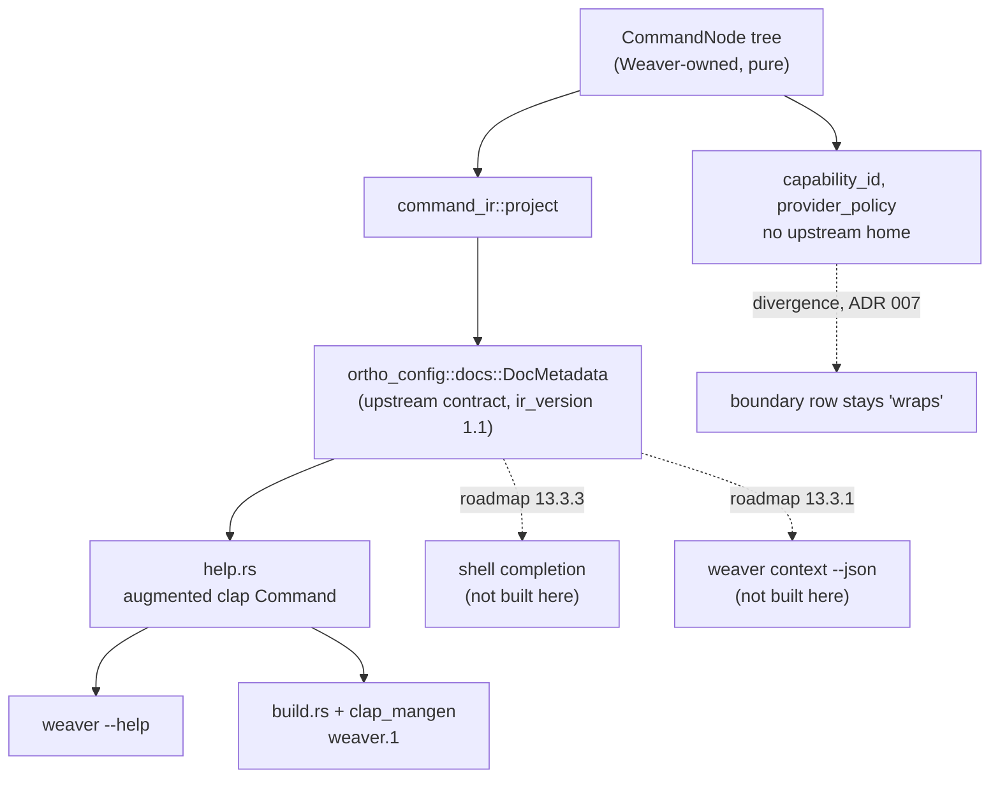

# Consume recursive command metadata (roadmap 12.1.2)

This ExecPlan (execution plan) is a living document. The sections `Constraints`,
`Tolerances`, `Risks`, `Progress`, `Surprises & discoveries`, `Decision log`,
`Outcomes & retrospective`, `Conformance basis`, and `Verification plan` must
be kept up to date as work proceeds.

Read `AGENTS.md` before starting. It carries the repository's non-negotiable
rules on commit gates, British English, file length, and testing.

Status: IN PROGRESS

## Purpose / big picture

The roadmap states the goal for this task as:

> 12.1.2. Consume recursive command metadata.
> Depends on OrthoConfig 6.1.1 and 6.1.2.
> Success: generated help, manpage, completion, and context output converge on
> the OrthoConfig recursive metadata shape.

After this change, Weaver has exactly one in-process description of its own
command surface, and that description is shaped by a contract Weaver does not
own. Concretely, a reader can observe all of the following:

- `weaver --help` and the generated `weaver.1` manual page are rendered from a
  single recursive `ortho_config::docs::DocMetadata` value rather than from
  handwritten prose that duplicates other handwritten prose.
- Adding a command to the one catalogue makes it appear in help and in the
  manual page together, and a test fails if it appears in one but not the other.
- Deleting an operation from the daemon's router without deleting it from the
  catalogue fails the build, because a test now compares the two across the
  crate boundary.
- `cargo test -p weaver-cli` fails loudly, with a named test, if OrthoConfig
  ever changes its metadata schema version out from under Weaver.

The word "converge" in the success criterion is a conformance predicate, not a
construction predicate. Two of the four named surfaces do not exist in Weaver
today and are owned by later roadmap items: shell completion and
`weaver context --json` are built by 13.3.3 and 13.3.1 respectively. This plan
therefore converges the two surfaces that exist, and establishes the metadata
shape that 13.3.1 and 13.3.3 will converge onto. That boundary is argued in
full under `Decision log`.

## Why this matters now

Phase 12 is described in the roadmap as "the minimum unavoidable foundation" —
it validates the build boundary rather than a user workflow. The value of this
task is that every later command-surface and renderer task can point at one
metadata shape instead of rediscovering the question. The cost of skipping it
is that phases 13 onward each grow their own catalogue, which is exactly the
failure this repository has already experienced: six separate handwritten lists
of the same operations exist today, and two of them have already drifted apart.

## Constraints

These are hard invariants. Violating one requires escalation, not a workaround.

1. Do not add a new runtime dependency, a new build-time dependency, or a new
   CI tool. In particular do not add `clap_complete` and do not add
   `cargo-orthohelp`. Both are scoped to roadmap 13.3.3.
2. Do not add a new crate to the workspace. Use module directories inside
   `crates/weaver-cli` to respect the file-length cap.
3. Do not add a `context` subcommand to `crates/weaver-cli/src/cli.rs`. The
   `weaver context --json` surface belongs to roadmap 13.3.1 and the boundary
   manifest already assigns context metadata to roadmap 12.1.3.
4. Do not change the daemon wire protocol. The `domain`/`operation` free-text
   passthrough in `crates/weaver-cli/src/cli.rs` is the wire application binary
   interface (ABI) by which `definitions get` reaches the daemon; see
   `crates/weaver-cli/src/command.rs`. It must keep parsing exactly as it does
   now.
5. No single code file may exceed 400 lines. This is enforced by the
   `module_max_lines` lint in `make lint`. Inline `mod tests` blocks count as
   separate modules for this lint, but plan the split up front regardless.
6. Comments and documentation use British English with Oxford spelling
   (`-ize`, `-yse`, `-our`), except when quoting an external API verbatim.
7. Every module begins with a `//!` module documentation comment; every public
   item carries `///` documentation.
8. Use `cap_std` and `camino` rather than `std::fs` and `std::path`.
9. Do not silence a lint to make a gate pass. Fix the code.
10. The committed `docs/orthoconfig-consumer-boundary.md` is generated. Never
    edit its table by hand.

## Tolerances (exception triggers)

Stop and escalate rather than improvising when any of these is reached.

- Scope: if the change exceeds 25 files or 1,200 net added lines, stop.
- Dependencies: if any new dependency appears necessary, stop. This is a
  constraint, so reaching it is an exception by definition.
- New crate: if the 400-line cap cannot be met without a new crate, stop and
  present the crate boundary for approval before creating it.
- Interface: if the daemon wire protocol or the runtime parsing behaviour of
  `Cli` must change, stop.
- Snapshot churn: if more than 120 lines of `.snap` content change, stop and
  present the diff for explicit review. Large snapshot diffs are the specific
  failure mode this plan is designed to prevent.
- Iterations: if a gate still fails after 3 fix attempts, stop and report the
  log path rather than continuing to iterate.
- Ambiguity: if the Fluent identifier work turns out to require authoring more
  than roughly 40 new catalogue entries, stop — that indicates the plan has
  drifted into roadmap 13.2.1's localized renderer work.

## Risks

- Risk: a recursive rewrite churns both help snapshots, and a reviewer accepts
  a large mechanical diff that silently drops content such as the domain
  catalogue or `--capabilities`. Severity: high. Likelihood: high. Mitigation:
  add the coverage test in Stage C before touching the renderers, so that
  content loss fails an assertion that `cargo insta accept` cannot bless. The
  repository already contains proof this happens: the committed top-level help
  snapshot carries two separate `Options:` headings, a known-wrong rendering
  that was accepted into the golden file.

- Risk: hand-assembled `DocMetadata` drifts from what the OrthoConfig derive
  would produce, and nothing notices. Severity: high. Likelihood: medium.
  Mitigation: the differential test in Stage C, plus the schema-version pin
  test. See `Verification plan` obligations INV-2 and INV-3.

- Risk: an upstream `ortho_config` 0.9.z release adds a field to `DocMetadata`
  and breaks the build via Dependabot. Severity: low. Likelihood: medium.
  Mitigation: this is the *good* failure mode — a compile error naming the
  missing field. Funnel every struct literal through one module so the fix is
  mechanical and local. Note that `docs::ir` types are not `#[non_exhaustive]`
  and have no builder, so hand-assembly is field-exact by construction.

- Risk: the generated help becomes more confidently wrong. The CLI advertises
  fourteen operations; the daemon router implements five. Severity: medium.
  Likelihood: high if unaddressed. Mitigation: do not silently propagate the
  fourteen. Stage B adds the cross-crate coverage test that makes the
  discrepancy explicit and fails the build if the two catalogues disagree.
  Record the advertised-versus-routed gap as a finding for roadmap 13.1/13.3
  rather than fixing routing here.

- Risk: the build script's `#[path]` include list grows and becomes fragile.
  Severity: medium. Likelihood: medium. Mitigation: keep the projection module
  free of intra-crate imports beyond the command tree, and add a comment in
  `build.rs` explaining the constraint. If the include list would exceed four
  modules, that is the signal to extract a crate — which is a tolerance breach
  requiring escalation.

- Risk: minting Fluent identifiers for command nodes produces silent fallback
  text rather than errors, because `weaver_config::config_field_help` ends in
  `unwrap_or(DEFAULT_CONFIG_FIELD_HELP)`. Severity: medium. Likelihood: high if
  unaddressed. Mitigation: obligation INV-4 — a test asserting every identifier
  the projection mints resolves without hitting a fallback.

## Progress

- [x] Stage A: orientation and confirmation of upstream facts (no code
      changes). Completed 2026-08-22: the resolved Git source provides the
      required recursive IR and schema version 1.1; `weaver-e2e` can compare
      the catalogues through a feature-gated daemon test-support accessor.
- [ ] Stage B: red tests — cross-crate catalogue drift gate and coverage
      assertions that fail for the expected reason. INV-6 has completed its
      red–green loop: the missing test-support accessor failed to compile, and
      the equality test now passes through the feature-gated accessor.
- [x] EP-M1: cross-crate catalogue drift gate. Completed 2026-08-22: the
      `weaver-e2e` test compares the public CLI catalogue with the daemon's
      private routing authority through the existing test-support feature.
      The negative control removed `verify syntax` and failed with the named
      mismatch before the unchanged router was restored.
- [ ] Stage C: the command tree and its `DocMetadata` projection, with
      verification artefacts developed alongside.
- [ ] Stage D: route help and manpage rendering through the projection; delete
      the superseded catalogues and `promote_static`.
- [ ] Stage E: boundary manifest, ADR 007, and user- and developer-facing
      documentation; full gate run.

## Surprises & discoveries

Recorded during planning; keep appending during implementation.

- Observation: OrthoConfig 6.1.1 and 6.1.2 are already complete upstream, and
  the resolved Git source provides the recursive metadata. Evidence: upstream
  `docs/roadmap.md` marks both `[x]`; `Cargo.toml:43` pins Git revision
  `4339a6f3c61dc4fed86493d99ffb05230bee2a1b`, which resolves to `ortho_config`
  0.8.0. Its checked-out `src/docs/ir.rs:26` declares
  `pub subcommands: Vec<DocMetadata>`, and `src/docs/mod.rs:56` declares
  `pub trait OrthoConfigSubcommandDocs`; the same module declares IR version
  1.1. Impact: the plan's 0.9.0 version claim was stale, but the required
  contract is present at the actual pinned revision. This task remains
  unblocked with no version change.

- Observation: the OrthoConfig subcommand derive cannot be applied to Weaver's
  command enums at all. It is not a matter of missing trait bounds. Evidence:
  `ortho_config_macros-0.9.0/src/subcommand_docs.rs:37-46` rejects named-field
  variants and unit variants as hard compile errors. Weaver's
  `CliCommand::Definitions { action }` and `CliCommand::Daemon { action }` are
  named-field variants (`crates/weaver-cli/src/cli.rs:91,96`), and
  `DaemonAction::{Start, Stop, Status}` are unit variants (`cli.rs:124-131`).
  Impact: the derive would produce zero nodes for Weaver today. The projection
  must be hand-assembled. This is recorded as a divergence rather than hidden.

- Observation: `ortho_config::agent_context` already models most of the
  Weaver-specific semantic fields that
  `crates/weaver-cli/src/command_surface.rs` holds locally. Evidence:
  `src/agent_context/mod.rs` declares `AgentCommand` (`:97`), `MutationEffect`
  (`:249`), `AsyncSubmission` (`:134`), `DeliveryRoute` (`:154`),
  `SkillManifest` (`:289`), and `ORTHO_AGENT_CONTEXT_SCHEMA_VERSION` (`:15`).
  Impact: this materially narrows the removal gate recorded in the boundary
  manifest. Only `capability_id` and `provider_policy` genuinely lack an
  upstream home. The remaining fields are awaiting adoption in roadmap 12.1.3,
  not awaiting an upstream contract.

- Observation: the operation catalogue is duplicated six times, and one copy
  lives in a different crate across the daemon socket with no compiler link.
  Evidence: `crates/weaver-cli/src/cli.rs:45-59` (`after_help` prose);
  `crates/weaver-cli/src/discoverability.rs:60-90` (`DOMAIN_OPERATIONS`);
  `crates/weaver-cli/src/localizer.rs:31-42` (`bare_help`);
  `crates/weaver-cli/locales/en-US/messages.ftl:28-44`;
  `crates/weaver-cli/src/command_surface.rs:79-80,96-98`; and
  `crates/weaverd/src/dispatch/router.rs:85-116`
  (`DomainRoutingContext::{OBSERVE, ACT, VERIFY}`). `crates/weaver-cli`
  declares no dependency on `weaverd`, so nothing cross-checks the last one.
  Impact: this is the drift that has actually occurred, and closing it is the
  most valuable part of "converge".

- Observation: `weaver-e2e` already declares development dependencies on both
  `weaver-cli` and `weaverd` with its `test-support` feature, but neither crate
  exposes its internal catalogue to another crate. Evidence:
  `crates/weaver-e2e/Cargo.toml` has both dependencies; `weaverd::dispatch` and
  `weaverd::dispatch::router` are private modules, and `DomainRoutingContext`
  fields are `pub(crate)`. Impact: INV-6 must use a narrow, feature-gated
  `weaverd::test_support::routing_catalogue` accessor. This adds no dependency
  and leaves the daemon's runtime interface unchanged.

- Observation: the CLI advertises fourteen operations; the daemon routes five.
  Evidence: `router.rs:210-215` routes `get-definition`, `get-card` and
  `graph-slice`; `router.rs:225-238` routes `apply-patch` and `refactor`;
  `route_verify` (`router.rs:241-249`) routes nothing and falls through.
  Impact: generating help from a catalogue that lists fourteen would make
  Weaver more confidently wrong. Recorded for roadmap 13.1/13.3; not fixed here.

- Observation correction: `DomainRoutingContext` declares all fourteen CLI
  operations as known routing operations. Five currently have dedicated handler
  branches; the remaining known operations use the router's not-implemented
  fallback. Evidence: `DomainRoutingContext::{OBSERVE, ACT, VERIFY}` contains
  the same three-domain, fourteen-operation catalogue as `DOMAIN_OPERATIONS`,
  and `router/tests.rs` already exercises every known operation. Impact: INV-6
  correctly protects advertised routing knowledge, but does not claim handler
  implementation coverage. The earlier five-operation wording describes
  dedicated handlers, not the router catalogue.

- Observation: `weaverd`'s manual page is covered by no live roadmap task.
  Evidence: `manpage` appears in `docs/roadmap.md` only at 12.1.2's success
  criterion, the phase 13 preamble, and 13.3.3 — and 13.3.3 names only `weaver`
  CLI surfaces. `crates/weaverd/Cargo.toml` declares no `clap` dependency, and
  no file under `crates/weaverd/src/` reads `argv`. Impact: treated here as a
  permanent divergence rather than deferred work, because a binary that parses
  nothing has no metadata to converge. If that reading is rejected, a roadmap
  task must be added — it is not covered today.

- Observation: `promote_static` in `crates/weaver-cli/src/help.rs:110-118`
  uses `Box::leak` to satisfy a clap requirement that clap 4 does not impose.
  Evidence: the pinned `clap_builder` provides `impl From<String> for Str` and
  `impl From<String> for Id`, and `Arg::new`, `.long()`, `.value_name()` and
  `Command::new` all accept `impl Into<…>`. Impact: deleting it removes an
  entire failure class before this plan can amplify it from five config fields
  to a whole recursive tree.

## Decision log

- Decision: define INV-6 against `DomainRoutingContext.known_operations`, not
  the subset of operations with dedicated handlers. Rationale: the router
  explicitly accepts all known operations and provides a stable not-implemented
  response for those without a handler. The test must prevent discoverability
  from drifting from that routing contract; requiring handler coverage would be
  a separate roadmap concern. Date/Author: 2026-08-22, implementation agent.

- Decision: put INV-6 in `crates/weaver-e2e/tests/catalogue_agreement.rs` and
  expose the daemon catalogue only through its existing `test-support` feature.
  Rationale: `weaver-e2e` already has both crate dependencies, avoiding a new
  dependency edge. A feature-gated accessor preserves the router as the single
  authority while keeping its implementation private in production builds.
  Date/Author: 2026-08-22, implementation agent.

- Decision: use the recursive documentation contract at the actual pinned
  OrthoConfig Git revision, without changing the dependency. Rationale:
  although the plan originally described the resolved dependency as 0.9.0,
  Cargo resolves its pinned revision to 0.8.0. The checked-out source
  nevertheless exposes `DocMetadata.subcommands`, `OrthoConfigSubcommandDocs`,
  and `ORTHO_DOCS_IR_VERSION = "1.1"`. Updating the dependency would be
  unscoped and unnecessary; the projection can consume the available contract
  directly. Date/Author: 2026-08-22, implementation agent.

- Decision: scope 12.1.2 to converging help and manpage, and to establishing
  the metadata shape — not to building shell completion or
  `weaver context --json`. Rationale: the roadmap assigns those surfaces
  elsewhere and in a different dependency order. `docs/roadmap.md:183-187` gives
  `weaver context --json` to 13.3.1, which "Requires 13.2.3" — the structured
  JSON envelope and error taxonomy, none of which exist.
  `docs/roadmap.md:193-197` gives "manpage input, shell completions, and
  `weaver skill-path` from the same metadata" to 13.3.3, depending on
  OrthoConfig 6.3 and 8.1. Building either now guarantees a rewrite and inverts
  the dependency order. Date/Author: 2026-08-21, planning agent.

- Decision: hand-assemble the `DocMetadata` projection; do not restructure
  Weaver's clap enums to fit the OrthoConfig subcommand derive. Rationale: the
  derive rejects named-field and unit variants outright, so adopting it would
  require rewriting the parsing surface — a runtime change smuggled into a
  boundary-classification task. `DefinitionGetArgs` has required `String`
  fields, so the `Default` bound the derive needs would be a lie that a future
  `OrthoConfig::load()` could act on. Date/Author: 2026-08-21, planning agent,
  after design review.

- Decision: reject encoding Weaver's semantic fields into `DocMetadata`'s
  `notes` or `examples`. Rationale: `Note` is a single `text_id` field
  documented as "Fluent ID for the note content" (`docs/ir.rs:298-302`), and
  `Example.code` is the only free-text prose field available on a command node,
  rendered verbatim into the manual page's EXAMPLES section. The sole other
  unconstrained string is `Link.uri`, which is semantically a uniform resource
  identifier and is no better a carrier. Encoding `capability_id` into either
  produces visibly wrong output or unresolved-identifier leakage, and destroys
  the type safety `command_surface.rs` already has via its closed enums.
  Date/Author: 2026-08-21, planning agent, after design review.

- Decision: keep the boundary manifest row for 12.1.2 at `state = "wraps"`.
  Do not flip it to `consumes`. Rationale: this reverses the initial proposal.
  `consumes` forbids a `removal_gate` value
  (`crates/weaver-docs-gate/tests/boundary_manifest.rs`,
  `validate_state_evidence`). Weaver retains a local adapter after this task,
  because `capability_id` and `provider_policy` have no upstream home and the
  hand-assembled spine remains. Flipping would delete the only field that
  records what is left to remove, in a document whose entire purpose is
  boundary honesty. Instead, narrow the gate text from the sweeping "once
  OrthoConfig 6.1 ships …" — which is now satisfied — to name precisely what is
  still missing. Date/Author: 2026-08-21, planning agent, after design review.

- Decision: model the free-text `observe`/`act`/`verify` passthrough as a
  single node with the operation catalogue as its value hints, rather than as
  fourteen peer commands. Rationale: roadmap 12.2.3 marks those spellings
  provenance-only, and ADR 007 resets the surface to resource-first. Promoting
  them to peers would entrench a superseded grammar in the very structure meant
  to outlive it. Keeping them as one node's value hints keeps help truthful
  about what the binary accepts while letting the node delete itself when the
  passthrough goes. Date/Author: 2026-08-21, planning agent.

- Decision: `crates/weaverd/build.rs`'s handwritten troff manual page is out
  of scope, and is a *permanent* divergence rather than deferred work.
  Rationale: `weaverd` parses no arguments at all. It declares no `clap`
  dependency and reads `argv` nowhere; `crates/weaverd/src/main.rs` calls
  `run_daemon()` directly. There is therefore no command metadata to converge,
  and its static three-section page is correct by construction. No live roadmap
  task covers it: roadmap 13.3.3 covers `weaver help`, command help, manpage
  input, shell completions and `weaver skill-path` — all `weaver` CLI surfaces
  — and never mentions `weaverd`. The only task that proposed retiring
  `clap_mangen` is archive 3.2.6, whose migration destination is 13.2/13.3 and
  which likewise concerns the CLI. Record it in ADR 007 as a permanent
  divergence, stating the reopening condition: if `weaverd` ever gains a parsed
  argument surface, its manual page must be generated from the same metadata as
  the CLI's. Date/Author: 2026-08-21, planning agent.

## Outcomes & retrospective

Stage A corrected the dependency version in this plan without changing the
dependency itself. The recursive IR and schema contract are available at the
actual pin. To be completed at the end of Stage E. Before setting this plan to
`COMPLETE`, reconcile every implementation discovery against the artefacts
named in `Conformance basis`, and confirm that the roadmap entry for 12.1.2 has
been marked done.

## Context and orientation

Weaver is a Rust workspace providing a semantic code-intelligence tool. A
command-line binary, `weaver`, talks to a background daemon, `weaverd`, over a
local socket using newline-delimited JSON (JSONL).

OrthoConfig is a separate crate by the same author, consumed by Weaver from
crates.io. It provides reusable command-contract machinery so that Weaver does
not rebuild generic command-line infrastructure. Weaver pins Git revision
`4339a6f3c61dc4fed86493d99ffb05230bee2a1b` at `Cargo.toml:43`, resolving to
`ortho_config` 0.8.0.

Terms used in this plan:

- **Intermediate representation (IR)** — OrthoConfig's serializable description
  of a command: the `ortho_config::docs::DocMetadata` type and everything it
  contains. It is "recursive" because `DocMetadata` contains
  `subcommands: Vec<DocMetadata>`.
- **Fluent identifier** — a message key resolved against a localization
  catalogue. Almost every human-readable string in `DocMetadata` is an
  identifier rather than literal prose: `about_id`, `help_id`, `long_help_id`,
  `Note.text_id`, and every field of `HeadingIds`.
- **Boundary manifest** — `docs/orthoconfig-consumer-boundary.toml`, the
  machine-readable record of which roadmap tasks consume, wrap, defer, or
  diverge from an OrthoConfig contract. It is validated by the
  `weaver-docs-gate` crate and rendered into
  `docs/orthoconfig-consumer-boundary.md`.
- **Projection** — the pure function in this plan that turns Weaver's own
  command tree into a `DocMetadata` value.

The files that matter for this task:

- `crates/weaver-cli/src/cli.rs` — the clap command tree. `Cli` has structured
  subcommands for `definitions get` and `daemon start|stop|status`, plus
  free-text `domain`, `operation` and trailing `arguments` positionals that
  carry everything else to the daemon.
- `crates/weaver-cli/src/help.rs` — builds an augmented `clap::Command` used
  for both runtime help and manual-page generation. It already consumes
  OrthoConfig's flat field metadata via `Config::get_doc_metadata().fields`.
- `crates/weaver-cli/src/command_surface.rs` — the ADR 007 temporary adapter
  holding Weaver's semantic command records.
- `crates/weaver-cli/src/discoverability.rs` — `DOMAIN_OPERATIONS`, the domain
  and operation catalogue used for `after_help` and guidance.
- `crates/weaver-cli/build.rs` — generates the manual page with `clap_mangen`.
  It cannot depend on its own crate's library, so it pulls `cli.rs` and
  `help.rs` in via `#[path]` module declarations.
- `crates/weaverd/src/dispatch/router.rs` — the daemon's authority on which
  operations exist.
- `crates/weaver-docs-gate/` — the boundary manifest validator and renderer.

## Conformance basis

Upstream artefacts governing this work:

- `docs/roadmap.md` section 12.1.2 (the success criterion, quoted verbatim in
  `Purpose / big picture`), plus sections 12.1.3, 13.3.1 and 13.3.3, which
  bound this task's scope.
- `docs/adr-007-agent-native-command-surface.md` — Weaver's ADR on the
  agent-native command surface, including the boundary-state vocabulary and the
  removal policy for `command_surface.rs`. Note that OrthoConfig upstream also
  numbers an ADR 007, on downstream context-command naming; the two are
  unrelated and prose must say which is meant.
- `docs/weaver-design.md` — the design document this plan must keep truthful.
- Upstream OrthoConfig roadmap items 6.1.1 and 6.1.2, both complete and
  available at the pinned OrthoConfig Git revision.

Trace links:

```plaintext
ROADMAP-12.1.2 -> ADR007-boundary -> EP-M2 -> tests::command_ir::projection_matches_derive
ROADMAP-12.1.2 -> ADR007-removal  -> EP-M5 -> docs-gate::boundary_manifest
ROADMAP-12.1.2 -> criterion-help  -> EP-M3 -> tests::command_ir::every_node_appears_in_help
ROADMAP-12.1.2 -> criterion-man   -> EP-M3 -> tests::man_page::contains_every_resource_path
```

## Verification plan

The change introduces genuine invariants over a recursive structure, so
example-based tests alone are insufficient for two of them.

**Axioms (assumed, not verified).** OrthoConfig's own correctness is out of
scope. Specifically this plan assumes: `ortho_config::docs` types serialize and
deserialize faithfully; the `OrthoConfig` derive produces correct
`FieldMetadata` for a struct that satisfies its bounds; `clap` renders a
`Command` correctly; and `clap_mangen` renders valid troff. Where Weaver-owned
logic builds on these, it is verified against the real interface rather than a
mock.

- Obligation INV-1: **projection totality**. Every node in Weaver's command
  tree yields exactly one `DocMetadata` node, and the projection preserves the
  parent-child relation and sibling order. Method: property test with
  `proptest` over generated trees, plus parameterized `rstest` cases for the
  real tree. Rationale: this is an invariant over a generated structural
  domain; examples cannot cover arbitrary shapes, and ordering bugs are exactly
  what silently reorders generated documentation. Domain: generated trees of
  depth 0–4 and branching 0–5, plus the real tree. Artefact:
  `crates/weaver-cli/src/command_ir/tests/projection_props.rs`. Evidence:
  `cargo test -p weaver-cli command_ir` fails before the projection exists;
  passes after. Non-vacuity: the generator must produce at least one tree of
  depth ≥ 2 and one leaf-only tree; assert generator classification with
  `proptest::prop_assume` avoided in favour of construction, so no case is
  filtered away. Negative control: a deliberately order-shuffling mutant of the
  projection must fail the sibling-order assertion.

- Obligation INV-2: **derive conformance**. For a command whose arguments
  struct *can* satisfy the OrthoConfig derive, the hand-assembled node is
  field-identical to the derive's output. Method: differential test against the
  real derive. Rationale: this is the only mechanism that pins hand-assembled
  IR to upstream's own notion of the shape. It is a live tripwire, not a
  comment. Domain: one representative arguments struct carrying
  `Serialize + Deserialize + Default`. Artefact:
  `crates/weaver-cli/src/command_ir/tests/derive_differential.rs`. Evidence:
  `cargo test -p weaver-cli derive_differential`. Fails if either producer
  drifts. Non-vacuity: the fixture struct must have at least one flag with a
  value and one boolean switch, so the comparison exercises both `CliMetadata`
  shapes. Negative control: changing one `help_id` in the hand-assembled node
  must fail the test.

- Obligation INV-3: **schema-version pinning**. Weaver must not silently claim
  conformance to an IR version it has not implemented. Method: parameterized
  test asserting `ortho_config::docs::ORTHO_DOCS_IR_VERSION == "1.1"`, plus a
  round-trip assertion that each projected node survives `serde_json`
  serialization and deserialization unchanged. Rationale: Weaver reads the
  version as a constant and would otherwise propagate any future value
  automatically. This is the single highest-value guard in the task and costs
  about ten lines. Domain: the constant, and every node of the real tree.
  Artefact: `crates/weaver-cli/src/command_ir/tests/schema_version.rs`.
  Evidence: `cargo test -p weaver-cli schema_version`. Deliberately fails on an
  upstream bump, forcing a conscious review. Non-vacuity: the round-trip must
  be shown to fail if a field is dropped during construction — seed that
  mutation once and observe the failure.

- Obligation INV-4: **identifier resolution**. Every Fluent identifier the
  projection mints resolves to real text without falling back. Method:
  parameterized test walking the projected tree and asserting each identifier
  resolves. Rationale: `weaver_config::config_field_help` ends in
  `unwrap_or(DEFAULT_CONFIG_FIELD_HELP)`, so a missing identifier currently
  renders plausible-but-wrong help rather than failing. At five config fields
  that is noticeable; across a whole tree it is not. Domain: every `about_id`,
  `help_id`, `long_help_id` and heading identifier in the real tree. Artefact:
  `crates/weaver-cli/src/command_ir/tests/identifiers.rs`. Evidence:
  `cargo test -p weaver-cli identifiers`. Non-vacuity: add one identifier with
  no catalogue entry, observe the failure, then remove it. A test that passes
  when the catalogue is empty is vacuous.

- Obligation INV-5: **cross-surface coverage (surjectivity)**. Every command
  node and every argument long flag in the tree appears in rendered help and in
  the rendered manual page. Method: parameterized assertion test over rendered
  output, deliberately *not* a snapshot. Rationale: this is the guard that a
  large accepted snapshot diff cannot bypass, and it is the direct mitigation
  for the highest-severity risk. Domain: the real tree against
  `help::command().render_long_help()` and the troff produced by `clap_mangen`.
  Artefact: `crates/weaver-cli/src/tests/unit/surface_coverage.rs`. Evidence:
  `cargo test -p weaver-cli surface_coverage`. Non-vacuity: removing one node
  from the renderer path must fail the test. Confirm the assertion is not
  trivially satisfied by substring collision — use whole-token matching.

- Obligation INV-6: **cross-crate catalogue agreement**. The CLI's operation
  catalogue and the daemon's `DomainRoutingContext` describe the same set.
  Method: parameterized test comparing the two, placed where both are visible.
  Rationale: these two lists are in different crates with no dependency edge,
  and they have already drifted. This is the one drift that has actually
  occurred. Domain: all three domains and their declared operations. Artefact:
  `crates/weaver-e2e/tests/catalogue_agreement.rs`, using the feature-gated
  daemon test-support accessor. Evidence:
  `cargo test -p weaver-e2e catalogue_agreement`. Non-vacuity: the test must
  currently pass on set equality but must be shown to fail when one operation
  is removed from either side. Seed that mutation once.

- Obligation INV-7: **bounded recursion depth**. The projection terminates and
  refuses pathological depth rather than overflowing the stack inside a build
  script. Method: an explicit depth bound returning `Err`, exercised by a
  parameterized test at and beyond the bound. Rationale: `clap_mangen` and
  `attach_ordering_caveat` both recurse. A stack overflow inside `build.rs`
  surfaces as `signal: 11` with no diagnostic. Domain: depths 0,
  `MAX_COMMAND_DEPTH`, and `MAX_COMMAND_DEPTH + 1`. Artefact:
  `crates/weaver-cli/src/command_ir/tests/depth.rs`. Evidence:
  `cargo test -p weaver-cli depth`. Non-vacuity: the over-bound case must
  return the specific error variant, not merely "an error".

No `kani` or `verus` obligation is proposed. There is no unbounded arithmetic,
no `unsafe`, and no concurrency in this change; the invariants above are
structural and are fully discharged by property and differential testing. The
repository currently contains no `kani` or `verus` harnesses and no Makefile
targets for them, so introducing one here would also breach the no-new-tooling
constraint.

## Plan of work

### Stage A: orient and confirm (no code changes)

Re-verify the upstream facts recorded under `Surprises & discoveries`, because
the plan's scope depends on them. Confirm the pinned Git source provides
`DocMetadata.subcommands`, and confirm the derive still rejects named-field and
unit variants. Confirm that `crates/weaver-e2e` can access both catalogues
through its existing development dependencies and the daemon's feature-gated
test-support accessor.

Validation: no code changes; record findings in `Progress`.

### Stage B: red tests

Write the failing tests first. In order: INV-6 (cross-crate agreement), adding
only the feature-gated test-support accessor needed to compile the cross-crate
test, then observe its expected data mismatch; then INV-5 (coverage), which
must be written against the *current* renderers so that it passes before the
rewrite and therefore proves the rewrite preserves content; then INV-3's
schema-version assertion.

The coverage test is deliberately written before the projection exists. That
ordering is the point: it must pass on today's output, so that any regression
during Stage D is attributable to the rewrite.

Validation: `cargo test -p weaver-cli` and
`cargo test -p weaver-e2e catalogue_agreement` show the new tests. INV-6 first
fails for the existing set mismatch, then passes once the catalogue is made
truthful; INV-5 passes against current behaviour and the projection tests fail
to compile or fail for the expected reason.

### Stage C: the tree and the projection

Introduce `crates/weaver-cli/src/command_surface/` as a module directory,
absorbing today's `command_surface.rs`, and `crates/weaver-cli/src/command_ir/`
for the projection. Keep the domain tree free of `clap` and `ortho_config`
types; keep every `DocMetadata`, `FieldMetadata`, `CliMetadata` and
`HeadingIds` struct literal inside `command_ir` so that an upstream field
addition is a one-file compile error.

Build a small constructor helper for `HeadingIds` and the `SectionsMetadata`
skeleton — the upstream types derive no `Default`, so a leaf node requires
twenty-six field initializers without one.

Implement obligations INV-1, INV-2, INV-3, INV-4 and INV-7 alongside the code
rather than afterwards.

Validation: `cargo test -p weaver-cli command_ir` passes; `make lint` passes,
confirming no file exceeds 400 lines.

### Stage D: converge the renderers, then delete

Route `help.rs` and `build.rs` through the projection. Then, and only then,
delete what the projection replaces: the `after_help` prose catalogue in
`cli.rs`, the `bare_help` duplicate in `localizer.rs`, and the redundant
catalogue copies, keeping exactly one. Delete `promote_static` and pass owned
`String`s to clap directly.

Deletion comes after convergence so that INV-5 is protecting content throughout.

Validation: INV-5 still passes; both help snapshots reviewed line by line
against the tolerance on snapshot churn; `cargo test --workspace` passes.

### Stage E: documentation and the boundary row

Update the boundary manifest row for 12.1.2 — keeping `state = "wraps"`,
narrowing `removal_gate`, refreshing `last_reviewed` — and regenerate the
Markdown matrix with the example binary. Amend
`docs/adr-007-agent-native-command-surface.md` to record the derive-shape
divergence and the `agent_context` finding. Update `docs/users-guide.md` only
if observable help text changes, `docs/developers-guide.md` with the convention
that command metadata is added in one place, and `docs/weaver-design.md` where
it describes the command surface.

Validation: the full gate sequence in `Concrete steps`.

## Milestones and plateaus

- EP-M1 — cross-crate drift gate in place. Discharges INV-6. Acceptance: the
  new test passes and fails when either catalogue is mutated. Recovery: revert
  a single test file. Remaining gaps: everything else. Compatibility decision:
  none required; test-only surface.
- EP-M2 — command tree and projection exist and are verified, but nothing
  renders from them yet. Discharges INV-1, INV-2, INV-3, INV-4, INV-7.
  Acceptance: `cargo test -p weaver-cli command_ir`. Recovery: the new modules
  are additive and can be deleted wholesale. Compatibility decision: none;
  `pub(crate)` surface inside a pre-1.0 binary crate.
- EP-M3 — help and manpage render from the projection; superseded catalogues
  deleted. Discharges INV-5. Acceptance: coverage test plus reviewed snapshots.
  Recovery: revert Stage D commits; EP-M2 remains a coherent plateau.
- EP-M4 — boundary manifest, ADR and documentation current. Acceptance: the
  boundary manifest gate and the Markdown gates pass.

No compatibility machinery is required at any milestone. Every interface
touched is `pub(crate)` within a pre-1.0 binary crate with no external
consumers, so interfaces and their callers change together.

## Concrete steps

Run everything from the repository root. Per `AGENTS.md`, capture gate output
to a log rather than relying on truncated terminal output.

```sh
export LOG_BASE="/tmp/$(git branch --show-current)"
```

Stage A — confirm upstream facts:

```sh
grep -n 'ortho_config' Cargo.toml
SRC=$(find ~/.cargo/git/checkouts -path '*/ortho_config/src/docs' -printf '%h\n' | head -1)
grep -n 'pub subcommands' "$SRC/src/docs/ir.rs"
grep -n 'ORTHO_DOCS_IR_VERSION' "$SRC/src/docs/mod.rs"
```

Expected, respectively: the pinned Git revision;
`pub subcommands: Vec<DocMetadata>,`; and
`pub const ORTHO_DOCS_IR_VERSION: &str = "1.1";`.

Stages B through D — the focused loop, repeated per obligation:

```sh
cargo test -p weaver-cli command_ir 2>&1 | tee "$LOG_BASE-unit.out"
cargo test -p weaver-e2e --test catalogue_agreement 2>&1 | tee "$LOG_BASE-e2e.out"
```

Reviewing snapshot changes — never accept blind:

```sh
cargo insta pending-snapshots -p weaver-cli
cargo insta show -p weaver-cli
```

Stage E — regenerate the boundary matrix after editing the TOML:

```sh
cargo run -p weaver-docs-gate --example render_boundary_matrix -- \
  docs/orthoconfig-consumer-boundary.toml docs/orthoconfig-consumer-boundary.md
cargo test -p weaver-docs-gate --test boundary_manifest -- --nocapture \
  2>&1 | tee "$LOG_BASE-boundary.out"
```

Full gate sequence, run sequentially — never in parallel, because the build
cache is shared:

```sh
make check-fmt   2>&1 | tee "$LOG_BASE-checkfmt.out"
make lint        2>&1 | tee "$LOG_BASE-lint.out"
make test        2>&1 | tee "$LOG_BASE-test.out"
make markdownlint 2>&1 | tee "$LOG_BASE-mdlint.out"
make nixie       2>&1 | tee "$LOG_BASE-nixie.out"
```

## Validation and acceptance

Behaviour a human can verify:

- `cargo run -p weaver-cli -- --help` lists every domain and operation that the
  catalogue declares, and the ordering caveat still appears.
- `cargo build -p weaver-cli` produces a manual page under
  `target/generated-man/`, and that page mentions every resource path.
- Removing one operation from `crates/weaverd/src/dispatch/router.rs` and
  running `cargo test -p weaver-e2e catalogue_agreement` fails with a message
  naming the missing operation. Restore it afterwards.

Red-Green-Refactor evidence to record:

- **Red.** INV-2's differential test fails before the projection exists,
  reporting a field mismatch rather than a compile error, once the fixture is
  in place.
- **Green.** The same command passes after the minimal projection lands.
- **Refactor.** After the module split, both the focused test and
  `make lint` pass, confirming no file breached the 400-line cap.

Quality criteria:

- Tests: `make test` passes across the workspace.
- Verification: INV-1 through INV-7 discharged, each with its non-vacuity check
  recorded beside it.
- Lint and typecheck: `make check-fmt` and `make lint` clean, with no new
  `allow` attributes.
- Documentation: `make markdownlint` and `make nixie` clean.
- Boundary: the boundary manifest gate passes and the committed matrix matches
  the generator byte for byte.

## Idempotence and recovery

Every step is re-runnable. The boundary matrix generator is deterministic and
overwrites its output, so re-running it is safe. The manual page is a build
artefact under `target/` and is regenerated on every build. Snapshot updates
are the only step that mutates committed files in a way that is easy to get
wrong; review them with `cargo insta show` rather than accepting in bulk.

Commit after each milestone so any stage can be reverted independently. If a
gate fails, read the captured log rather than re-running the gate; re-run only
after applying a fix.

## Interfaces and dependencies

No new dependencies. The types below are the intended end state; keep every
upstream struct literal confined to `command_ir`.

In `crates/weaver-cli/src/command_surface/mod.rs`, the Weaver-owned tree, free
of `clap` and `ortho_config`:

```rust
/// One node in Weaver's canonical command surface.
pub(crate) struct CommandNode {
    pub(crate) resource_path: &'static [&'static str],
    pub(crate) verb: &'static str,
    pub(crate) summary_id: &'static str,
    pub(crate) arguments: &'static [CommandArgument],
    pub(crate) semantics: CommandSemantics,
    pub(crate) children: &'static [CommandNode],
}
```

In `crates/weaver-cli/src/command_ir/mod.rs`, the projection and its bound:

```rust
/// Maximum supported command-tree depth.
pub(crate) const MAX_COMMAND_DEPTH: usize = 8;

/// Projects Weaver's command tree into the OrthoConfig documentation IR.
pub(crate) fn project(root: &CommandNode) -> Result<DocMetadata, ProjectionError>;
```

## Boundary classification diagram



The solid edges are delivered by this plan. The dotted edges are the surfaces
this plan deliberately leaves to later roadmap items, and the divergence that
keeps the boundary row honest.

## Artefacts and notes

Gate logs follow the `AGENTS.md` convention:

```plaintext
/tmp/12-1-2-consume-recursive-command-metadata-checkfmt.out
/tmp/12-1-2-consume-recursive-command-metadata-lint.out
/tmp/12-1-2-consume-recursive-command-metadata-test.out
/tmp/12-1-2-consume-recursive-command-metadata-boundary.out
/tmp/12-1-2-consume-recursive-command-metadata-mdlint.out
/tmp/12-1-2-consume-recursive-command-metadata-nixie.out
```

## Relevant skills and documentation

Skills to load:

- `rust-router` first, then the smallest useful follow-on. `rust-unit-testing`
  for the fixture and assertion work, `proptest` for obligation INV-1,
  `arch-crate-design` only if the tolerance on crate creation is reached, and
  `arch-decision-records` for the ADR 007 amendment.
- `leta` for code navigation; prefer it over text search when a symbol name is
  known.
- `hexagonal-architecture` to keep the domain tree free of `clap` and
  `ortho_config`, applied to protect that one boundary rather than to impose a
  directory layout.
- `execplans` to keep this document current.

Documents to read before starting:

- `AGENTS.md` — the binding rules.
- `docs/roadmap.md` sections 12.1 and 13.3 — the scope boundary.
- `docs/adr-007-agent-native-command-surface.md` — the boundary vocabulary and
  the removal policy for `command_surface.rs`.
- `docs/ortho-config-users-guide.md` — the consumer-facing guide to the
  dependency.
- `docs/rust-testing-with-rstest-fixtures.md` and
  `docs/rstest-bdd-users-guide.md` — the house testing patterns.
- `docs/reliable-testing-in-rust-via-dependency-injection.md` and
  `docs/complexity-antipatterns-and-refactoring-strategies.md`.
- `docs/documentation-style-guide.md` — required for the ADR amendment.

Upstream references, read-only:

- `~/.cargo/git/checkouts/*/*/ortho_config/src/docs/{ir.rs,mod.rs}` — the
  contract being consumed at the pinned revision.
- `~/.cargo/git/checkouts/*/*/ortho_config/src/agent_context/mod.rs` — the
  home for the semantic fields, relevant to roadmap 12.1.3.
- `~/.cargo/git/checkouts/*/*/ortho_config_macros/src/subcommand_docs.rs` —
  the derive's variant-shape restrictions.

## Revision note

On 2026-08-22, Stage A corrected the plan's stale 0.9.0 dependency claim to the
pinned 0.8.0 Git source. The revision exposes the same recursive IR and schema
1.1 required by this work, so no dependency change or scope deviation is
needed. It also records Stage A completion and resolves the INV-6 placement to
the existing `weaver-e2e` development boundary; the remaining milestones are
unchanged.
