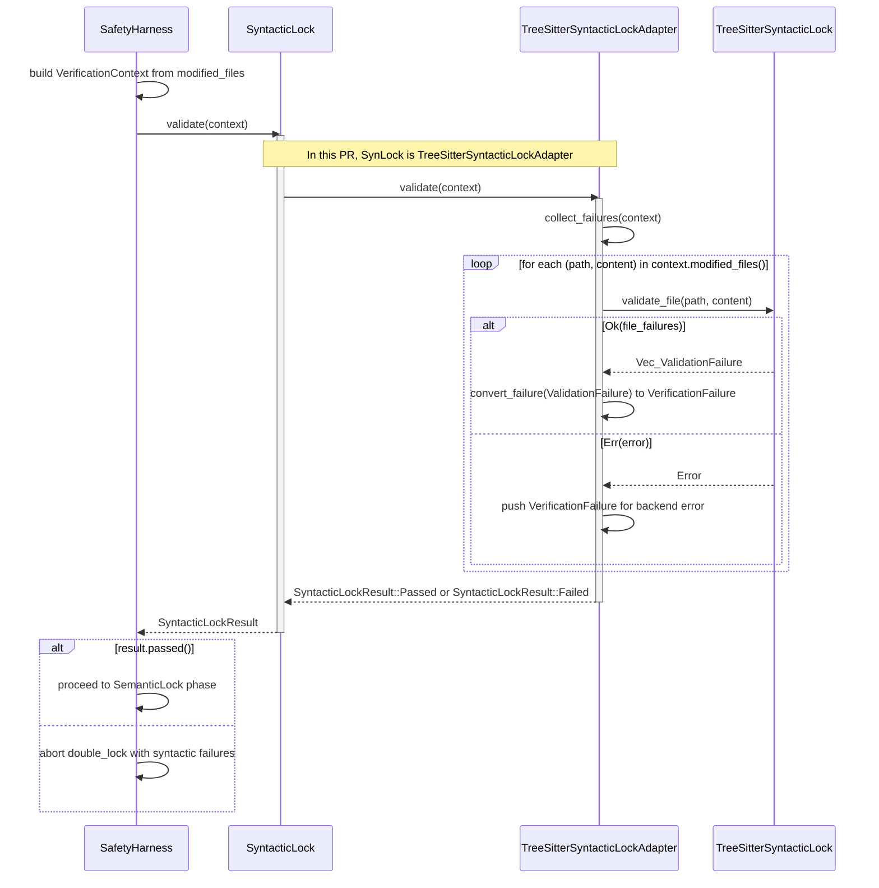

# Execution Plan: Integrate Syntactic Lock into Double-Lock Harness

**Status**: Complete **Phase**: 2 - Syntactic & Relational Intelligence **Last
Updated**: 2025-12-16

## Overview

This document tracks the integration of `TreeSitterSyntacticLock` from
`weaver-syntax` into the Double-Lock safety harness in `weaverd`, replacing the
current `PlaceholderSyntacticLock`.

## Background

The Double-Lock safety harness validates code modifications through two
sequential phases:

1. **Syntactic Lock**: Ensures modified files produce valid syntax trees
2. **Semantic Lock**: Verifies no new errors are introduced via Language Server
   Protocol (LSP) diagnostics

Currently, the syntactic lock uses a placeholder implementation that always
passes. The `weaver-syntax` crate provides `TreeSitterSyntacticLock`, a
production-ready implementation using Tree-sitter parsers for Rust, Python, and
TypeScript.

### Syntactic Lock Validation Flow

The following diagram illustrates how the safety harness delegates syntactic
validation to the `TreeSitterSyntacticLockAdapter`, which in turn invokes the
underlying `TreeSitterSyntacticLock` from `weaver-syntax`:

## Design Decisions

### DD-1: Adapter Pattern for Integration

**Decision**: Create `TreeSitterSyntacticLockAdapter` in `weaverd` that wraps
`weaver_syntax::TreeSitterSyntacticLock` and implements the
`weaverd::safety_harness::SyntacticLock` trait.

**Rationale**:

- Keeps the harness decoupled from `weaver-syntax` internals
- Handles type conversion at the crate boundary
- Allows the harness to remain testable with configurable test doubles
- Follows the existing pattern where lock implementations are injected

### DD-2: Error Handling for Parser Failures

**Decision**: When `TreeSitterSyntacticLock.validate_file()` returns
`Err(SyntaxError)`, the adapter returns `SyntacticLockResult::Failed` with a
single `VerificationFailure` containing the error message.

**Rationale**:

- Maintains consistency with the semantic lock's approach to backend errors
- Prevents silent failures that could allow invalid code through
- Provides actionable error messages to operators

### DD-3: Module Organization

**Decision**: Place the adapter in a new file
`crates/weaverd/src/safety_harness/verification/syntactic.rs`.

**Rationale**:

- Follows the existing module structure where `verification/` contains lock
  implementations
- Keeps the adapter separate from test doubles in `test_doubles.rs`
- Makes the integration point explicit and easy to locate

### DD-4: Test World Abstraction for Behaviour-Driven Development (BDD)

**Decision**: Modify `SafetyHarnessWorld` to use a `SyntacticLockVariant` enum
that can hold either `ConfigurableSyntacticLock` or
`TreeSitterSyntacticLockAdapter`, enabling pluggable lock implementations in
BDD tests.

**Rationale**:

- Enables testing with both `ConfigurableSyntacticLock` (for controlled
  outcomes) and `TreeSitterSyntacticLockAdapter` (for real validation)
- Avoids heap allocation overhead of `Box<dyn SyntacticLock>`
- Maintains backwards compatibility with existing scenarios
- Uses a closed enum since only two lock variants are needed in tests

## Implementation Checklist

- [x] Create execution plan document
- [x] Add `weaver-syntax` dependency to `weaverd/Cargo.toml`
- [x] Create `TreeSitterSyntacticLockAdapter` in `verification/syntactic.rs`
- [x] Update module exports in `verification.rs` and `mod.rs`
- [x] Add unit tests for the adapter
- [x] Add BDD scenarios to `safety_harness.feature`
- [x] Implement BDD step definitions
- [x] Verify `docs/users-guide.md` accuracy
- [x] Mark roadmap item as complete
- [x] Run quality gates (`make check-fmt`, `make lint`, `make test`)

## Files Modified

| File                                                          | Status   | Description        |
| ------------------------------------------------------------- | -------- | ------------------ |
| `crates/weaverd/Cargo.toml`                                   | Complete | Add dependency     |
| `crates/weaverd/src/safety_harness/verification/syntactic.rs` | Complete | New adapter        |
| `crates/weaverd/src/safety_harness/verification.rs`           | Complete | Module declaration |
| `crates/weaverd/src/safety_harness/mod.rs`                    | Complete | Public export      |
| `crates/weaverd/src/tests/safety_harness_behaviour.rs`        | Complete | BDD world & steps  |
| `crates/weaverd/tests/features/safety_harness.feature`        | Complete | BDD scenarios      |
| `docs/roadmap.md`                                             | Complete | Mark complete      |
| `docs/users-guide.md`                                         | Complete | Verify accuracy    |

## Test Coverage

### Unit Tests

1. Valid Rust code passes validation
2. Invalid Rust code fails with location information
3. Unknown file extensions pass through (not validated)
4. Multiple files collect all failures
5. Empty context passes validation
6. Mixed valid/invalid files fail with complete failure list

### BDD Scenarios

1. Valid Rust code passes syntactic validation with Tree-sitter
2. Invalid Rust code fails syntactic validation with Tree-sitter
3. Unknown file extensions pass through Tree-sitter validation
4. Python code validated by Tree-sitter
5. TypeScript code validated by Tree-sitter

## Risks and Mitigations

| Risk                          | Impact | Mitigation                                 |
| ----------------------------- | ------ | ------------------------------------------ |
| Parser initialization failure | Medium | Map to backend error, not silent pass      |
| Type conversion overhead      | Low    | Conversion is O(n) where n = failures      |
| Thread safety concerns        | Low    | `TreeSitterSyntacticLock` is `Send + Sync` |

## References

- `docs/weaver-design.md` - Section 4.2 "Double-Lock Safety Harness"
- `crates/weaver-syntax/src/syntactic_lock.rs` - Source implementation
- `crates/weaverd/src/safety_harness/verification.rs` - Target trait
