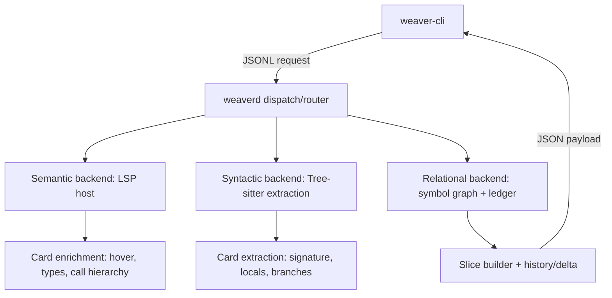

# Jacquard card-first symbol graph extension for Weaver

## Summary

This document specifies a “cards-first” symbol context system for Weaver that
builds and serves small, structured “symbol cards” and bounded graph slices,
then supports time-travel diffs over recent commits using probabilistic symbol
matching.

The design extends Weaver’s existing “Semantic Fusion” approach by combining:

- Tree-sitter for fast, fault-tolerant syntactic extraction.
- Language Server Protocol (LSP) for semantic enrichment (hover, types, call
  hierarchy, references).
- A relational graph layer for traversal, slicing, and history/delta queries.

The goal is to make high-signal context cheap by default, and make “read more”
an explicit escalation step rather than a reflex.

The approach mirrors the core claims of Symbol Delta Ledger (SDL) systems[^1]:
cards, typed edges (call/import/config), budgeted slices, and semantic deltas,
but fits Weaver’s JSON Lines (JSONL) command model and daemon-backed
architecture.[^2]

## Problem statement

Weaver already has the primitives for semantic inspection (via LSP) and
structural parsing (via Tree-sitter) and a call graph module using LSP call
hierarchy.[^3]

However, common agent workflows still tend to overfetch:

- Entire files get loaded when only one symbol matters.
- Context grows without a budget or a stopping rule.
- Repeated “what changed?” questions re-derive context from scratch.
- Symbol identity across commits becomes ambiguous after renames/moves/splits.

The requested workflow highlights the missing connective tissue:

1. Symbol discovery via external semantic search (“Sempai”).
2. Fetch a symbol card (docstring, signature, locals, branches, LSP hover).
3. Expand a graph neighbourhood (call graph) to depth two.
4. Diff that neighbourhood over the last five commits.

This extension provides that connective tissue as first-class `observe`
operations in Weaver’s daemon protocol.[^4]

## Goals

- Provide a deterministic, structured “symbol card” format that is:

  - Cheap to render.
  - Suitable for piping, caching, and downstream ranking.
  - Incrementally enrichable (progressive discovery).
- Build budgeted graph slices using typed edges:

  - `call`, `import`, and `config` as baseline edge types.
- Support depth-limited traversal with intelligent expansion rules:

  - Avoid fan-out explosions.
  - Prefer higher-confidence, higher-signal edges.
  - Respect explicit budgets (node/card count and estimated tokens).
- Support time-travel diffs for graph slices over recent commits:

  - Compute symbol-level deltas and “blast radius” within the slice.
  - Map symbols across commits probabilistically when identifiers drift.

## Non-goals

- Implement a Model Context Protocol (MCP) server or replicate SDL-MCP’s tool
  surface.
- Provide full-file “code window” gating and audit trails in this phase.
  (Weaver may add proof-of-need gating later, but this document focuses on
  cards, slices, and history.)
- Guarantee perfect symbol identity across arbitrary refactors.
  The system must expose confidence and ambiguity rather than fake certainty.

## Glossary

- Symbol card: A structured record describing a symbol’s identity, signature,
  documentation, local structure, and selected semantic metadata.
- Symbol ref: A location-based reference to a symbol (URI + range + language +
  kind), used as an input handle even when stable IDs are unavailable.
- Slice: A bounded subgraph rooted at one or more entry symbols, built under
  traversal and budget constraints.
- Ledger: A persisted store of symbol cards and edges for a given version of a
  repository (optionally represented as deltas between versions).
- Time travel: Querying cards/slices at historical commits and computing deltas.

## Existing Weaver integration points

Weaver’s daemon manages backends lazily (`semantic`, `syntactic`, `relational`)
and routes JSONL commands by domain and operation.[^5]

Relevant existing components:

- `weaver-lsp-host` and `SemanticBackendProvider`:

  - Manages process-based LSP servers (currently Rust, Python, TypeScript in
    the provider’s supported list).[^6]
- `weaver-graph`:

  - Provides an LSP call-hierarchy-based call graph provider with depth-limited
    exploration.[^3]
- `weaverd` dispatch and routing:

  - Already recognises operations including `call-hierarchy` (not implemented
    yet) and performs request parsing and response streaming over JSONL.[^4]

This extension adds:

- A symbol card extractor/enricher (Tree-sitter + LSP).
- A typed symbol graph layer (edges beyond call graph).
- A history/delta layer (git-backed snapshots + probabilistic matching).

## High-level architecture

For screen readers: The following diagram shows the request flow from the CLI
to the daemon and the three backends used to construct cards and slices.



*Figure 1: Card/slice requests flow through Weaver’s daemon and fuse LSP,
Tree-sitter, and relational indexing.*

## Data model

### Symbol identity

Symbols need two identities:

- A stable “best effort” ID for caching and matching within a version.
- A location-based reference to bootstrap extraction and recover from drift.

Proposed types:

- `SymbolRef` (input/output handle)

  - `uri`: file URI string
  - `range`: `{ start: { line, column }, end: { line, column } }`
  - `language`: Weaver language enum string (`rust`, `python`, `typescript`, …)
  - `kind`: `function`, `method`, `class`, `interface`, `type`, `variable`,
    `module`, `field`, …
  - `name`: symbol name as written
  - `container`: optional container/namespace (class/module), if known

- `SymbolId` (version-scoped, content-derived)

  - `symbol_id`: base64url-encoded hash of:

    - `language`
    - `kind`
    - `canonical_name` (best-known qualified name)
    - `signature_fingerprint`
    - `syntactic_fingerprint` (AST shape features)
    - `file_path_hint` (normalised path, low weight)
  - The hash must remain stable under whitespace-only edits.

Symbol IDs are not expected to survive semantic changes. Time-travel uses
probabilistic matching when IDs differ.

### Symbol card

A card is a JSON object. It supports progressive enrichment by “detail level”.

```json
{
  "card_version": 1,
  "symbol": {
    "symbol_id": "sym_…",
    "ref": {
      "uri": "file:///…",
      "range": { "start": { "line": 10, "column": 0 }, "end": { "line": 42, "column": 1 } },
      "language": "python",
      "kind": "function",
      "name": "foo",
      "container": "pkg.mod"
    }
  },
  "signature": {
    "display": "def foo(x: int, y: int) -> int",
    "params": [
      { "name": "x", "type": "int" },
      { "name": "y", "type": "int" }
    ],
    "returns": "int"
  },
  "doc": {
    "docstring": "…",
    "summary": "…",
    "source": "tree_sitter"
  },
  "structure": {
    "locals": [
      { "name": "tmp", "kind": "variable", "decl_line": 15 }
    ],
    "branches": [
      { "kind": "if", "line": 18 },
      { "kind": "for", "line": 27 }
    ]
  },
  "lsp": {
    "hover": "…",
    "type": "Callable[[int, int], int]",
    "deprecated": false,
    "source": "lsp_hover"
  },
  "metrics": {
    "lines": 33,
    "cyclomatic": 5,
    "fan_in": 12,
    "fan_out": 3
  },
  "deps": {
    "calls": ["sym_…", "sym_…"],
    "imports": ["mod_…"],
    "config": ["cfg_…"]
  },
  "provenance": {
    "extracted_at": "2026-03-03T12:34:56Z",
    "sources": ["tree_sitter", "lsp"]
  },
  "etag": "etag_…"
}
```

Notes:

- `metrics.fan_in/fan_out` are computed from the relational layer, not guessed
  from the card alone.
- `etag` is a hash of the canonical JSON encoding of the card for cache checks.
- `doc.summary` remains deterministic by default (e.g., first sentence of
  docstring or extracted comment). LLM-generated summaries can be added later.

### Edge model

Edge types follow the baseline SDL vocabulary: `call`, `import`, `config`.[^1]

Edge object:

```json
{
  "edge_version": 1,
  "type": "call",
  "from": "sym_…",
  "to": "sym_…",
  "confidence": 0.92,
  "direction": "out",
  "provenance": {
    "source": "lsp_call_hierarchy",
    "details": { "call_site": { "uri": "file:///…", "line": 123, "column": 8 } }
  }
}
```

Where the target cannot be resolved to a symbol ID (common in Tree-sitter-only
modes or dynamic languages), `to` becomes an external node reference:

```json
{
  "type": "call",
  "from": "sym_…",
  "to_external": { "language": "python", "name": "requests.get" },
  "confidence": 0.35,
  "provenance": { "source": "tree_sitter_heuristic" }
}
```

| Edge type | Semantics                         | Primary provider                       | Fallback provider                              | Typical confidence |
| --------- | --------------------------------- | -------------------------------------- | ---------------------------------------------- | ------------------ |
| `call`    | caller → callee                   | LSP call hierarchy                     | Tree-sitter call-site heuristic                | 0.6–0.99           |
| `import`  | symbol/file depends on module     | Tree-sitter import queries             | LSP document symbols + imports (lang-specific) | 0.7–0.95           |
| `config`  | symbol depends on config key/flag | Tree-sitter literal/identifier queries | grep-based heuristics (optional)               | 0.3–0.9            |

*Table 1: Baseline edge types and the initial extraction strategy.*

## Progressive discovery and enhancement

Cards must support partial answers quickly and deeper answers only when needed.

Proposed detail levels:

- `minimal`

  - Identity: `SymbolRef`, `SymbolId`
  - Name/kind/container (best effort)
- `signature`

  - Add signature (Tree-sitter + optional LSP signature help)
- `structure`

  - Add docstring, locals, branches, basic metrics (lines, cyclomatic)
- `semantic`

  - Add LSP hover/type info, definition/refs counts where available
- `full`

  - Add deps (typed edges), fan-in/out metrics, canonical test mapping (future)

| Detail      | Adds                       | Requires         | Expected latency |
| ----------- | -------------------------- | ---------------- | ---------------- |
| `minimal`   | identity only              | none             | lowest           |
| `signature` | signature fingerprint      | Tree-sitter      | low              |
| `structure` | locals/branches/cyclomatic | Tree-sitter      | low–medium       |
| `semantic`  | hover/types                | LSP initialised  | medium           |
| `full`      | deps + fan metrics         | relational graph | medium–high      |

*Table 2: Progressive card enhancement layers.*

Implementation rules:

- `observe get-card` defaults to `structure` for high utility without requiring
  a live LSP server.
- `--detail semantic` triggers a semantic backend start if required.[^5]
- Each field includes provenance (`tree_sitter`, `lsp_hover`, …) so downstream
  tooling can treat low-confidence data appropriately.

## Graph slice construction

### Slice request shape

Slice building needs a root symbol and constraints:

- `entry`: `SymbolRef` or `SymbolId`
- `depth`: integer (default 2)
- `direction`: `out`, `in`, or `both` (default `both`)
- `edge_types`: subset of edge types (default all)
- `budget`:

  - `max_cards` (default 30)
  - `max_estimated_tokens` (default 4000)
  - `max_edges` (default 200)
- `min_confidence` (default 0.5)
- `card_detail` (default `minimal` for non-entry nodes, `structure` for entry)

### Traversal algorithm

Traversal must avoid the “giant fan-out, tiny budget” failure mode. The
algorithm uses a priority queue rather than pure breadth-first search (BFS),
but preserves depth constraints. (BFS stays available via a flag for
debuggability.)

Core idea:

- Use “graph distance” (depth) as a hard constraint.
- Use a score function to decide which frontier expansions fit the budget.

Score components (initial heuristic weights):

- Edge confidence (prefer high confidence).
- Node “importance” estimate:

  - fan-in (more depended-on symbols tend to matter),
  - proximity to entry symbol,
  - churn (if commit history available).
- Novelty: prefer nodes that add new files/modules to reduce redundancy.
- Cost: estimated tokens for adding the node’s card at chosen detail level.

Pseudocode:

```plaintext
slice_build(entry, constraints):
    init slice with entry node (detail = entry_detail)
    frontier := priority queue of (score, depth, edge_candidate)
    seed frontier with outgoing/incoming edges of entry

    while frontier not empty:
        cand := pop best scored candidate
        if cand.depth > max_depth: continue
        if cand.confidence < min_confidence: continue

        delta_cost := estimate_cost(cand.target_card_detail, cand.edge)
        if budget_would_exceed(delta_cost): continue (record spillover)

        add node/edge to slice
        if cand.depth < max_depth:
            expand cand.target and push new candidates

    return slice + spillover (optional)
```

“Estimate tokens” uses a model-agnostic approximation:

- `estimated_tokens ≈ ceil(utf8_bytes / 4)`

A later iteration can plug in model-specific tokenizers if required.

### Using existing call graph capability

`weaver-graph` already constructs a depth-limited call graph using LSP call
hierarchy (`textDocument/callHierarchy`) and adds nodes/edges as it
explores.[^3]

The slice builder should:

- Use LSP call edges where available.
- Convert `CallGraph` nodes into `SymbolRef` candidates.
- Enrich nodes with cards lazily:

  - entry node gets a card immediately,
  - neighbours only get cards if included in the budget.

This preserves the “cards-first” behaviour: do not fetch more than the slice
needs.

## Time-travel diff over last N commits

### User-visible behaviour

Given an entry symbol in the working tree, the system returns:

- The slice at `HEAD` (or working tree, configurable).
- A list of deltas for the same logical slice over the last `N` commits:

  - node changes (added/removed/changed cards),
  - edge changes (added/removed/changed confidence/source),
  - mapping confidence for symbol correspondences.

The output must expose ambiguity:

- Multiple candidate mappings for a symbol if no clear winner exists.
- Confidence values and “reason codes” for debugging.

### Git integration strategy

Two modes:

- `history_mode = snapshots_on_demand` (initial implementation)

  - For each commit in the range:

    - Load relevant file blobs directly from git (no checkout).
    - Parse with Tree-sitter to extract cards and heuristic edges for only the
      files/symbols required by the slice budget.
  - LSP enrichment is optional and disabled by default for history queries.

- `history_mode = ledger_cache` (future)

  - Maintain a persistent ledger keyed by commit hash.
  - Store incremental deltas between commits for fast queries.

This document specifies `snapshots_on_demand` as the starting point to keep
operational complexity low.

## Probabilistic symbol matching

### Requirements

Symbol matching must handle:

- Renames (same body, different name).
- Moves (same symbol moved to another file/module).
- Signature edits (parameter changes).
- Splits/merges (one function becomes two, or vice versa).
- Homonyms (multiple `foo` functions).

The matcher returns:

- `best_match`: candidate symbol with `p` probability.
- `alternates`: top-K candidates with probabilities.
- `features`: top contributing features for the score.

### Feature extraction

For each symbol at a given commit:

- Identity features:

  - kind, language
  - name tokens (split on `_`, camelCase, etc.)
  - container/module path tokens
- Signature features:

  - arity
  - parameter name set
  - type multiset (where available)
  - return type (where available)
- Syntactic structure features (Tree-sitter):

  - AST node-kind histogram
  - control-flow skeleton signature (e.g., sequence of branch constructs)
  - cyclomatic complexity estimate
  - literal/constant fingerprint (normalised)
- Text features:

  - docstring/comment fingerprint (normalised)
- Graph neighbourhood features:

  - outgoing call set (resolved IDs where possible, otherwise names)
  - incoming call set
  - import/config adjacency
  - 1-hop and 2-hop neighbourhood sketches (MinHash/Jaccard-friendly)

### Candidate generation

To keep matching tractable:

- Restrict candidates by:

  - same language and compatible kind,
  - same file (or renamed file) first,
  - else same directory/module,
  - else global top-N by name token similarity.
- Use git diff metadata (where available) to prioritise changed files/ranges.

### Scoring model

Start with a weighted similarity function, then map to a calibrated probability
via logistic transform.

Similarity components:

- `S_name`: token-based similarity (Jaccard or cosine on token counts)
- `S_sig`: signature similarity (arity + parameter/type overlap)
- `S_ast`: structural similarity (cosine on node-kind histogram +
  edit-distance-like score on skeleton signature)
- `S_text`: docstring fingerprint similarity
- `S_ngb`: neighbourhood similarity (Jaccard/MinHash on adjacency sets)

Combined score:

- `S = w1*S_name + w2*S_sig + w3*S_ast + w4*S_text + w5*S_ngb + b`

Probability:

- `p = 1 / (1 + exp(-S))`

Initial weights are heuristic, then tuned on a small labelled dataset collected
from real refactors.

### Global consistency (assignment)

Local best matches can collide (two old symbols map to the same new symbol). To
enforce consistency within a file/module, solve a bipartite assignment:

- Left side: symbols in commit `t`
- Right side: candidate symbols in commit `t+1`
- Edge cost: `-log(p)` for candidate pairs above threshold
- Add dummy nodes for “deleted” and “created”
- Solve with Hungarian algorithm (or min-cost flow) per file/module partition

This yields a globally consistent mapping with explicit “no match” outcomes.

### How the “foo → qux” intuition fits

The example:

- Five functions named `foo`.
- `foo` calls `bar`.
- Candidate `qux` calls `bar`.
- Neighbourhood distance is 1 and no other candidate matches as closely.

This maps directly to high `S_ngb` and likely high `S_ast`/`S_sig` if the
bodies are similar. The model should surface “neighbourhood overlap” as a
primary reason code rather than hiding it.

## Delta computation

Given two slices `G_t` and `G_{t+1}` and a symbol mapping `M`:

- Node delta:

  - `added`: nodes in `G_{t+1}` not matched from `G_t`
  - `removed`: nodes in `G_t` with no match
  - `changed`: matched nodes whose cards differ beyond a threshold

    - signature change
    - docstring change
    - structure change (branches/locals/cyclomatic)
- Edge delta:

  - compare edges after remapping endpoints via `M`
  - track changes in `confidence`, `provenance.source`, and call-site ranges

Output includes a “blast radius” score within the slice:

- Start with changed nodes.
- Propagate along edges with decay by graph distance.
- Amplify by fan-in growth where available (future ledger_cache mode).

## Command surface

All commands live under `observe` and use Weaver’s existing JSONL envelope.[^7]

The command names, flags, and detail-level values in this section are
provisional design identifiers. Implementation should align the final CLI
surface with the routed `observe` operations in `weaverd` and update this
document when naming or argument contracts change.

### `observe get-card`

Purpose: return a symbol card at a given location (or by symbol ID).

Arguments (CLI-style):

- `--uri <file://…>`
- `--position <line:column>`
- `--detail <minimal|signature|structure|semantic|full>`
- `--format <json>` (default: JSON in machine mode)

Response:

- JSON object encoding `SymbolCard`.

### `observe graph-slice`

Purpose: build a bounded slice rooted at an entry symbol.

Arguments:

- `--uri <file://…>`
- `--position <line:column>`
- `--depth <n>` (default 2)
- `--direction <in|out|both>` (default both)
- `--edge-types <call,import,config>` (default all)
- `--min-confidence <0..1>` (default 0.5)
- `--max-cards <n>` (default 30)
- `--max-edges <n>` (default 200)
- `--max-estimated-tokens <n>` (default 4000)
- `--entry-detail <…>` (default structure)
- `--node-detail <…>` (default minimal)

Response:

```json
{
  "slice_version": 1,
  "entry": { "symbol_id": "sym_…" },
  "constraints": { "depth": 2, "max_cards": 30, "max_estimated_tokens": 4000 },
  "cards": [ /* SymbolCard objects (possibly minimal) */ ],
  "edges": [ /* typed edges */ ],
  "spillover": {
    "truncated": false,
    "frontier": [ /* optional candidates for pagination */ ]
  }
}
```

### `observe graph-history`

Purpose: diff a slice over the last N commits.

Arguments:

- All `graph-slice` arguments (to define the slice shape and budgets)
- `--commits <n>` (default 5)
- `--ref <git ref>` (default `HEAD`)
- `--history-mode <snapshots_on_demand|ledger_cache>` (default snapshots)
- `--match-threshold <0..1>` (default 0.6)
- `--alternates <k>` (default 3)

Response:

```json
{
  "history_version": 1,
  "base_ref": "HEAD",
  "commits": [
    {
      "commit": "…",
      "slice": { /* slice */ }
    },
    {
      "commit": "…",
      "delta_from_prev": {
        "mapping": [ /* symbol matches with p and alternates */ ],
        "nodes": { "added": [], "removed": [], "changed": [] },
        "edges": { "added": [], "removed": [], "changed": [] }
      }
    }
  ]
}
```

## Backend and module changes

### Backend provider

`FusionBackends` already models three backend kinds.[^5]

The current `SemanticBackendProvider` starts Semantic and returns success with
a warning for Syntactic/Relational.[^6]

Proposed change:

- Introduce `FusionBackendProvider` in `weaverd` that owns:

  - an LSP host provider (existing behaviour),
  - a Tree-sitter provider (new),
  - a relational provider (new).
- Implement `BackendProvider` for `FusionBackendProvider` by delegating on
  `BackendKind`.

### New crates or modules

Two viable structures:

Option A (new crates):

- `crates/weaver-cards`

  - Tree-sitter queries and card extraction.
  - LSP enrichment glue.
- `crates/weaver-ledger`

  - On-disk storage for cards/edges by version/commit.
- `crates/weaver-history`

  - Git snapshot loader + probabilistic matching + delta pack builder.

Option B (incremental modules inside `weaverd`):

- `weaverd::cards`, `weaverd::relational`, `weaverd::history`

Option A reduces daemon coupling and improves testability.

## Testing strategy

- Unit tests:

  - Tree-sitter queries for symbol kinds, locals, and branches per language.
  - Card fingerprint stability under whitespace-only edits.
  - Edge extraction confidence calibration (basic invariants).
- Property tests:

  - Matching should remain stable under alpha-renaming of locals.
  - Assignment solver should not map two sources to one target unless
    split/merge
    mode is enabled.
- Integration tests (behaviour-driven development (BDD) suite):

  - `observe get-card` returns expected fields for fixture repos.
  - `observe graph-slice` respects budgets and depth limits.
  - `observe graph-history --commits 5` produces deterministic deltas for a
    curated git fixture repository with scripted refactors.

## Observability and debugging

- Emit structured tracing spans for:

  - card extraction time,
  - LSP requests (initialise, hover, call hierarchy),
  - slice build iterations (frontier size, accepted/rejected expansions),
  - history commit processing time,
  - matching outcomes (entropy, collision rate).
- Include “reason codes” for match scores in JSON output when
  `--debug-matching` is set:

  - `name_tokens`, `signature`, `ast_shape`, `neighbourhood_overlap`, …

## Failure modes and mitigations

- LSP not available or fails to initialise:

  - `get-card` still works up to `structure`.
  - `graph-slice` falls back to Tree-sitter heuristic call edges and lowers
    confidence accordingly.
- Fan-out explosion:

  - Hard caps (`max_edges`, `max_cards`) and cost-based frontier pruning.
- Ambiguous symbol mapping across commits:

  - Return alternates and low confidence.
  - Mark delta entries as “uncertain” when mapping confidence is below
    threshold.
- Non-UTF-8 paths/URIs:

  - Continue using existing URI conversion utilities and fallbacks.[^8]

## Rollout plan

- Phase 1: `observe get-card` (Tree-sitter first, optional LSP hover)
- Phase 2: `observe graph-slice` (call edges via LSP call hierarchy adapter)
- Phase 3: `observe graph-history` in `snapshots_on_demand` mode
- Phase 4: probabilistic matching assignment + “reason codes”
- Phase 5: optional ledger cache and richer edge types

## Open questions

- Language coverage:

  - Initial scope likely matches Weaver’s configured LSP languages plus
    Tree-sitter grammars already vendored/available.
- Config edges:

  - Define “config” per-language patterns (environment variables, flags, config
    objects) or treat as a pluggable extractor.
- Split/merge detection:

  - Decide whether to support n:m mappings in the first implementation or treat
    them as delete+create with a low-confidence hint.

## Footnotes

[^1]: SDL systems describe slices connected by `call`, `import`, and `config`
    edges, bounded by budgets, and refreshed via symbol-level deltas. See [6].

[^2]: Weaver’s design explicitly frames “Semantic Fusion” as the combination of
    Tree-sitter, LSP, and a graph module, exposed as composable JSONL commands.
    See [1].

[^3]: Weaver already contains an LSP call-hierarchy-based call graph provider
    with depth-limited exploration, suitable as a high-confidence `call` edge
    source. See [5].

[^4]: `weaverd`’s routing layer is responsible for dispatching `observe` and
    `act` operations over the JSONL protocol. See [2].

[^5]: Backend lifecycle and orchestration is implemented in `weaverd`’s backend
    registry. See [3].

[^6]: `SemanticBackendProvider` defines the LSP-backed semantic backend startup
    path and supported language list. See [4].

[^7]: The JSONL request/response envelope types live alongside request parsing
    and validation logic. See [7].

[^8]: URI parsing and path conversion utilities are shared by graph and history
    components and must handle non-UTF-8 inputs gracefully. See [8].

## References

[1]: weaver-design.md
[2]: ../crates/weaverd/src/dispatch/router.rs
[3]: ../crates/weaverd/src/backends.rs
[4]: ../crates/weaverd/src/semantic_provider/mod.rs
[5]: ../crates/weaver-graph/src/provider.rs
[6]: <https://github.com/GlitterKill/sdl-mcp>
[7]: ../crates/weaverd/src/dispatch/request.rs
[8]: ../crates/weaver-graph/src/uri.rs
