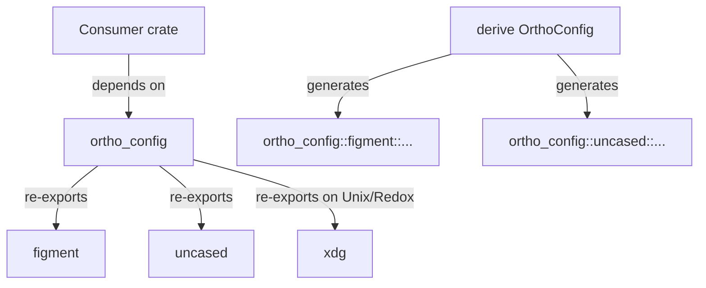

# OrthoConfig user's guide

`OrthoConfig` is a Rust library that unifies command‑line arguments,
environment variables and configuration files into a single, strongly typed
configuration struct. It is inspired by tools such as `esbuild` and is designed
to minimize boiler‑plate. The library uses `serde` for deserialization and
`clap` for argument parsing, while `figment` provides layered configuration
management. This guide covers the functionality currently implemented in the
repository.

## Core concepts and motivation

Rust projects often wire together `clap` for CLI parsing, `serde` for
de/serialization, and ad‑hoc code for loading `*.toml` files or reading
environment variables. Mapping between different naming conventions (kebab‑case
flags, `UPPER_SNAKE_CASE` environment variables, and `snake_case` struct
fields) can be tedious. `OrthoConfig` addresses these problems by letting
developers describe their configuration once and then automatically loading
values from multiple sources. The core features are:

- **Layered configuration** – Configuration values can come from application
  defaults, configuration files, environment variables and command‑line
  arguments. Later sources override earlier ones. Command‑line arguments have
  the highest precedence and defaults the lowest.

- **Orthographic naming** – A single field in a Rust struct is automatically
  mapped to a CLI flag (kebab‑case), an environment variable (upper snake case
  with a prefix), and a file key (snake case). This removes the need for manual
  aliasing.

- **Type‑safe deserialization** – Values are deserialized into strongly typed
  Rust structs using `serde`.

- **Easy adoption** – A procedural macro `#[derive(OrthoConfig)]` adds the
  necessary code. Developers only need to derive `serde` traits on their
  configuration struct and call a generated method to load the configuration.

- **Customizable behaviour** – Attributes such as `default`, `cli_long`,
  `cli_short`, and `merge_strategy` provide fine‑grained control over naming
  and merging behaviour.
- **Declarative merge tooling** – Every configuration struct exposes a
  `merge_from_layers` helper along with `MergeComposer`, making it simple to
  compose defaults, files, environment captures, and CLI values in unit tests
  or bespoke loaders without instantiating the CLI parser. Vector fields honour
  the append strategy by default, so defaults flow through alongside
  environment and CLI additions.

The workspace bundles an executable Hello World example under
`examples/hello_world`. It layers defaults, environment variables, and CLI
flags via the derive macro; see its
[README](https://github.com/leynos/ortho-config/blob/v0.8.0/examples/hello_world/README.md)
 for a step-by-step walkthrough and the `rstest-bdd` (Behaviour-Driven
Development) scenarios that validate behaviour end-to-end.

Run `make test` to execute the example’s coverage. The unit suite uses `rstest`
fixtures to exercise parsing, validation, and command planning across
parameterized edge-cases (conflicting delivery modes, blank salutations, and
custom punctuation). Behavioural coverage comes from the `rstest-bdd`
integration test under `tests/rstest_bdd`, which spawns the compiled binary
inside a temporary working directory, layers `.hello_world.toml` defaults via
`cap-std`, and sets `HELLO_WORLD_*` environment variables per scenario to
demonstrate precedence: configuration files < environment variables < CLI
arguments. Scenarios tagged `@requires.yaml` are gated by compile-time tag
filters, so non-`yaml` builds skip them automatically.

`ConfigDiscovery` exposes the same search order used by the example so
applications can replace bespoke path juggling with a single call. By default
the helper honours `HELLO_WORLD_CONFIG_PATH`, then searches
`$XDG_CONFIG_HOME/hello_world`, each entry in `$XDG_CONFIG_DIRS` (falling back
to `/etc/xdg` on Unix-like targets), Windows application data directories,
`$HOME/.config/hello_world`, `$HOME/.hello_world.toml`, and finally the project
root. Candidates are deduplicated in precedence order (case-insensitively on
Windows). Call `utf8_candidates()` to receive a `Vec<camino::Utf8PathBuf>`
without manual conversions:

```rust,no_run
use ortho_config::ConfigDiscovery;

# fn load() -> ortho_config::OrthoResult<()> {
let discovery = ConfigDiscovery::builder("hello_world")
    .env_var("HELLO_WORLD_CONFIG_PATH")
    .build();

if let Some(figment) = discovery.load_first()? {
    // Extract your configuration struct from the figment here.
    println!(
        "Loaded configuration from {:?}",
        discovery.candidates().first()
    );
} else {
    // Fall back to defaults when no configuration files exist.
}
# Ok(())
# }
```

The repository ships `config/overrides.toml`, which extends
`config/baseline.toml` to set `is_excited = true`, provide a `Layered hello`
preamble, and swap the greet punctuation for `!!!`. Behavioural tests and demo
scripts assert the uppercase output to guard this layering.

### Declarative merging

The derive macro now emits helpers for composing configuration layers without
going through Figment directly. `MergeComposer` collects `MergeLayer` instances
for defaults, files, environment, and CLI input; once constructed, pass the
layers to `YourConfig::merge_from_layers` to build the final struct:

```rust
use ortho_config::{MergeComposer, OrthoConfig};
use serde::Deserialize;
use serde_json::json;

#[derive(Debug, Deserialize, OrthoConfig)]
struct AppConfig {
    recipient: String,
    salutations: Vec<String>,
}

let mut composer = MergeComposer::new();
composer.push_defaults(json!({"recipient": "Defaults", "salutations": ["Hi"] }));
composer.push_environment(json!({"salutations": ["Env"] }));
composer.push_cli(json!({"recipient": "Cli" }));

let merged = AppConfig::merge_from_layers(composer.layers())?;
assert_eq!(merged.recipient, "Cli");
assert_eq!(
    merged.salutations,
    vec![String::from("Hi"), String::from("Env")]
);
```

This API surfaces the same precedence as the generated `load()` method while
making it trivial to drive unit and behavioural tests with hand-crafted layers.
`Vec<_>` fields accumulate values from each layer in order, so defaults can
coexist with environment or CLI extensions. The Hello World example’s
behavioural suite includes a dedicated scenario that parses JSON descriptors
into `MergeLayer` values and asserts the merged configuration via these
helpers. Unit tests can mirror this approach with `rstest` fixtures: define
fixtures for default payloads, then enumerate cases for file, environment, and
CLI layers. This validates every precedence permutation without copy-pasting
setup.

Every derived configuration also exposes `compose_layers()` and
`compose_layers_from_iter(...)`. These helpers discover configuration files,
serialize environment variables, and capture CLI input as a `LayerComposition`,
keeping discovery separate from merging. The returned composition includes both
the ordered layers and any collected errors, letting callers push additional
layers or aggregate errors before invoking `merge_from_layers`.

### Post-merge hooks

Some configuration structs require custom adjustments after the standard merge
pipeline completes. The `PostMergeHook` trait provides an opt-in hook that the
library invokes automatically when the `#[ortho_config(post_merge_hook)]`
attribute is present.

```rust
use ortho_config::{OrthoConfig, OrthoResult, PostMergeContext, PostMergeHook};
use serde::{Deserialize, Serialize};

#[derive(Debug, Default, Deserialize, Serialize, OrthoConfig)]
#[ortho_config(prefix = "APP_", post_merge_hook)]
struct GreetArgs {
    #[ortho_config(default = String::from("!"))]
    punctuation: String,
    preamble: Option<String>,
}

impl PostMergeHook for GreetArgs {
    fn post_merge(&mut self, _ctx: &PostMergeContext) -> OrthoResult<()> {
        // Normalize whitespace-only preambles to None
        if self.preamble.as_ref().is_some_and(|p| p.trim().is_empty()) {
            self.preamble = None;
        }
        Ok(())
    }
}
```

The `PostMergeContext` provides metadata about the merge process:

- `prefix()` – the environment variable prefix used during loading
- `loaded_files()` – paths of configuration files that contributed to the merge
- `has_cli_input()` – whether CLI arguments were present in the merge

Use post-merge hooks sparingly. Most configuration needs are satisfied by the
standard merge pipeline combined with field-level attributes like
`cli_default_as_absent` and `merge_strategy`. Hooks are best suited for:

- Normalizing values after all layers have been applied
- Performing validation that depends on multiple fields being merged
- Conditional transformations based on which sources contributed

The Hello World example demonstrates this pattern with `GreetCommand`, which
uses a post-merge hook to clean up whitespace-only preambles.

### Localizing CLI copy

`ortho_config` exposes a `Localizer` trait, so applications can swap the text
`clap` displays without abandoning sensible defaults. Each implementation is
`Send + Sync` and returns owned `String` instances, making it cheap to cache
resolved messages or fall back to the stock help text. The helper type
`LocalizationArgs<'a> = HashMap<&'a str, FluentValue<'a>>` mirrors Fluent’s
placeholder model, keeping argument-aware lookups ergonomic.

The crate now ships a Fluent-backed implementation. `FluentLocalizer` embeds an
English catalogue at `locales/en-US/messages.ftl`, layers any consumer bundles
over those defaults, logs formatting errors with `tracing`, and falls back to
the next bundle when a lookup fails:

```rust
use ortho_config::{langid, FluentLocalizer, LocalizationArgs, Localizer};

static APP_EN: &str = include_str!("../locales/en-US/app.ftl");

let localizer = FluentLocalizer::builder(langid!("en-US"))
    .with_consumer_resources([APP_EN])
    .try_build()
    .expect("embedded locales load successfully");

let mut args: LocalizationArgs<'_> = LocalizationArgs::default();
args.insert("binary", "demo".into());
assert_eq!(
localizer
    .lookup("cli.usage", Some(&args))
    .expect("usage copy exists"),
    "Usage: demo [OPTIONS] <COMMAND>"
);
```

Applications can inject a custom logger with `with_error_reporter` when they
need to capture Fluent formatting errors alongside command parsing failures.

The Hello World example ships `hello_world::localizer::DemoLocalizer`, which
builds a `FluentLocalizer` from `examples/hello_world/locales/en-US` and drives
`CommandLine::command().localize(&localizer)` and
`CommandLine::try_parse_localized_env`. If the localization setup ever fails,
the example falls back to `NoOpLocalizer`, preserving the stock `clap` strings
until translations are fixed.

Errors surfaced by `clap` can be localized as well. Use
`localize_clap_error_with_command` to map each `ErrorKind` to a Fluent
identifier of the form `clap-error-<kebab-case>`, forwarding argument context
such as the missing flag or the offending value. Supplying the command enables
the helper to populate missing context (for example, the available subcommands
when `clap` emits `DisplayHelpOnMissingArgumentOrSubcommand`). When no
translation exists, the helper returns the original `clap` error unchanged:

```rust
use clap::CommandFactory;
use ortho_config::{localize_clap_error_with_command, Localizer};

# #[derive(clap::Parser)]
# struct Cli {}
fn parse(localizer: &dyn Localizer) -> Result<Cli, clap::Error> {
    let mut command = Cli::command().localize(localizer);
    let mut matches = command
        .try_get_matches()
        .map_err(|err| {
            localize_clap_error_with_command(err, localizer, Some(&command))
        })?;

    Cli::from_arg_matches_mut(&mut matches).map_err(|err| {
        let err = err.with_cmd(&command);
        localize_clap_error_with_command(err, localizer, Some(&command))
    })
}
```

## Installation and dependencies

Add `ortho_config` as a dependency in `Cargo.toml` along with `serde`:

```toml
[dependencies]
ortho_config = "0.8.0"            # replace with the latest version
serde = { version = "1.0", features = ["derive"] }
clap = { version = "4", features = ["derive"] }    # required for CLI support
```

By default, only TOML configuration files are supported. To enable JSON5
(`.json` and `.json5`) and YAML (`.yaml` and `.yml`) support, enable the
corresponding cargo features:

```toml
[dependencies]
ortho_config = { version = "0.8.0", features = ["json5", "yaml"] }
# Enabling these features expands file formats; precedence stays: defaults < file < env < CLI.
```

Enabling the `json5` feature causes both `.json` and `.json5` files to be
parsed using the JSON5 format. Without this feature, these files are ignored
during discovery and do not cause errors if present. The `yaml` feature
similarly enables `.yaml` and `.yml` files; without it, such files are skipped
during discovery and do not cause errors if present.

`ortho_config` re-exports its parsing dependencies, so consumers do not need to
declare them directly. Access `figment`, `uncased`, `xdg` (on Unix-like and
Redox targets), and the optional parsers (`figment_json5`, `json5`,
`serde_saphyr`, `toml`) via `ortho_config::` paths. The `serde_json` re-export
is enabled by default because the crate relies on it internally; disable
default features only when explicitly opting back into `serde_json`.

### Dependency architecture for derive macro users

The `#[derive(OrthoConfig)]` macro emits fully qualified paths rooted at
`ortho_config`. For example, generated code references
`ortho_config::figment::Figment` and `ortho_config::uncased::Uncased` rather
than `figment::...` or `uncased::...`. Those paths resolve because
`ortho_config` re-exports these crates.

For screen readers: The following diagram shows that generated code references
re-exported crates through `ortho_config`, so consumer crates can rely on the
runtime crate dependency.



_Figure 1: Derive output resolves parser crates through `ortho_config`._

In the common case, `Cargo.toml` does not need direct `figment`, `uncased`, or
`xdg` dependencies:

```toml
[dependencies]
ortho_config = "0.8.0"
serde = { version = "1.0", features = ["derive"] }
clap = { version = "4", features = ["derive"] }
```

### Troubleshooting dependency errors

- If source code imports `figment`, `uncased`, or `xdg` directly, either switch
  imports to `ortho_config::figment` / `ortho_config::uncased` /
  `ortho_config::xdg`, or keep explicit dependencies for that direct usage.
- If derive output fails with unresolved `ortho_config::...` paths, ensure the
  dependency key is named `ortho_config` in `Cargo.toml` or use the
  `#[ortho_config(crate = "...")]` attribute to specify the alias.
- **Dependency aliasing** is supported via the `crate` attribute. When
  renaming the dependency in `Cargo.toml` (for example,
  `my_cfg = { package = "ortho_config", ... }`), add
  `#[ortho_config(crate = "my_cfg")]` to the struct so generated code
  references the correct crate path.
- If dependency resolution reports conflicts, inspect duplicates with
  `cargo tree -d` and prefer the versions selected through `ortho_config`
  unless direct usage requires something else.

### FAQ: should `figment`, `uncased`, or `xdg` be direct dependencies?

No for derive-generated code. Yes, only when application code directly imports
those crates without going through the `ortho_config::` re-exports.

YAML parsing is handled by the pure-Rust `serde-saphyr` crate. It adheres to
the YAML 1.2 specification, so unquoted scalars such as `yes`, `on`, and `off`
remain strings. The provider enables `Options::strict_booleans`, ensuring only
`true` and `false` deserialize as booleans, while legacy YAML 1.1 literals are
treated as plain strings. Duplicate mapping keys surface as parsing errors
instead of silently accepting the last entry, helping catch typos early.

## Migrating from earlier versions

Projects using a pre‑0.5 release can upgrade with the following steps:

- `#[derive(OrthoConfig)]` remains the correct way to annotate configuration
  structs. No additional derives are required.
- Remove any `load_with_reference_fallback` helpers. The merge logic inside
  `load_and_merge_subcommand_for` supersedes this workaround.
- Replace calls to deprecated helpers such as `load_subcommand_config_for` with
  `ortho_config::subcommand::load_and_merge_subcommand_for` or import
  `ortho_config::SubcmdConfigMerge` to call `load_and_merge` directly.

Import it with:

```rust
use ortho_config::SubcmdConfigMerge;
```

Subcommand structs can leverage the `SubcmdConfigMerge` trait to expose a
`load_and_merge` method automatically:

```rust
use ortho_config::{OrthoConfig, OrthoResult};
use ortho_config::SubcmdConfigMerge;
use serde::Deserialize;

#[derive(Deserialize, OrthoConfig)]
struct PrArgs {
    reference: String,
}

# fn demo(pr_args: &PrArgs) -> OrthoResult<()> {
let merged = pr_args.load_and_merge()?;
# let _ = merged;
# Ok(())
# }
```

After parsing the relevant subcommand struct, call `load_and_merge()?` on that
value (for example, `pr_args.load_and_merge()?`) to obtain the merged
configuration for that subcommand.

## Defining configuration structures

A configuration is represented by a plain Rust struct. To take advantage of
`OrthoConfig`, derive the following traits:

- `serde::Deserialize` and `serde::Serialize` – required for deserializing
  values and merging overrides.

- The derive macro generates a hidden `clap::Parser` implementation, so
  manual `clap` annotations are not required in typical use. CLI customization
  is performed using `ortho_config` attributes such as `cli_short`, or
  `cli_long`.

- `OrthoConfig` – provided by the library. This derive macro generates the code
  to load and merge configuration from multiple sources.

Optionally, the struct can include a `#[ortho_config(prefix = "PREFIX")]`
attribute. The prefix sets a common string for environment variables and
configuration file names. When the attribute omits a trailing underscore,
`ortho_config` appends one automatically so environment variables consistently
use `<PREFIX>_`. Trailing underscores are trimmed and the prefix is lower‑cased
when used to form file names. For example, a prefix of `APP` results in
environment variables like `APP_PORT` and file names such as `.app.toml`.

### Field-level attributes

Field attributes modify how a field is sourced or merged:

| Attribute                   | Behaviour                                                                                                                                                                                       |
| --------------------------- | ----------------------------------------------------------------------------------------------------------------------------------------------------------------------------------------------- |
| `default = expr`            | Supplies a default value when no source provides one. The expression can be a literal or a function path.                                                                                       |
| `cli_long = "name"`         | Overrides the automatically generated long CLI flag (kebab-case).                                                                                                                               |
| `cli_short = 'c'`           | Adds a single-letter short flag for the field.                                                                                                                                                  |
| `merge_strategy = "append"` | For `Vec<T>` fields, specifies that values from different sources should be concatenated. This is currently the only supported strategy and is the default for vector fields.                   |
| `cli_default_as_absent`     | Treats typed clap defaults (`default_value_t`, `default_values_t`) as absent during configuration merging. File and environment values take precedence, while explicit CLI overrides still win. |

Unrecognized keys are ignored by the derive macro for forwards compatibility.
Unknown keys will therefore silently do nothing. Developers who require
stricter validation may add manual `compile_error!` guards.

Vector append buffers operate on raw JSON values, so element types only need to
implement `serde::Deserialize`. Deriving `serde::Serialize` remains useful when
applications serialize configuration back out (for example, to emit defaults),
but it is no longer required merely to opt into the append strategy.

By default, each field receives a long flag derived from its name in kebab‑case
and a short flag. The macro chooses the short flag using these rules:

- Use the field's first ASCII alphanumeric character.
- If that character is already taken or reserved, try its uppercase form.
- If both are unavailable, no short flag is assigned; specify `cli_short` to
  resolve the collision.

| Scenario                          | Result                 |
| --------------------------------- | ---------------------- |
| First letter free                 | `-p`                   |
| Lowercase taken; uppercase free   | `-P`                   |
| Both cases taken                  | none (set `cli_short`) |
| Explicit override via `cli_short` | `-r`                   |

Collisions are evaluated against short flags already assigned within the same
parser, and reserved characters such as clap's `-h` and `-V`. A character is
considered taken if it matches either set.

The macro does not scan other characters in the field name when deriving the
short flag. Short flags must be single ASCII alphanumeric characters and may
not use clap's global `-h` or `-V` options. Long flags must contain only ASCII
alphanumeric characters or hyphens, must not start with `-`, cannot be named
`help` or `version`, and the macro rejects underscores.

For example, when multiple fields begin with the same character, `cli_short`
can disambiguate the final field:

```rust
#[derive(OrthoConfig)]
struct Options {
    port: u16,                         // -p
    path: String,                      // -P
    #[ortho_config(cli_short = 'r')]
    peer: String,                      // -r via override
}
```

### Example configuration struct

The following example illustrates many of these features:

```rust
  use ortho_config::{OrthoConfig, OrthoError};
  use serde::{Deserialize, Serialize};

  #[derive(Debug, Clone, Deserialize, Serialize, OrthoConfig)]
  // env vars use APP_ (the macro adds the underscore automatically)
  #[ortho_config(prefix = "APP")]
  struct AppConfig {
      /// Logging verbosity
      log_level: String,

    /// Port to bind on – defaults to 8080 when unspecified
    #[ortho_config(default = 8080)]
    port: u16,

    /// Optional list of features. Values from files, environment and CLI are appended.
    #[ortho_config(merge_strategy = "append")]
    features: Vec<String>,

    /// Nested configuration for the database. A separate prefix is used to avoid ambiguity.
    #[serde(flatten)]
    database: DatabaseConfig,

    /// Enable verbose output; also available as -v via cli_short
    #[ortho_config(cli_short = 'v')]
    verbose: bool,
  }

#[derive(Debug, Clone, Deserialize, Serialize, OrthoConfig)]
#[ortho_config(prefix = "DB")]               // used in conjunction with APP_ prefix to form APP_DB_URL
struct DatabaseConfig {
    url: String,

    #[ortho_config(default = 5)]
    pool_size: Option<u32>,
}

fn main() -> Result<(), OrthoError> {
    // Parse CLI arguments and merge with defaults, file and environment
    let config = AppConfig::load()?;
    println!("Final config: {:#?}", config);
    Ok(())
}
```

`clap` attributes are not required in general; flags are derived from field
names and `ortho_config` attributes. In this example, the `AppConfig` struct
uses a prefix of `APP`. The `DatabaseConfig` struct declares a prefix `DB`,
resulting in environment variables such as `APP_DB_URL`. The `features` field
is a `Vec<String>` and accumulates values from multiple sources rather than
overwriting them.

### Customising configuration discovery

Configuration discovery can be tailored per struct using the `discovery(...)`
attribute. The keys recognised today include:

- `app_name`: directory name used under XDG and application data folders.
- `env_var`: override for the environment variable consulted before discovery
  runs (defaults to `<PREFIX>CONFIG_PATH`).
- `config_file_name`: primary filename searched in platform-specific
  configuration directories (defaults to `config.toml`).
- `dotfile_name`: dotfile name consulted in the current working directory and
  the user's home directory.
- `project_file_name`: filename searched within project roots (defaults to the
  dotfile name).
- `config_cli_long` / `config_cli_short`: rename the CLI flag used to provide an
  explicit configuration path.
- `config_cli_visible`: when `true`, the generated CLI flag appears in help
  output instead of remaining hidden.

Supplying only the keys you need lets you rename the CLI flag without altering
file discovery, or vice versa. When the attribute is omitted, the defaults
described in [Config path override](#config-path-override) continue to apply.

## Loading configuration and precedence rules

### How loading works

The `load_from_iter` method (used by the convenience `load`) performs the
following steps:

1. Builds a `figment` configuration profile. A defaults provider constructed
   from the `#[ortho_config(default = …)]` attributes is added first.

2. Attempts to load a configuration file. Candidate file paths are searched in
   the following order:

    1. If provided, a path supplied via the CLI flag generated by the
       `discovery(...)` attribute (which defaults to a hidden `--config-path`)
       or the `<PREFIX>CONFIG_PATH` environment variable (for example,
       `APP_CONFIG_PATH` or `CONFIG_PATH`) takes precedence; see
       [Config path override](#config-path-override).

    2. A dotfile named `.<prefix>.toml` in the current working directory.

    3. A dotfile of the same name in the user's home directory.

    4. On Unix‑like systems, the XDG configuration directory (e.g.
       `~/.config/app/config.toml`) is searched using the `xdg` crate; on
       Windows, the `%APPDATA%` and `%LOCALAPPDATA%` directories are checked.

    5. If the `json5` or `yaml` features are enabled, files with `.json`,
       `.json5`, `.yaml`, or `.yml` extensions are also considered in these
       locations.

3. Adds an environment provider using the prefix specified on the struct. Keys
   are upper‑cased and nested fields use double underscores (`__`) to separate
   components.

4. Adds a provider containing the CLI values (captured as `Option<T>` fields)
   as the final layer.

5. Merges vector fields according to the `merge_strategy` (currently only
   `append`) so that lists of values from lower precedence sources are extended
   with values from higher precedence ones.

6. Attempts to extract the merged configuration into the concrete struct. On
   success it returns the completed configuration; otherwise an `OrthoError` is
   returned.

### Config path override

The derive macro always recognises a configuration override flag and the
associated environment variables even when you do not declare a field
explicitly. By default a hidden `--config-path` flag is accepted alongside
`<PREFIX>CONFIG_PATH` and the unprefixed `CONFIG_PATH`. Applying the
struct-level `discovery(...)` attribute customises this behaviour, allowing you
to rename or expose the CLI flag and adjust the filenames searched during
discovery:

```rust
#[derive(Debug, Deserialize, ortho_config::OrthoConfig)]
#[ortho_config(
    prefix = "APP_",
    discovery(
        app_name = "demo",
        env_var = "DEMO_CONFIG_PATH",
        config_file_name = "demo.toml",
        dotfile_name = ".demo.toml",
        project_file_name = ".demo.toml",
        config_cli_long = "config",
        config_cli_short = 'c',
        config_cli_visible = true,
    )
)]
struct CliArgs {
    #[ortho_config(default = 8080)]
    port: u16,
}
```

The snippet above exposes a visible `--config`/`-c` flag, renames the
environment override to `DEMO_CONFIG_PATH`, and instructs discovery to search
for `demo.toml` (and `.demo.toml`) within the standard directories. Omitting
`config_cli_visible` keeps the flag hidden while still parsing it, and leaving
`config_cli_short` unset skips the short alias. When the `discovery(...)`
attribute is absent, the defaults—hidden `--config-path`, `<PREFIX>CONFIG_PATH`
and `CONFIG_PATH`, and the automatically derived dotfile names—remain in effect.

### Source precedence

Values are loaded from each layer in a specific order. Later layers override
earlier ones. The precedence, from lowest to highest, is:

1. **Application‑defined defaults** – values provided via `default` attributes
   or `Option<T>` fields are considered defaults.

2. **Configuration file** – values from a TOML (or JSON5/YAML) file loaded from
   one of the paths listed above.

3. **Environment variables** – variables prefixed with the struct's `prefix`
   (e.g. `APP_PORT`, `APP_DATABASE__URL`) override file values.

4. **Command‑line arguments** – values parsed by `clap` override all other
   sources.

Nested structs are flattened in the environment namespace by joining field
names with double underscores. For example, if `AppConfig` has a nested
`database` field and the prefix is `APP`, then `APP_DATABASE__URL` sets the
`database.url` field. If a nested struct has its own prefix attribute, that
prefix is used for its fields (e.g. `APP_DB_URL`).

When `clap`'s `flatten` attribute is employed to compose argument groups, the
flattened struct is initialized even if no CLI flags within the group are
specified. During merging, `ortho_config` discards these empty groups so that
values from configuration files or the environment remain in place unless a
field is explicitly supplied on the command line.

### Using defaults and optional fields

Fields of type `Option<T>` are treated as optional values. If no source
provides a value for an `Option<T>` field then it remains `None`. To provide a
default value for a non‑`Option` field or for an `Option<T>` field that should
have an initial value, specify `#[ortho_config(default = expr)]`. This default
acts as the lowest‑precedence source and is overridden by file, environment or
CLI values.

### Environment variable naming

Environment variables are upper‑cased and use underscores. The struct‑level
prefix (if supplied) is prepended without any separator, and nested fields are
separated by double underscores. For the `AppConfig` and `DatabaseConfig`
example above, valid environment variables include `APP_LOG_LEVEL`, `APP_PORT`,
`APP_DATABASE__URL` and `APP_DATABASE__POOL_SIZE`. If the nested struct has its
own prefix (`DB`), then the environment variable becomes `APP_DB_URL`.

Comma-separated values such as `DDLINT_RULES=A,B,C` are parsed as lists. The
loader converts these strings into arrays before merging, so array fields
behave the same across environment variables, CLI arguments and configuration
files. Values containing literal commas must be wrapped in quotes or brackets
to disable list parsing.

## Configuration inheritance

A configuration file may specify an `extends` key pointing to another file. The
referenced file is loaded first and the current file's values override it. The
path is resolved relative to the file containing the `extends` directive.
Missing files raise a not-found error that includes both the resolved absolute
path and the file that declared `extends`, making it clear what needs to be
created. Precedence across all sources becomes base file → extending file →
environment variables → CLI flags. Cycles are detected and reported via a
`CyclicExtends` error. Prefix handling and subcommand namespaces work as normal
when inheritance is in use.

## Dynamic rule tables

Map fields such as `BTreeMap<String, RuleConfig>` allow configuration files to
declare arbitrary rule keys. Any table nested under `rules.<name>` is
deserialized into the map without prior knowledge of the key names. This
enables use cases like:

```toml
[rules.consistent-casing]
enabled = true
[rules.no-tabs]
enabled = false
```

Each entry becomes a map key with its associated struct value.

## Ignore patterns

Lists of files or directories to exclude can be specified via comma-separated
environment variables and CLI flags. Values are merged using the `append`
strategy, so that configuration defaults are extended by environment variables
and finally by the CLI. Whitespace around entries is trimmed and duplicates are
preserved. For example:

```bash
DDLINT_IGNORE_PATTERNS=".git/,build/"
mytool --ignore-patterns target/
```

results in `ignore_patterns = [".git/", "build/", "target/"]`.

By default, the ignore-pattern list includes `[".git/", "build/", "target/"]`.
These defaults are extended (not replaced) by environment variables and CLI
flags via the `append` merge strategy.

## Subcommand configuration

Many CLI applications use `clap` subcommands to perform different operations.
`OrthoConfig` supports per‑subcommand defaults via a dedicated `cmds`
namespace. The helper function `load_and_merge_subcommand_for` loads defaults
for a specific subcommand and merges them beneath the CLI values. The merged
struct is returned as a new instance; the original `cli` struct remains
unchanged. CLI fields left unset (`None`) do not override environment or file
defaults, avoiding accidental loss of configuration.

### How it works

When a struct derives `OrthoConfig`, it also implements the associated
`prefix()` method. This method returns the configured prefix string.
`load_and_merge_subcommand_for(prefix, cli_struct)` uses this prefix to build a
`cmds.<subcommand>` section name for the configuration file and an
`PREFIX_CMDS_SUBCOMMAND_` prefix for environment variables. Configuration is
loaded in the same order as global configuration (defaults → file → environment
→ CLI), but only values in the `[cmds.<subcommand>]` section or environment
variables beginning with `PREFIX_CMDS_<SUBCOMMAND>_` are considered.

### Example

Suppose an application has a `pr` subcommand that accepts a `reference`
argument and a `repo` global option. With `OrthoConfig` the argument structures
might be defined as follows:

```rust
use clap::Parser;
use ortho_config::OrthoConfig;
use ortho_config::SubcmdConfigMerge;
use serde::{Deserialize, Serialize};

#[derive(Parser, Deserialize, Serialize, Debug, OrthoConfig, Clone, Default)]
#[ortho_config(prefix = "VK")]               // all variables start with VK
pub struct GlobalArgs {
    pub repo: Option<String>,
}

#[derive(Parser, Deserialize, Serialize, Debug, OrthoConfig, Clone, Default)]
#[ortho_config(prefix = "VK")]               // subcommands share the same prefix
pub struct PrArgs {
    #[arg(required = true)]
    pub reference: Option<String>,            // optional for merging defaults but required on the CLI
}

fn main() -> Result<(), ortho_config::OrthoError> {
    let cli_pr = PrArgs::parse();
    // Merge defaults from [cmds.pr] and VK_CMDS_PR_* over CLI
    let merged_pr = cli_pr.load_and_merge()?;
    println!("PrArgs after merging: {:#?}", merged_pr);
    Ok(())
}
```

A configuration file might include:

```toml
[cmds.pr]
reference = "https://github.com/leynos/mxd/pull/31"

[cmds.issue]
reference = "https://github.com/leynos/mxd/issues/7"
```

and environment variables could override these defaults:

```bash
VK_CMDS_PR_REFERENCE=https://github.com/owner/repo/pull/42
VK_CMDS_ISSUE_REFERENCE=https://github.com/owner/repo/issues/101
```

Within the `vk` example repository, the global `--repo` option is provided via
the `GlobalArgs` struct. A developer can set this globally using the
environment variable `VK_REPO` without passing `--repo` on every invocation.
Subcommands `pr` and `issue` load their defaults from the `cmds` namespace and
environment variables. If the `reference` field is missing in the defaults, the
tool continues using the CLI value instead of exiting with an error.

### Merging a selected subcommand enum

When the root CLI parses into a `Commands` enum, it is possible to derive
`ortho_config_macros::SelectedSubcommandMerge` and import the
`SelectedSubcommandMerge` trait from `ortho_config` to merge the selected
variant in one call, instead of matching only to call `load_and_merge()` per
branch.

Variants that rely on `cli_default_as_absent` (because they use
`default_value_t`) should be annotated with `#[ortho_subcommand(with_matches)]`
so the merge can consult `ArgMatches` and treat clap defaults as absent.

To load the global configuration and merge the selected subcommand in one
expression, use `load_globals_and_merge_selected_subcommand` and supply a
global loader as a closure.

```rust
use clap::{CommandFactory, FromArgMatches, Parser, Subcommand};
use ortho_config::{SelectedSubcommandMerge, load_globals_and_merge_selected_subcommand};

#[derive(Parser)]
struct Cli {
    #[command(subcommand)]
    command: Commands,
}

#[derive(Subcommand, ortho_config_macros::SelectedSubcommandMerge)]
enum Commands {
    #[ortho_subcommand(with_matches)]
    Greet(GreetArgs),
    Run(RunArgs),
}

// Placeholder types for the example; real subcommands define fields and derive
// `OrthoConfig`.
struct GreetArgs;
struct RunArgs;

fn main() -> Result<(), Box<dyn std::error::Error>> {
let mut cmd = Cli::command();
let matches = cmd.get_matches();
let cli = Cli::from_arg_matches(&matches)?;
let (_globals, _merged) = load_globals_and_merge_selected_subcommand(
    &matches,
    cli.command,
    || Ok::<_, std::io::Error>(()),
)?;
Ok(())
}
```

### Hello world walkthrough

<https://github.com/leynos/ortho-config/tree/main/examples/hello_world>

The `hello_world` example crate demonstrates these patterns in a compact
setting. Global options such as `--recipient` or `--salutation` are resolved by
`load_global_config`, which now reuses
`HelloWorldCli::compose_layers_from_iter` to collect defaults, discovered files
and environment variables before applying CLI overrides. When callers pass
`-s/--salutation`, the helper clears earlier vector contributions, so CLI input
replaces file or environment values. The `greet` subcommand adds optional
behaviour like a preamble (`--preamble "Good morning"`) or custom punctuation
while reusing the merged global configuration. The `take-leave` subcommand
combines switches and optional arguments (`--wave`, `--gift`,
`--channel email`, `--remind-in 15`) alongside greeting adjustments
(`--preamble "Until next time"`, `--punctuation ?`) to describe how the
farewell should unfold. Each subcommand struct derives `OrthoConfig` so
defaults from `[cmds.greet]` or `[cmds.take-leave]` merge automatically when
`load_and_merge_selected()` is invoked on the derived `Commands` enum.

Behavioural tests in `examples/hello_world/tests` exercise scenarios such as
`hello_world greet --preamble "Good morning"` and running
`hello_world --is-excited take-leave` with `--gift biscuits`, `--remind-in 15`,
`--channel email`, and `--wave`. These end-to-end checks verify that CLI
arguments override configuration files and that validation errors surface
cleanly when callers provide blank strings or conflicting switches.

Sample configuration files live in `examples/hello_world/config`. The
`baseline.toml` defaults underpin both the automated tests and the demo
scripts, while `overrides.toml` extends the baseline to demonstrate inheritance
by adjusting the recipient and salutation. The paired `scripts/demo.sh` and
`scripts/demo.cmd` helpers copy these files into a temporary directory before
running `cargo run -p hello_world`, illustrating how file defaults, environment
variables, and CLI arguments override one another without mutating the working
tree.

### Treating clap defaults as absent

Non‑`Option` fields annotated with `#[arg(default_value_t = ...)]` normally
override configuration files and environment variables because `clap` always
populates them. The `cli_default_as_absent` attribute changes this behaviour:
when the user does not explicitly provide a value on the command line, the
field is excluded from the CLI layer so that file and environment values take
precedence.

Add `cli_default_as_absent` and define the default in clap. The derive macro
now infers the struct default from clap's default metadata, so the default only
needs to be declared once:

```rust
#[derive(Parser, Deserialize, Serialize, OrthoConfig)]
#[ortho_config(prefix = "APP_")]
struct GreetArgs {
    #[arg(long, default_value_t = String::from("!"))]
    #[ortho_config(cli_default_as_absent)]
    punctuation: String,
}
```

`default_value_t` and `default_values_t` are supported for inferred defaults.
`default_value` inference is intentionally unsupported for now; use
`default_value_t` or add an explicit `#[ortho_config(default = ...)]` to avoid
string-parser mismatches. Parser-faithful `default_value` inference is planned
as a day-2 follow-up.

If `#[ortho_config(default = ...)]` is still provided, that explicit value
remains available for generated defaults/documentation metadata.

**Precedence with the attribute (lowest to highest):**

1. Struct default (`#[ortho_config(default = ...)]` or inferred from clap)
2. Configuration file
3. Environment variable
4. Explicit CLI override (e.g. `--punctuation "?"`)

Without `cli_default_as_absent`, the clap default would always beat the file
and environment layers. With the attribute, calling `greet` without
`--punctuation` allows a `[cmds.greet] punctuation = "?"` file entry or
`APP_CMDS_GREET_PUNCTUATION=?` environment variable to win.

When using this attribute, pass the `ArgMatches` so the crate can inspect
`value_source()`:

```rust
let matches = GreetArgs::command().get_matches();
let cli = GreetArgs::from_arg_matches(&matches)?;
let merged = cli.load_and_merge_with_matches(&matches)?;
```

Clap's `value_source()` uses argument IDs (the field identifier unless
`#[arg(id = "...")]` overrides it). This behaviour requires the `serde_json`
feature (enabled by default).

### Dispatching with `clap‑dispatch`

The `clap‑dispatch` crate can be combined with `OrthoConfig` to simplify
subcommand execution. Each subcommand struct implements a trait defining the
action to perform. An enum of subcommands is annotated with
`#[clap_dispatch(fn run(...))]`, and the `load_and_merge_subcommand_for`
function can be called on each variant before dispatching. See the
`Subcommand Configuration` section of the `OrthoConfig`
[README](https://github.com/leynos/ortho-config/blob/v0.8.0/README.md) for a
complete example.

## Error handling

`load` and `load_and_merge_subcommand_for` return `OrthoResult<T>`, an alias
for `Result<T, Arc<OrthoError>>`. `OrthoError` wraps errors from `clap`, file
I/O and `figment`. Failures during the final merge of CLI values over
configuration sources surface as the `Merge` variant, providing clearer
diagnostics when the combined data is invalid. When multiple sources fail, the
errors are collected into the `Aggregate` variant so callers can inspect each
individual failure. Consumers should handle these errors appropriately, for
example by printing them to stderr and exiting. If required fields are missing
after merging, the crate returns `OrthoError::MissingRequiredValues` with a
user‑friendly list of missing paths and hints on how to provide them. For
example:

```plaintext
Missing required values:
  sample_value (use --sample-value, SAMPLE_VALUE, or file entry)
```

### Preserving `clap` display exits

When a user passes `--help` or `--version`, `clap` surfaces specialised
`ErrorKind::DisplayHelp` / `DisplayVersion` errors so applications can print
usage text and exit successfully. Deriving `OrthoConfig` often goes hand in
hand with `Cli::try_parse()` so applications can map errors into their own
types. Before performing that conversion, call
`ortho_config::is_display_request` to detect these cases and delegate to
`err.exit()`:

```rust
use clap::Parser;
use ortho_config::{is_display_request, OrthoConfig};

fn parse_cli() -> Result<MyCli, CliError> {
    match MyCli::try_parse() {
        Ok(cli) => Ok(cli),
        Err(mut err) => {
            if is_display_request(&err) {
                err.exit();
            }
            Err(CliError::ArgumentParsing(err.into()))
        }
    }
}
```

The `examples/hello_world` crate applies this pattern in `main.rs`. Behavioural
tests assert that both `--help` and `--version` exit with code 0 so regressions
are caught automatically.

### Aggregating multiple errors

To return multiple errors in one go, use `OrthoError::aggregate`. It accepts
any iterator of items that can be converted into `Arc<OrthoError>` so both
owned and shared errors are supported. If the list might be empty,
`OrthoError::try_aggregate` returns `Option<OrthoError>` instead of panicking:

```rust
use std::sync::Arc;
use ortho_config::OrthoError;

// From bare errors
let err = OrthoError::aggregate(vec![
    OrthoError::Validation { key: "port".into(), message: "must be positive".into() },
    OrthoError::gathering(figment::Error::from("invalid")),
]);

// From shared errors
let err = OrthoError::aggregate(vec![
    Arc::new(OrthoError::Validation { key: "x".into(), message: "bad".into() }),
    OrthoError::gathering_arc(figment::Error::from("boom")),
]);
```

### Gathering vs Merge errors

`OrthoConfig` distinguishes between two phases of configuration loading:

- **Gathering** (`OrthoError::Gathering`): Errors that occur while reading
  configuration sources (files, environment variables). These indicate problems
  with the source data itself, such as malformed TOML or invalid JSON.

- **Merge** (`OrthoError::Merge`): Errors that occur while combining layers and
  deserializing the final configuration. These indicate incompatibilities
  between the merged data and the target struct, such as type mismatches or
  invalid field values.

When deserializing the final merged configuration fails (for example, because a
field has an invalid type after all layers are combined), the error is reported
as `Merge`. This distinction helps diagnose whether an issue lies with a
specific source file (Gathering) or with the combined result of all layers
(Merge).

### Mapping errors ergonomically

To reduce boiler‑plate when converting between error types, the crate exposes
small extension traits:

- `OrthoResultExt::into_ortho()` converts `Result<T, E>` into
  `OrthoResult<T>` when `E: Into<OrthoError>` (e.g., `serde_json::Error`).
- `OrthoMergeExt::into_ortho_merge()` converts `Result<T, figment::Error>`
  into `OrthoResult<T>` as `OrthoError::Merge`.
- `OrthoJsonMergeExt::into_ortho_merge_json()` converts
  `Result<T, serde_json::Error>` into `OrthoResult<T>` as `OrthoError::Merge`,
  preserving location information from the JSON parser.
- `IntoFigmentError::into_figment()` converts `Arc<OrthoError>` (or
  `&Arc<OrthoError>`) into `figment::Error` for interop in tests or adapters,
  cloning the inner error to preserve structured details where possible.
- `ResultIntoFigment::to_figment()` converts `OrthoResult<T>` into
  `Result<T, figment::Error>`.

Examples:

```rust
use ortho_config::{OrthoMergeExt, OrthoResultExt, ResultIntoFigment};

fn sanitize<T: serde::Serialize>(v: &T) -> ortho_config::OrthoResult<serde_json::Value> {
    serde_json::to_value(v).into_ortho()
}

fn extract(fig: figment::Figment) -> ortho_config::OrthoResult<MyCfg> {
    fig.extract::<MyCfg>().into_ortho_merge()
}

fn interop(r: ortho_config::OrthoResult<MyCfg>) -> Result<MyCfg, figment::Error> {
    r.to_figment()
}
```

## Documentation metadata (OrthoConfigDocs)

The derive macro now emits an `OrthoConfigDocs` implementation alongside the
runtime loader. This lets tooling such as `cargo-orthohelp` serialize a stable,
clap-agnostic intermediate representation (IR) for man pages and PowerShell
help.

```rust
use ortho_config::docs::OrthoConfigDocs;

#[derive(serde::Deserialize, serde::Serialize, ortho_config::OrthoConfig)]
#[ortho_config(prefix = "APP")]
struct AppConfig {
    #[ortho_config(default = 8080)]
    port: u16,
}

let ir = AppConfig::get_doc_metadata();
let json = ortho_config::serde_json::to_string_pretty(&ir)?;
println!("{json}");
```

When IDs are not supplied, the macro generates deterministic defaults such as
`{app}.about` for the CLI overview and `{app}.fields.{field}.help` for field
descriptions. Field-level metadata can be refined with `help_id`,
`long_help_id`, `value(type = "...")`, `deprecated(note_id = "...")`,
`env(name = "...")`, and `file(key_path = "...")`. These documentation
attributes affect only the emitted IR; they do not change runtime naming or
loading behaviour.

### Generating IR with cargo-orthohelp

`cargo-orthohelp` compiles a tiny bridge binary that calls
`OrthoConfigDocs::get_doc_metadata()`, resolves Fluent messages per locale, and
writes localized IR JSON into the chosen output directory. Add metadata to the
package `Cargo.toml` so the tool knows which config type to load:

```toml
[package.metadata.ortho_config]
root_type = "hello_world::cli::HelloWorldCli"
locales = ["en-US", "ja"]
```

Run the tool from the project root:

```bash
cargo orthohelp --out-dir target/orthohelp --locale en-US
```

`--cache` reuses any previously generated IR cached under
`target/orthohelp/<hash>/ir.json`, while `--no-build` skips the bridge build
and fails if the cache is missing. The generated per-locale JSON lives under
`<out>/ir/<locale>.json` and is ready for downstream generators.

### Generating man pages

`cargo-orthohelp` can generate roff-formatted man pages from the localized IR.
Use `--format man` to produce `man/man<N>/<name>.<N>` files suitable for
installation via `make install` or packaging:

```bash
cargo orthohelp --format man --out-dir target/man --locale en-US
```

The generator produces standard man page sections in the canonical order:

1. **NAME** – binary name and one-line description
2. **SYNOPSIS** – usage pattern with flags
3. **DESCRIPTION** – expanded about text
4. **OPTIONS** – CLI flags with types, defaults, and possible values
5. **ENVIRONMENT** – environment variables mapped to fields
6. **FILES** – configuration file paths and discovery locations
7. **PRECEDENCE** – source priority order (defaults → file → env → CLI)
8. **EXAMPLES** – usage examples from the IR
9. **SEE ALSO** – related commands and documentation links
10. **EXIT STATUS** – standard exit codes

Additional options:

- `--man-section <N>` – man page section number (default: 1)
- `--man-date <DATE>` – override the date shown in the footer
- `--man-split-subcommands` – generate separate man pages for each subcommand

Text is automatically escaped for roff: backslashes are doubled, and leading
dashes, periods, and single quotes are escaped to prevent macro interpretation.
Enum fields list their possible values in the OPTIONS description.

### Generating PowerShell help

`cargo-orthohelp` can generate PowerShell external help in Microsoft Assistance
Markup Language (MAML) alongside a wrapper module so `Get-Help {BinName} -Full`
surfaces the same configuration metadata as the man page generator. Use the
`ps` format to emit the module layout under `powershell/<ModuleName>`:

```bash
cargo orthohelp --format ps --out-dir target/orthohelp --locale en-US
```

The generator produces:

- `powershell/<ModuleName>/<ModuleName>.psm1` – wrapper module.
- `powershell/<ModuleName>/<ModuleName>.psd1` – module manifest.
- `powershell/<ModuleName>/<culture>/<ModuleName>-help.xml` – MAML help.
- `powershell/<ModuleName>/<culture>/about_<ModuleName>.help.txt` – about topic.

`en-US` help is always generated. If only other locales are rendered, the
generator copies the first locale into `en-US` unless fallback generation is
disabled with `--ensure-en-us false`.

PowerShell options:

- `--ps-module-name <NAME>` – override the module name (defaults to the binary
  name).
- `--ps-split-subcommands <BOOL>` – emit wrapper functions for subcommands.
- `--ps-include-common-parameters <BOOL>` – include CommonParameters in MAML.
- `--ps-help-info-uri <URI>` – set `HelpInfoUri` for Update-Help payloads.
- `--ensure-en-us <BOOL>` – control the `en-US` fallback behaviour.

To set defaults in `Cargo.toml`, use the Windows metadata table:

```toml
[package.metadata.ortho_config.windows]
module_name = "MyModule"
include_common_parameters = true
split_subcommands_into_functions = false
help_info_uri = "https://example.com/help/MyModule"
```

## Additional notes

- **Vector merging** – For `Vec<T>` fields the default merge strategy is
  `append`, meaning that values from the configuration file appear first, then
  environment variables and finally CLI arguments. Use
  `merge_strategy = "append"` explicitly for clarity. When overrides should
  discard earlier layers entirely (for example, to replace a default list with
  a CLI-provided value) apply `merge_strategy = "replace"` instead.
- **Map merging** – Map fields (such as `BTreeMap<String, _>`) default to keyed
  merges, where later layers update only the entries they define. Apply
  `merge_strategy = "replace"` when later layers must replace the entire map.
  The hello_world example exposes a `greeting_templates` map that uses this
  strategy, so declarative configuration files can swap the full template set
  at once.

- **Option&lt;T&gt; fields** – Fields of type `Option<T>` are not treated as
  required. They default to `None` and can be set via any source. Required CLI
  arguments can be represented as `Option<T>` to allow configuration defaults
  while still requiring the CLI to provide a value when defaults are absent;
  see the `vk` example above.

- **Changing naming conventions** – Runtime naming continues to use the
  default snake/hyphenated (underscores → hyphens)/upper snake mappings. For
  documentation output, use `env(name = "...")` and `file(key_path = "...")` to
  override IR metadata without altering runtime behaviour.

- **Testing** – Because the CLI and environment variables are merged at
  runtime, integration tests should set environment variables and construct CLI
  argument vectors to exercise the merge logic. The `figment` crate makes it
  easy to inject additional providers when writing unit tests.

- **Sanitized providers** – The `sanitized_provider` helper returns a `Figment`
  provider with `None` fields removed. It aids manual layering when bypassing
  the derive macro. For example:

  ```rust
  use figment::{Figment, providers::Serialized};
  use ortho_config::sanitized_provider;

  let fig = Figment::from(Serialized::defaults(&Defaults::default()))
      .merge(sanitized_provider(&cli)?);
  let cfg: Defaults = fig.extract()?;
  ```

## Conclusion

`OrthoConfig` streamlines configuration management in Rust applications. By
defining a single struct and annotating it with a small number of attributes,
developers obtain a full configuration parser that respects CLI arguments,
environment variables and configuration files with predictable precedence.
Subcommand support and integration with `clap‑dispatch` further reduce
boiler‑plate in complex CLI tools. The example `vk` repository demonstrates how
a real application can adopt `OrthoConfig` to handle global options and
subcommand defaults. Contributions to the project are welcome, and the design
documents outline planned improvements such as richer error messages and
support for additional naming strategies.
