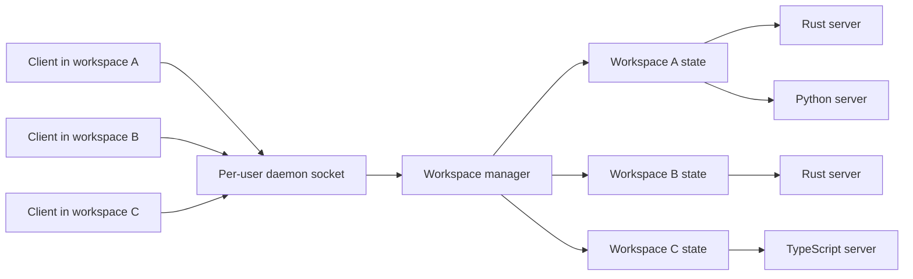

# RFC 0002: Multi-workspace daemon and language-server lifecycle

## Preamble

- **RFC number:** 0002
- **Status:** Proposed
- **Created:** 2026-08-16

## 1. Summary

This RFC proposes that one per-user `weaverd` instance serve several
repositories without sharing mutable workspace state between them. Every
request identifies one workspace before routing. The daemon resolves that
locator to a canonical key, obtains a workspace-owned state object, and routes
the operation without holding a daemon-wide backend lock.

Each workspace owns its caches, mutation coordination, and lifecycle-managed
language-server instances. A language-server instance is reusable only while
its workspace, language, executable, configuration, toolchain, and relevant
environment identity remain equal. Rust servers are resolved from the target
workspace and launched with an explicit rustup toolchain when rustup manages
the executable.

The proposal is split into three decisions:

- [ADR 008](../adr-008-workspace-scoped-daemon-tenancy.md) defines workspace
  identity and daemon tenancy;
- [ADR 009](../adr-009-workspace-scoped-language-server-lifecycle.md) defines
  language-server execution identity and lifecycle; and
- [ADR 010](../adr-010-workspace-local-concurrency.md) defines concurrency,
  mutation isolation, and overload behaviour.

## 2. Problem

The current daemon has process reuse, but not a workspace-aware process pool.
It captures the directory from which it starts as one `workspace_root`, then
retains that root for its lifetime. The default socket, however, is per user.
Commands from other repositories therefore reach the first daemon and are
routed against the first daemon's workspace.

The language-server host compounds this problem. It stores at most one session
per language. Production adapters do not set a working directory, so a server
inherits the daemon's current directory. Background daemonization changes that
directory to Weaver's runtime directory. The LSP `initialize` request does not
send `rootUri` or `workspaceFolders`, despite those being the protocol fields
that identify the initial workspace.[^1]

Rust toolchain selection is directory-sensitive. Rustup considers command-line
selection, `RUSTUP_TOOLCHAIN`, directory overrides, nearby
`rust-toolchain.toml` or `rust-toolchain` files, and the default toolchain in a
defined precedence order.[^2] Launching the `rust-analyzer` proxy from the
runtime directory cannot establish which repository toolchain should own the
server.

Finally, the transport accepts connections concurrently while backend execution
remains serialized behind one daemon-wide mutex. A slow semantic request blocks
unrelated languages and repositories. When all 128 handler threads are
occupied, the listener drops newly accepted connections rather than returning a
structured overload response.

The result is concurrent admission into a single-workspace execution model.
That is not a safe foundation for several agents operating across several
repositories.

## 3. Current state

The current implementation has the following properties:

- `run_daemon_with` captures `current_dir()` before daemonization and passes
  that one path to `DispatchConnectionHandler`.
- daemonization changes the daemon working directory to the runtime directory;
- the default endpoint is `$XDG_RUNTIME_DIR/weaver/weaverd.sock`, with a
  per-user `/tmp` fallback;
- `LspHost` stores `HashMap<Language, Session>` and rejects a second
  registration for the same language;
- `SemanticBackendProvider` owns one lazily initialized `LspHost`;
- `ProcessLanguageServer::new` uses bare executable names and leaves
  `working_dir` unset;
- the LSP `initialize` request sends process and capability information but no
  workspace root;
- `BackendManager::with_backends` holds one
  `Mutex<FusionBackends<SemanticBackendProvider>>` across `router.route`; and
- the listener caps active handler threads at 128 and drops connections when
  the limiter is full.

The relevant implementation points are:

- the daemon [launch path](../../crates/weaverd/src/process/launch.rs) and
  [daemonizer](../../crates/weaverd/src/process/daemonizer.rs);
- the [dispatch handler](../../crates/weaverd/src/dispatch/handler/mod.rs) and
  [backend manager](../../crates/weaverd/src/dispatch/backend_manager.rs);
- the [listener](../../crates/weaverd/src/transport/listener.rs); and
- the [LSP host](../../crates/weaver-lsp-host/src/host.rs) and
  [process adapter](../../crates/weaver-lsp-host/src/adapter/process.rs).

The design document already describes `weaverd` as managing a project registry,
but the live implementation has no request-selected registry. This RFC makes
that intended boundary concrete.

## 4. Goals and non-goals

### 4.1. Goals

- Make workspace identity explicit before daemon routing or backend access.
- Allow one per-user daemon to serve several repositories correctly.
- Isolate caches, open-document state, language servers, and mutations by
  canonical workspace.
- Reuse healthy language servers only when their complete execution identity
  still matches.
- Resolve Rust toolchains from the target workspace rather than daemon process
  state.
- Allow unrelated workspaces and languages to make progress concurrently.
- Serialize conflicting mutations within one workspace.
- Replace connection dropping with bounded, observable overload behaviour.
- Bound idle processes, queues, and retained workspace state.
- Preserve the current local, single-user security boundary.

### 4.2. Non-goals

- Turn `weaverd` into a multi-user or remotely exposed service.
- Share one language-server process between unrelated repositories.
- Make arbitrary LSP servers safely support several unrelated roots.
- Define distributed scheduling across several daemon processes or machines.
- Guarantee read concurrency with a mutation that temporarily changes a shared
  LSP document view.
- Select final default values for idle timeouts, queue lengths, or process
  budgets in this RFC.
- Replace the mutation vertical slice's stale-base and compare-and-swap
  contracts.

## 5. Terminology and invariants

| Term                      | Meaning                                                                                                              |
| ------------------------- | -------------------------------------------------------------------------------------------------------------------- |
| Workspace locator         | Client-supplied path or URI used to identify the requested repository. It is untrusted input.                        |
| Workspace key             | Daemon-resolved canonical root used as the registry identity.                                                        |
| Workspace state           | Mutable state owned by one workspace key: caches, server pool, revision, and mutation coordinator.                   |
| Server execution identity | Language, command, arguments, resolved executable or toolchain, configuration, and relevant environment fingerprint. |
| Server lease              | A bounded borrow of one healthy language-server instance for one operation.                                          |
| Mutation lease            | Exclusive authority to stage, verify, and commit or roll back one workspace mutation.                                |

_Table 1: Terms used by the multi-workspace design._

The following invariants are normative:

1. Every routed operation resolves exactly one workspace key.
2. No mutable cache, document state, server session, or mutation state crosses
   workspace keys.
3. The registry lock is never held while routing, waiting for a server, doing
   filesystem input/output, or executing a plugin.
4. A server is reused only while its execution identity matches.
5. A mutation may commit only if its expected workspace revision and content
   digests still match the live workspace.
6. Overload is bounded and observable; it does not silently create unbounded
   threads or queues.

## 6. Proposed design

### 6.1. Request workspace identity

The CLI-to-daemon request envelope gains a required workspace locator. The CLI
derives the ordinary value from the invocation directory or an explicit public
workspace option. The daemon, not the client, owns validation and canonical
resolution.

The daemon rejects a locator that:

- does not resolve to an accessible directory;
- escapes an allowed capability root;
- cannot be represented as a UTF-8 path where Weaver's public contract
  requires one;
- resolves through an unsupported filesystem topology; or
- conflicts with a workspace identity already being retired.

Canonicalization collapses ordinary relative components and supported symlink
aliases so the same repository does not gain duplicate mutable state. The
implementation must use capability-oriented directory access rather than
treating the canonical string as filesystem authority.

The per-user socket remains the default. Separate socket configuration remains
an operational escape hatch, not the primary tenancy mechanism.

### 6.2. Workspace registry and ownership

For screen readers: the following diagram shows a per-user daemon registry
dispatching requests into independent workspace-owned state.



_Figure 1: Per-user daemon dispatch into isolated workspace state._

The target ownership shape is illustrated below. Names are provisional; the
ownership boundaries are normative.

```rust,no_run
struct WorkspaceKey {
    root: Utf8PathBuf,
}

struct WorkspaceManager {
    workspaces: RwLock<HashMap<WorkspaceKey, Arc<WorkspaceState>>>,
}

struct WorkspaceState {
    root: WorkspaceRoot,
    revision: WorkspaceRevision,
    lsp_servers: LanguageServerPool,
    cards: CardCache,
    mutation: WorkspaceMutationCoordinator,
}
```

The manager lock protects only lookup, insertion, retirement marking, and
removal. An `Arc<WorkspaceState>` remains valid after the manager releases its
lock. Workspace creation must be single-flight so simultaneous first requests
do not create duplicate pools.

Workspace-owned caches include any state whose correctness depends on paths,
file contents, configuration, language-server documents, or workspace revision.
Truly immutable registries may remain daemon-global.

### 6.3. Language-server pool and execution identity

`LanguageServerPool` means lifecycle-managed, reusable server instances. It
does not mean multiplexing unrelated repositories through one process.

Within one workspace, a server key contains at least:

```rust,no_run
struct LanguageServerKey {
    language: Language,
    command: ServerCommandFingerprint,
    server_roots: ServerRootsFingerprint,
    toolchain: Option<ToolchainIdentity>,
    configuration: ServerConfigurationFingerprint,
    environment: EnvironmentFingerprint,
}
```

The workspace key is implicit in the owning `WorkspaceState`. A pool may keep
old and new identities briefly during a graceful replacement, but only the
current identity may receive new leases.

`ServerRootsFingerprint` captures the process working directory, the initial
`rootUri`, and the ordered `workspaceFolders` used to launch and initialize a
server. Launch and protocol initialization derive from the same fingerprint so
the server cannot be reused under a different root topology.

The fingerprint includes only environment variables declared relevant by the
adapter. Raw environment values must not appear in logs, metrics labels, or
unbounded diagnostic payloads.

### 6.4. Rust toolchain resolution

Rustup's documented precedence and directory walk make the selected process
root part of toolchain resolution.[^2] Weaver therefore resolves the active
toolchain with the adapter-selected process root as `current_dir`.

For a rustup-managed adapter, the resolver records:

- the selected toolchain identity;
- the resolved `rust-analyzer` component or executable;
- the relevant rustup environment inputs;
- the workspace files that contributed to the result; and
- a bounded freshness marker for directory overrides stored outside the
  repository.

The preferred launch shape is explicit:

```plaintext
rustup run <resolved-toolchain> rust-analyzer
```

The child process also receives that selected process root as its working
directory. If the selected toolchain lacks `rust-analyzer`, Weaver returns a
structured `unavailable` result with installation guidance. It does not
silently fall back to another toolchain.

A directly configured executable remains supported. In that case the adapter
fingerprints the configured command, resolved executable, arguments, selected
environment, and server configuration instead of inventing a rustup identity.

Before reusing an idle Rust server, the pool revalidates the execution identity
when a watched input changes or the bounded freshness marker expires. A changed
identity retires the old server and starts a replacement. Relevant inputs
include `rust-toolchain`, `rust-toolchain.toml`, `.cargo/config`,
`.cargo/config.toml`, Weaver configuration, and configured adapter inputs.

### 6.5. LSP initialization and document ownership

Every server starts with the adapter-selected process root as its process
working directory. The LSP `initialize` request derives `rootUri` and a single
entry in `workspaceFolders` from the same root-topology fingerprint when the
server supports workspace folders. The client capabilities truthfully advertise
workspace-folder support.

The LSP specification makes opened document content client-owned until close,
and versions each subsequent change.[^1] Open-document maps, version counters,
pending diagnostics, and request correlation therefore belong to one server
session and one workspace.

An adapter may support several related project roots inside one canonical
repository only when its contract defines that topology. Weaver does not add
unrelated repositories to a shared server through
`workspace/didChangeWorkspaceFolders`.

Helix provides useful prior art by distinguishing its editor workspace root
from language-server roots selected from each file and bounded by the
workspace.[^3] Weaver similarly treats the daemon workspace key as the tenancy
boundary while allowing an adapter to select a more specific project root
inside it.

### 6.6. Concurrency and request admission

The daemon replaces the request-wide global backend mutex with two levels of
coordination:

1. a short-lived registry lookup or creation lock; and
2. workspace- and server-local coordination for the selected operation.

Read-only operations in different workspaces run concurrently. Read-only
operations within one workspace may run concurrently when their selected
backend supports it and they observe the same committed revision. Each
language-server transport owns a bounded request queue and response
multiplexer; adapter capabilities determine whether operations may be in flight
concurrently.

Tower's concurrency limit, bounded buffer, and load-shedding services provide
useful implementation prior art for separating maximum in-flight work, queue
capacity, and overload responses.[^4][^5][^6] This RFC does not require Tower,
but it requires those concerns to remain separate and observable.

Admission limits apply at three scopes:

- daemon connection and request admission;
- workspace in-flight operations; and
- individual server queues.

When capacity is exhausted, Weaver returns a structured retryable overload
result whenever the transport can still respond. The result identifies the
scope, stable reason code, and bounded retry guidance. The listener must not
accept a connection merely to drop it without diagnostic evidence.

Queue wait time, execution time, and rejection count are observable through
low-cardinality tracing and metrics. Workspace paths, request IDs, source text,
and raw errors do not become metric labels.

### 6.7. Workspace-local mutation isolation

A mutation obtains an exclusive mutation lease for its workspace before
capturing the baseline revision. The lease covers staged changes, formatting,
both safety locks, compare-and-swap checks, commit or rollback, and restoration
of any shared LSP document view.

This first design allows read-only operations in the same workspace to wait
behind a mutation. That prevents a shared live LSP session from exposing staged
`didChange` content to unrelated readers. Read-only work in other workspaces
continues normally.

Transaction-scoped shadow language servers may later permit concurrent reads
against the committed revision while a mutation verifies staged content. That
optimization requires evidence because it adds process cost and another
lifecycle path. It is not required for the first multi-workspace slice.

The mutation vertical slice remains responsible for complete-workspace staged
views, expected content digests, stale-base refusal, formatting, Double-Lock
verification, and atomic commit. This RFC determines where that state lives and
what may execute concurrently; it does not weaken those contracts.

### 6.8. Lifecycle, health, and eviction

Workspace and server lifecycle states are explicit. A minimal model includes:

```plaintext
Workspace: creating -> ready -> draining -> retired
Server: absent -> starting -> ready -> unhealthy -> draining -> stopped
```

Health checks detect child exit, transport failure, initialization failure, and
repeated request timeout. Restart uses bounded exponential backoff and a
circuit breaker so a broken server cannot create an unbounded spawn loop.

Idle eviction applies separately to server processes and workspace state. A
workspace with active requests, open documents, a mutation lease, or a server
startup cannot be evicted. Eviction is deterministic and observable.

The daemon owns a configurable process budget. When the budget is reached, it
evicts eligible idle servers before refusing a new server lease. It does not
evict an active server or silently share a process across workspaces.

RFC 0001 remains the local observability contract. Multi-workspace operation
adds workspace-safe lifecycle fields, queue saturation events, server identity
changes, eviction, and overload reasons without turning Weaver into a remote
fleet service.

### 6.9. Security and privacy

The daemon remains local to one user. This proposal does not add network
authentication or a remotely reachable default endpoint.

Workspace locators are untrusted. Canonicalization, capability directory
opening, path containment, and symlink policy are enforced before a workspace
enters the registry. A client cannot choose an internal workspace key, server
key, toolchain identity, or environment fingerprint directly.

Logs and metrics may include only bounded, opaque workspace identifiers for
workspace identity. Raw workspace paths are excluded from logs and metrics.
Environment values, source contents, patch bodies, and complete server command
lines are excluded from telemetry by default.

## 7. Requirements

### 7.1. Functional requirements

- Commands from two repositories through the default socket affect only their
  requested repositories.
- Two Rust repositories with different active toolchains receive distinct
  correctly launched `rust-analyzer` instances.
- A toolchain or relevant adapter configuration change retires the stale
  server before new semantic work uses it.
- Mutations in different workspaces may proceed concurrently.
- Two mutations in one workspace do not commit concurrently.
- Read-only work does not observe another request's staged LSP document state.
- Saturation returns bounded, retryable diagnostics instead of silent drops
  whenever a response is possible.
- Idle processes and workspace states are reclaimed under explicit policy.

### 7.2. Technical requirements

- The CLI-daemon schema carries a versioned workspace locator.
- The daemon is the authority for canonical workspace resolution.
- Workspace state is owned beneath a canonical workspace key.
- Registry critical sections exclude routing and external input/output.
- Server startup always sets the adapter-selected process root as
  `current_dir`.
- LSP initialization supplies truthful root and workspace-folder fields.
- Server identity changes are compared structurally, not inferred from a
  process still being alive.
- Rustup resolution runs in the adapter-selected process root and preserves
  documented precedence.
- Queue and process budgets are finite and configuration-validated.
- Shutdown drains or cancels requests within a bounded deadline.
- New state transitions emit structured `tracing` events and low-cardinality
  `metrics` where uptake or saturation evidence is required.

### 7.3. Verification requirements

- Unit and property tests cover key canonicalization, registry single-flight,
  identity equality, invalidation, and eviction invariants.
- Behavioural tests cover server roots, Rust toolchain selection, overload
  responses, and mutation lease ordering.
- End-to-end tests run simultaneous commands against several temporary
  repositories through one socket.
- The combinatorial suite includes stable and dated-nightly Rust repositories,
  mixed Rust/Python/TypeScript work, toolchain changes, server crash and
  restart, queue saturation, idle eviction, and stale-base mutation refusal.
- Tests prove that the registry lock is not held across request routing.

## 8. Compatibility and migration

Weaver is pre-0.1.0, so the request schema may make workspace identity required
without preserving an indefinitely ambiguous fallback. Migration should still
be staged so each pull request has an observable compatibility boundary.

### 8.1. Stage one: ratify contracts

Accept or revise this RFC and ADRs 008-010. Fix the request, error, lifecycle,
and configuration vocabulary before implementation.

### 8.2. Stage two: carry workspace identity

Add the workspace locator to CLI-daemon requests and reject missing locators or
schema/version mismatches. The daemon returns an explicit schema error for any
validation failure. No workspace operation executes before validation, and the
daemon does not infer the locator from its captured startup root.

### 8.3. Stage three: introduce workspace ownership

Add `WorkspaceManager` and one `WorkspaceState` while retaining conservative
serialization. Move workspace-dependent caches and providers behind the state
boundary before enabling concurrency.

### 8.4. Stage four: scope language servers

Add execution identity resolution, adapter-selected-root process launch and LSP
initialization, Rust toolchain mediation, health checks, and identity-driven
restart.

### 8.5. Stage five: narrow serialization and bound admission

Replace the global backend mutex with registry, workspace, mutation, and server
coordination. Introduce bounded queues and structured overload results. Enable
cross-workspace concurrency only after isolation tests pass.

### 8.6. Stage six: prove the service boundary

Run the multi-repository combinatorial suite and operational probes. Remove any
rollout scaffolding only after the CLI and daemon version contract is covered
end to end.

## 9. Alternatives considered

### 9.1. One daemon and socket per repository

This preserves the current fixed-root assumption and can be configured today.
It is rejected as the primary model because clients must coordinate socket
selection, each repository pays for an independent daemon lifecycle, and there
is no central process or admission budget. It remains a troubleshooting and
isolation option.

### 9.2. One global language server per language

This minimizes process count. It is rejected because LSP open-document state,
workspace configuration, build-system discovery, diagnostics, and toolchain
selection are workspace-sensitive. Multi-root support does not imply that
unrelated repositories can safely share one server instance.

### 9.3. One language-server process per request

This gives strong isolation. It is rejected as the default because it removes
the startup amortization that justifies the daemon. Transaction-scoped servers
remain a possible semantic-verification mode where staged-state isolation is
worth the cost.

### 9.4. Keep the global backend mutex

This is simple and prevents races. It is rejected because one slow request
blocks unrelated languages and workspaces, defeats the listener's concurrent
admission model, and turns connection capacity into a queue of blocked threads.

### 9.5. Key only by workspace and language

This is simpler than an execution-identity key. It is rejected because a
running server may be stale after toolchain, executable, adapter configuration,
or relevant environment changes. Liveness is not identity.

### 9.6. Trust client-side canonicalization

This avoids daemon filesystem work. It is rejected because the client locator
is untrusted and may use a different filesystem view, symlink policy, or
version. The daemon must establish the authority under which it will read and
mutate files.

## 10. Roadmap and design impact

The first implementation work belongs in phase 12 as a dependency boundary. It
must establish multi-workspace daemon tenancy before phase 14 proves LSP-backed
resource commands and before Sempai or mutation work increases pressure on the
single-workspace boundary.

The mutation vertical slice remains in phase 16, but its reusable engine,
Double-Lock verification, transaction, and end-to-end tasks depend on the
workspace manager and workspace-scoped LSP lifecycle.

The living design document must describe:

- request workspace identity and the per-user tenancy model;
- workspace registry ownership and lock scope;
- language-server execution identity and Rust toolchain resolution;
- LSP root initialization and session-local document state;
- workspace-local mutation isolation; and
- bounded admission, health, restart, and eviction.

## 11. Open questions

- Which public option, if any, overrides the invocation-derived workspace
  locator for all commands?
- How should nested repositories and worktrees select the canonical tenancy
  boundary while still allowing adapter-specific project roots?
- Which environment variables belong in each adapter's execution fingerprint?
- What bounded freshness interval should revalidate rustup directory overrides
  stored outside the repository?
- What are the default workspace, process, connection, and queue budgets?
- Should an overload response include a numeric `retry_after_ms`, or only a
  stable retryable class and human guidance?
- When does transaction-scoped shadow semantic verification justify its
  additional process and cache cost?
- Which filesystem identities are portable enough to supplement canonical
  paths without making the public protocol platform-specific?

## 12. Recommendation

Adopt one per-user, multi-workspace daemon with canonical workspace ownership;
workspace-scoped language-server execution identity; explicit Rust toolchain
resolution; and workspace-local concurrency.

Keep the first mutation model conservative: read-only operations may share one
workspace revision, while a mutation holds an exclusive workspace lease through
verification and commit. This closes the correctness hole without requiring
transaction-scoped language servers in the first implementation.

Do not enable cross-workspace concurrency until the request schema, workspace
registry, server identity, and isolation tests exist. Once they do, remove the
daemon-wide backend mutex as the unit of serialization and make overload an
explicit protocol result.

## References

[^1]: [Language Server Protocol specification 3.17](https://microsoft.github.io/language-server-protocol/specifications/lsp/3.17/specification/)
[^2]: [Rustup override precedence and toolchain files](https://rust-lang.github.io/rustup/overrides.html)
[^3]: [Helix project and LSP root selection](https://github.com/helix-editor/helix/blob/master/book/src/languages.md#project-and-lsp-root-selection)
[^4]: [Tower concurrency limiting](https://docs.rs/tower/latest/tower/limit/concurrency/)
[^5]: [Tower bounded service buffering](https://docs.rs/tower/latest/tower/buffer/)
[^6]: [Tower load shedding](https://docs.rs/tower/latest/tower/load_shed/)
