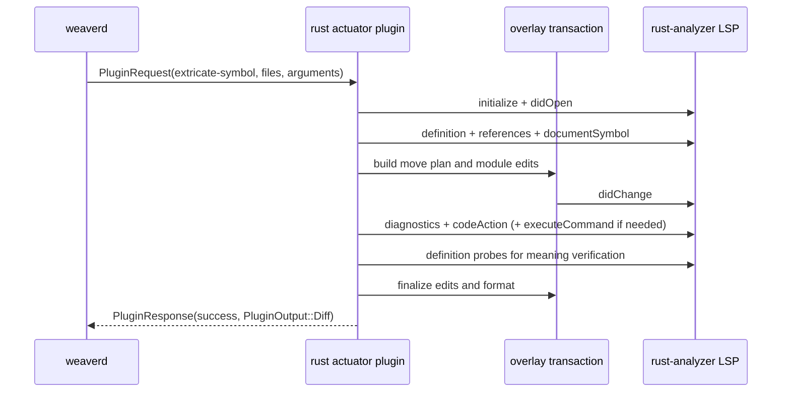

# Rust extricate actuator plugin technical design

## Status

Proposed.

## Date

2026-02-28.

## Audience and scope

This document targets software engineers implementing the Rust
`extricate-symbol` capability through the actuator plugin path.

The design covers request contract changes, rust-analyzer Language Server
Protocol (LSP) orchestration, edit-planning strategy, semantic verification,
and test strategy. It aligns with
[ADR 001](adr-001-plugin-capability-model-and-act-extricate.md).

## Relationship to ADR 001 provider model

ADR 001 defines Rust extrication as a built-in provider responsibility in the
daemon capability resolver. This document specifies a plugin-backed execution
path that the built-in provider can delegate to during rollout.

Implementation responsibilities are split as follows:

- `weaverd` owns capability routing, policy, and user-facing contract,
- the Rust actuator plugin owns staged edit planning and RA orchestration,
- users still invoke one capability surface (`act extricate`) regardless of
  execution backend.

## Problem statement

Rust `extricate-symbol` must move an item to a destination module while keeping
symbol meaning stable, references correct, and code idiomatic on the first
commit.

The implementation must not rely on broad post-hoc repair loops, compatibility
shims, or deferred clean-up. Final output must read as if it was authored in
its final location.

## Design principles

- Treat rust-analyzer (RA) as the semantic oracle for definition, references,
  diagnostics, and code-action repair.
- Keep edit intent and ordering under Weaver control through a transactional
  overlay.
- Verify semantic meaning, not just syntax, before commit.
- Refuse unsafe or ambiguous transformations rather than emitting degraded
  output.
- Keep the working tree unchanged on failure.

## System context

The current Rust actuator plugin (`crates/weaver-plugin-rust-analyzer`)
supports `rename` only and returns a unified diff through `PluginOutput::Diff`.
The plugin protocol already supports multiple file payloads and structured
arguments, which provides the substrate for multi-file extrication.

Because plugin execution is sandboxed, the plugin cannot assume unrestricted
filesystem access. The daemon must provide all file payloads required for
analysis and patch generation.

## Capability and request contract

### Command contract

The daemon operation is expected to resolve to capability ID `extricate-symbol`
and forward a normalised request to the plugin.

```plaintext
weaver act extricate --uri <file:///...> --position <line:col> --to <module>
```

### Plugin request operation

Set `PluginRequest.operation` to `extricate-symbol` for Rust capability
requests.

The plugin arguments are defined as follows.

| Key                      | Type   | Required | Description                                                     |
| ------------------------ | ------ | -------- | --------------------------------------------------------------- |
| `uri`                    | string | Yes      | Source file URI containing the selected symbol.                 |
| `position`               | string | Yes      | Source position in `line:col` form using LSP coordinates.       |
| `to`                     | string | Yes      | Destination module path or destination file URI.                |
| `create_missing_modules` | bool   | No       | Create missing destination modules when `true`. Default `true`. |
| `format`                 | string | No       | `auto`, `on`, or `off`. Default `auto`.                         |
| `explain`                | bool   | No       | Emit execution plan metadata in diagnostics output.             |

_Table 1: Arguments for Rust `extricate-symbol` plugin requests._

### File payload requirements

`PluginRequest.files` must include a deterministic Rust package snapshot for
all files that may be read or edited during the transaction:

- source file containing the target symbol,
- destination module file and destination parent module files,
- files containing references returned by pre-move reference discovery,
- relevant `mod` chain files needed to materialise module graph updates,
- package `Cargo.toml` and crate roots required for RA workspace loading.

If the payload set is incomplete for deterministic execution, the plugin must
fail with a structured diagnostic.

### Diagnostic response schema

Rust `extricate-symbol` failures must return `PluginResponse::failure` with one
or more `PluginDiagnostic` entries.

| Field                    | Type   | Required | Description                                                         |
| ------------------------ | ------ | -------- | ------------------------------------------------------------------- |
| `success`                | bool   | Yes      | Must be `false` for refusal or execution failure.                   |
| `output`                 | enum   | Yes      | Must be `empty` on failure.                                         |
| `diagnostics[].severity` | enum   | Yes      | `error`, `warning`, or `info`.                                      |
| `diagnostics[].message`  | string | Yes      | Human-readable failure reason with actionable context.              |
| `diagnostics[].file`     | path   | No       | Absolute or workspace-relative path for location-specific failures. |
| `diagnostics[].line`     | u32    | No       | 1-based line for location-specific failures.                        |

_Table 2: Failure payload schema for `extricate-symbol` responses._

Diagnostic message convention for deterministic handling:

- prefix messages with a stable code token, for example
  `EXTRICATE_UNSUPPORTED_VISIBILITY`,
- include exactly one primary `error` diagnostic describing refusal cause,
- include additional `info` diagnostics for remediation hints where relevant.

## Architecture

The implementation uses a transactional refactoring driver with five layers:

- request normalisation and validation,
- RA LSP session manager,
- move-set planner (syntax + semantic filters),
- overlay edit transaction engine,
- semantic verification and patch emitter.

For screen readers: The following sequence diagram shows daemon-to-plugin
contract, plugin orchestration with RA, and patch return after semantic
verification.



_Figure 1: Rust `extricate-symbol` orchestration through overlay and RA._

## Canonical execution sequence

The following sequence is normative and is the single source of truth for
ordering.

1. Validate request arguments and payload completeness.
2. Start RA session and open overlay documents.
3. Resolve selected definition and collect pre-move references.
4. Compute module paths and destination module graph updates.
5. Build move-set closure for symbol and associated `impl` blocks.
6. Apply planned move edits to overlay and publish `didChange`.
7. Rewrite external references and affected `use` trees.
8. Run import repair via diagnostics plus code actions.
9. Resolve ambiguous fixes using definition-equivalence checks.
10. Apply formatting for touched files when enabled.
11. Run semantic invariants and diagnostics gate checks.
12. Emit unified diff and return success, or refuse and rollback.

## LSP surface and behaviour

The plugin uses RA over JSON-RPC 2.0 with stdio transport.[^1]

| LSP method                        | Purpose                                                 |
| --------------------------------- | ------------------------------------------------------- |
| `initialize` / `initialized`      | Start session and negotiate capabilities.               |
| `textDocument/didOpen`            | Load file content from payloads into RA.                |
| `textDocument/didChange`          | Keep RA in sync with overlay edits.                     |
| `textDocument/documentSymbol`     | Select top-level item enclosing the requested position. |
| `textDocument/definition`         | Resolve symbols for move-set and meaning checks.        |
| `textDocument/references`         | Enumerate all call sites that must remain equivalent.   |
| `textDocument/codeAction`         | Request import and fix-up actions from diagnostics.     |
| `workspace/executeCommand`        | Execute code actions that are command-only.             |
| `experimental/parentModule`       | Compute canonical module path chain.                    |
| `experimental/ssr`                | Optional structural rewrite helper for path updates.    |
| `textDocument/publishDiagnostics` | Primary diagnostics source for fix loops.               |

_Table 3: RA and LSP methods required for extrication.[^2][^3]_

Implementation notes:

- Diagnostics should be consumed from publish notifications, not from pull
  diagnostics requests.[^4]
- Code action handling must support both direct `WorkspaceEdit` payloads and
  command-based actions.[^5]
- A session quiescence check must be used after each edit stage before
  evaluating diagnostics or reference probes.

## Transaction model

All edits occur in an in-memory overlay keyed by URI. No filesystem mutation is
allowed until all checks pass. The transaction model spans canonical execution
steps 2 through 12.

If any stage fails, discard overlay and return failure diagnostics without
writing changes.

## Symbol move-set planning

Move-set planning defines exactly which syntax nodes move.

1. Resolve selected top-level item from `documentSymbol` by position.
2. Parse source syntax tree and collect candidate `impl` blocks.
3. For each candidate `impl`, probe the self-type definition using
   `textDocument/definition`.
4. Include only `impl` blocks resolving to the selected item definition.
5. Preserve item attributes, docs, and comments verbatim in moved text.

This approach prevents accidental capture of similarly named types in scope.

## Module graph computation and destination plumbing

Module path computation must use RA `experimental/parentModule` recursion
rather than filesystem heuristics.

Destination materialisation rules:

- create destination module file when missing and policy allows creation,
- insert `mod` declaration in the correct parent module file,
- choose visibility (`mod` or `pub mod`) based on destination policy,
- maintain deterministic insertion ordering for module declarations.

If destination module creation is disabled and required, fail before edits.

## End-to-end execution algorithm details

This section expands canonical steps 5 through 11 for implementers working on
the planner and verification layers.

## Reference rewrite strategy

Reference rewrites are performed from the pre-move reference index.

- `use` imports for moved items are rewritten to the new module path.
- grouped imports remove moved symbols and introduce explicit replacement
  imports as needed.
- qualified paths are rewritten minimally, preserving absolute or relative form
  where valid.
- bare identifiers are left in place unless a semantic probe proves they no
  longer resolve correctly.

If a clean relative path cannot be produced reliably, rewrite to an explicit
`crate::...` path.

## Import repair and semantic disambiguation

Destination files are expected to report unresolved symbols after initial move.

Repair loop:

1. Read destination diagnostics.
2. Request code actions for missing-name diagnostics.
3. If one action is available, apply it.
4. If multiple actions exist, evaluate candidates one at a time:
   - apply candidate in overlay,
   - probe definition at diagnostic site,
   - keep candidate only if definition matches pre-move anchor,
   - otherwise revert candidate.
5. Continue until diagnostics converge or deterministic resolution fails.

Deterministic failure to disambiguate imports is a hard error.

## Semantic invariants and acceptance checks

The plugin may return success only when all invariants hold:

- no new high-severity diagnostics in touched files,
- all tracked reference probes resolve to the moved definition,
- no references to the old definition location remain,
- no compatibility shims are added,
- formatting is stable across repeated formatting passes.

## Refusal and safety policy

The plugin must refuse execution for non-deterministic or unsound cases,
including:

- macro-generated items lacking stable editable ranges,
- unsupported visibility constraints such as non-preservable `pub(in ...)`,
- ambiguous import repair without a unique semantic match,
- incomplete file payload coverage for required edits.

Each refusal returns precise diagnostics and leaves workspace content unchanged.

## Integration points in this repository

The following components are expected to change for implementation:

- `crates/weaver-plugin-rust-analyzer/src/lib.rs`
  - add `extricate-symbol` dispatch and argument parser,
  - introduce overlay transaction and planner modules.
- `crates/weaver-plugin-rust-analyzer/src/lsp/`
  - add RA requests for references, symbols, code actions, parent module,
    optional SSR, diagnostics handling, and command execution.
- `crates/weaverd/src/dispatch/act/`
  - add `extricate` handler and capability routing integration,
  - extend payload provisioning for multi-file Rust transactions.
- `crates/weaver-plugins/src/manifest/mod.rs`
  - extend manifest schema for capability declaration metadata.

## Testing strategy

### Unit tests

- argument parsing and request validation,
- move-set planning with same-name type disambiguation,
- reference rewrite logic for grouped imports and qualified paths,
- semantic anchor comparison and candidate action filtering,
- refusal triggers and rollback guarantees.

### Behavioural tests

- successful `extricate-symbol` request returns a unified diff,
- missing required arguments produce structured diagnostics,
- ambiguous code action scenarios fail deterministically,
- incomplete payload requests fail without filesystem mutation.

### End-to-end tests

- fixture crate moves a type across modules with no shims,
- destination module graph updates compile and lint cleanly,
- reference probes before and after transformation resolve equivalently,
- repeated formatter pass yields no additional diffs.

## Operational considerations

- RA subprocess timeout should exceed current rename timeout because extrication
  touches multiple files and requires multiple request rounds.
- Diagnostics and quiescence timing must be bounded to avoid hangs.
- `--explain` output should include capability resolution, staged edit counts,
  and refusal rationale when aborted.
- Formatting in `auto` mode should use `rustfmt` through RA integration or a
  direct `cargo fmt` pass over touched files.[^6]

## Risks and mitigations

| Risk                                      | Impact                          | Mitigation                                                       |
| ----------------------------------------- | ------------------------------- | ---------------------------------------------------------------- |
| Incomplete payload snapshot               | Incorrect or partial edits      | Validate required file-set closure before session start.         |
| RA code actions vary across versions      | Non-deterministic import repair | Gate on semantic probes and pin behaviour via fixture snapshots. |
| Command-only actions without usable edits | Inability to apply fixes        | Implement `workspace/executeCommand` with explicit allow list.   |
| Destination module policy mismatch        | Broken module graph             | Enforce deterministic module creation policy in planner.         |

_Table 4: Primary implementation risks and mitigations._

## References

[^1]: [Manually use rust-analyzer](https://users.rust-lang.org/t/manually-use-rust-analyzer/57156?utm_source=chatgpt.com)
[^2]: [rust-analyzer LSP extensions](https://git.joshthomas.dev/language-servers/rust-analyzer/src/commit/c0107d2ea63a5527d2990f7f322f642340ceb3cd/docs/dev/lsp-extensions.md)
[^3]: [LSP extensions mirror](https://android.googlesource.com/toolchain/rustc/%2B/HEAD/src/tools/rust-analyzer/docs/dev/lsp-extensions.md)
[^4]: [RA diagnostic pull issue](https://github.com/rust-lang/rust-analyzer/issues/18709)
[^5]: [Command-based RA code action handling](https://github.com/kakoune-lsp/kakoune-lsp/issues/314?utm_source=chatgpt.com)
[^6]: [rust-analyzer book](https://rust-analyzer.github.io/book/)
