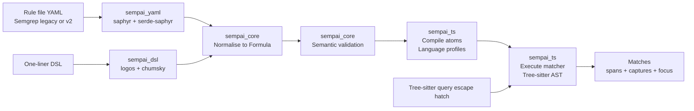

# Sempai technical design for Weaver

This document specifies the implementation design for Sempai: a Semgrep-
compatible query parser and Tree-sitter-backed query engine for feature
extraction inside the Weaver workspace.

Sempai is intended to power semantics-aware extraction and selection of
language objects (functions, decorators, types, blocks, callsites, and similar)
for subsequent actuation by Weaver’s `act` commands.

This design follows the “Sempai Semgrep-compatible query engine on Tree-sitter
for Weaver” architectural decision record (ADR) and the provided Semgrep
specification documents.[^1][^2][^3]

## Goals

- Provide a Semgrep-compatible query surface for Weaver feature extraction:

  - Legacy `pattern*` operators.
  - v2 `match` formula operators and decorators.
- Support Rust, Python, TypeScript, and Go with full Tree-sitter feature
  coverage (including decorators/attributes).
- Provide optional HashiCorp Configuration Language (HCL) support, gated by a
  feature flag.
- Support both:

  - Full rule files (YAML) with comments and structure.
  - One-liner queries for command-line interface (CLI) interactive usage.
- Provide a stable Rust library API suitable for use outside Weaver.
- Provide an explicit escape hatch for raw Tree-sitter queries.

## Non-goals

- Full Semgrep parity across all modes:

  - `taint`, `join`, and `extract` are parsed for compatibility but are not
    executed in the initial feature-extraction minimum viable product (MVP).
- Rewriting and autofix application:

  - `fix` is parsed and surfaced but is not applied by Sempai.
  - Weaver remains the actuator for edits.
- Dataflow analysis and path-sensitive semantics.

## Terminology

- Rule file: YAML document containing `rules: [...]`.
- Rule: A single entry under `rules`.
- Query formula: A logical expression composed of patterns, regex atoms, and
  boolean/context operators.
- Pattern snippet: A host-language code fragment containing Semgrep tokens
  (`$X`, `$_`, `$...ARGS`, `...`, `<... ...>`).[^2]
- Match: A successful binding of a rule query against a source file, including
  capture bindings and a primary span.
- Focus: The primary span selected for downstream actuation.

## Repository placement and crate layout

Repository structure from the root listing includes `crates/`, `weaver-cli`,
`weaverd`, and supporting crates. Sempai should be implemented as a new crate
under `crates/` and integrated into `weaverd` and `weaver-cli` as a new
`observe` command.

Table 1 describes the proposed crates.

*Table 1: Proposed workspace crates for Sempai.*

| Path                     | Crate name        | Purpose                                                            | Public API |
| ------------------------ | ----------------- | ------------------------------------------------------------------ | ---------- |
| `crates/sempai`          | `sempai`          | Facade crate, stable API                                           | Yes        |
| `crates/sempai-core`     | `sempai_core`     | Data model, diagnostics, planning intermediate representation (IR) | Yes        |
| `crates/sempai-yaml`     | `sempai_yaml`     | YAML rule parsing via saphyr                                       | Yes        |
| `crates/sempai-dsl`      | `sempai_dsl`      | One-liner domain-specific language (DSL) parsing via Chumsky       | Yes        |
| `crates/sempai-ts`       | `sempai_ts`       | Tree-sitter backend + matcher                                      | Yes        |
| `crates/sempai-fixtures` | `sempai_fixtures` | Test corpora + helper macros                                       | No         |

The facade crate `sempai` re-exports stable types from `sempai_core` and
provides top-level convenience entrypoints.

Weaver integration code should live in `weaverd` (backend execution) and
`weaver-cli` (command surface), but should depend only on `sempai` as a library.

## System overview

For screen readers: the following diagram shows the flow from rule input (YAML
or one-liner domain-specific language (DSL)) to a normalised query plan and
execution against a Tree-sitter parse tree, producing matches and captures.



*Figure 1: Sempai pipeline from query input to Tree-sitter execution.*

## Semgrep compatibility scope

### Supported query operators

The Extended Backus-Naur Form (EBNF) defines the supported legacy and v2
operators and their composition rules.[^2]

Legacy root operators:

- `pattern`
- `pattern-regex`
- `patterns`
- `pattern-either`

Legacy node operators within `patterns` and `pattern-either`:

- `pattern-not`
- `pattern-inside`
- `pattern-not-inside`
- `pattern-not-regex`
- `semgrep-internal-pattern-anywhere`

v2 `match` operators:

- `pattern`
- `regex`
- `all`
- `any`
- `not`
- `inside`
- `anywhere`

v2 decorators:

- `where`
- `as`
- `fix`

### Supported Semgrep lexical tokens

Pattern snippets must support:

- Metavariable: `$X` (uppercase/underscore form)
- Anonymous metavariable: `$_`
- Metavariable ellipsis: `$...ARGS`
- Ellipsis: `...`
- Deep ellipsis: `<... [fragment] ...>`[^2]

### Parser-enforced semantic constraints

Semantic constraints must be enforced after parsing and normalisation.[^3]

- `pattern-either` (legacy OR) rejects negated branches (`InvalidNotInOr`).[^3]
- `patterns` and `all` reject conjunctions with no positive terms
  (`MissingPositiveTermInAnd`), except in metavariable-pattern contexts.[^3]

### Mode handling

Semgrep schema defines multiple modes and conditional requirements.[^1]

Sempai execution scope:

- `mode: search`:

  - Full support for `pattern*` and `match`.
- `mode: extract`:

  - Rule file parsing support.
  - Execution returns `UnsupportedMode(extract)` until implemented.
- `mode: taint` and `mode: join`:

  - Rule file parsing support.
  - Execution returns `UnsupportedMode(taint|join)` until implemented.

This preserves interoperability with rule corpora while keeping the runtime
engine focused on feature extraction.

## Public API design

### Stability and semver

The facade crate `sempai` is the only semver-stable entrypoint. Internal crates
may evolve, but the facade must preserve:

- Type names and serialisation formats of public structs.
- Behaviour of core methods within documented constraints.
- Backwards compatibility of the one-liner DSL within a minor release line.

`#[non_exhaustive]` should be used on public enums to allow extension.

### Core types

A minimal stable type set:

```rust
/// A supported host language identifier.
#[derive(Debug, Clone, Copy, PartialEq, Eq, Hash)]
pub enum Language {
    Rust,
    Python,
    TypeScript,
    Go,
    Hcl,
}

/// A byte and line/column span in a UTF-8 source.
#[derive(Debug, Clone, PartialEq, Eq, serde::Serialize, serde::Deserialize)]
pub struct Span {
    pub start_byte: u32,
    pub end_byte: u32,
    pub start: LineCol,
    pub end: LineCol,
}

#[derive(Debug, Clone, PartialEq, Eq, serde::Serialize, serde::Deserialize)]
pub struct LineCol {
    pub line: u32,
    pub column: u32,
}

/// A match result produced by query execution.
#[derive(Debug, Clone, serde::Serialize, serde::Deserialize)]
pub struct Match {
    pub rule_id: String,
    pub uri: String,
    pub span: Span,
    pub focus: Option<Span>,
    pub captures: std::collections::BTreeMap<String, CaptureValue>,
}

#[derive(Debug, Clone, serde::Serialize, serde::Deserialize)]
#[serde(tag = "kind", rename_all = "snake_case")]
pub enum CaptureValue {
    Node(CapturedNode),
    Nodes(Vec<CapturedNode>),
}

#[derive(Debug, Clone, serde::Serialize, serde::Deserialize)]
pub struct CapturedNode {
    pub span: Span,
    pub kind: String,
    pub text: Option<String>,
}
```

`CapturedNode.text` is optional to allow streaming without re-slicing in Weaver
when only structural selection is required.

### Engine entrypoints

The stable API must support compilation and execution as separate phases.

```rust
/// Compiles and executes Semgrep-compatible queries on Tree-sitter syntax trees.
pub struct Engine {
    config: EngineConfig,
}

/// Engine configuration for performance and safety.
pub struct EngineConfig {
    pub max_matches_per_rule: usize,
    pub max_capture_text_bytes: usize,
    pub max_deep_search_nodes: usize,
    pub enable_hcl: bool,
}

/// A compiled query plan for one rule and one language.
pub struct QueryPlan {
    pub rule_id: String,
    pub language: Language,
    pub plan: sempai_core::PlanNode,
}

impl Engine {
    /// Compiles a YAML rule file into query plans.
    ///
    /// # Errors
    /// Returns a diagnostic report if parsing or validation fails.
    pub fn compile_yaml(&self, yaml: &str) -> Result<Vec<QueryPlan>, DiagnosticReport>;

    /// Compiles a one-liner query DSL expression into a query plan.
    pub fn compile_dsl(
        &self,
        rule_id: &str,
        language: Language,
        dsl: &str,
    ) -> Result<QueryPlan, DiagnosticReport>;

    /// Executes a compiled query plan against a source snapshot.
    pub fn execute(
        &self,
        plan: &QueryPlan,
        uri: &str,
        source: &str,
    ) -> Result<Vec<Match>, DiagnosticReport>;
}
```

A Tree-sitter escape hatch is represented as an atom within the plan (see
“Escape hatch”).

## Internal architecture

### Data flow phases

1. Ingestion:

   - YAML rule file parsing.
   - One-liner DSL parsing.
2. Normalisation:

   - Lower legacy and v2 syntaxes to a shared formula model.[^3]
3. Validation:

   - Enforce semantic constraints and mode constraints.
4. Compilation:

   - Compile pattern atoms to pattern IR (intermediate representation).
   - Select a Tree-sitter language profile and snippet wrapper.
5. Execution:

   - Parse target source via Tree-sitter.
   - Evaluate the compiled plan over the syntax tree.
6. Projection:

   - Produce `Match` objects with spans, captures, and focus.

### Normalised formula model

The internal model follows the operator set used in the precedence and guidance
documents.[^3]

Key design choice: `Inside` and `Anywhere` are treated as constraints in
conjunction contexts, rather than match-producers. This aligns with the
“positive term” semantics in conjunction validity checking.[^3]

```rust
#[derive(Debug, Clone)]
pub enum Formula {
    Atom(Atom),
    Not(Box<Decorated<Formula>>),
    Inside(Box<Decorated<Formula>>),
    Anywhere(Box<Decorated<Formula>>),
    And(Vec<Decorated<Formula>>),
    Or(Vec<Decorated<Formula>>),
}

#[derive(Debug, Clone)]
pub enum Atom {
    Pattern(PatternAtom),
    Regex(RegexAtom),
    TreeSitterQuery(TreeSitterQueryAtom),
}

#[derive(Debug, Clone)]
pub struct Decorated<T> {
    pub node: T,
    pub where_: Vec<WhereClause>,
    pub as_: Option<String>,
    pub fix: Option<String>,
    pub span: SourceSpan,
}
```

### Operator precedence

Operator precedence is required only for one-liner parsing. YAML nesting is
authoritative for rule files.[^3]

The one-liner Pratt binding powers must follow the provided table.[^3]

## YAML rule parsing

### YAML parser stack

- `saphyr` parses YAML into a value model with location info.
- `serde-saphyr` deserialises to Rust structs.
- A custom deserialisation layer handles:

  - Union shapes (string vs object).
  - Forward-compatible unknown keys on the rule object
    (`additionalProperties: true`).[^1]

### Rule model

The schema defines the rule object and the allowed query keys.[^1]

Sempai should model:

- Rule metadata: `id`, `message`, `languages`, `severity`, `mode`.
- Query principal:

  - Legacy: `pattern`, `pattern-regex`, `patterns`, `pattern-either`.
  - v2: `match` (string or object).
- Execution gating:

  - Parse all modes.
  - Execute search mode only.

### Schema-aligned validation

Validation should follow the conditional constraints in the schema.[^1]

Search mode rules require:

- `id`, `message`, `languages`, `severity`
- Any of:

  - `pattern`
  - `patterns`
  - `pattern-either`
  - `pattern-regex`
  - `match`
  - `r2c-internal-project-depends-on` (parsed but ignored by Sempai).[^1]

Extract mode rules require legacy query keys, not `match`.[^1]

### Sempai extensions for Tree-sitter queries

The Semgrep schema sets `additionalProperties: true` on the rule object.[^1]

Sempai may define optional extension keys:

- `ts-query`: string
- `ts-language`: string override
- `ts-focus`: string capture name

These keys must not collide with Semgrep keys and must be namespaced via a
prefix if collisions appear likely. A safer alternative is `sempai-ts-query`,
but the shorter form is acceptable given local scope.

## One-liner DSL parsing

### Syntax overview

The DSL provides a compact expression form for interactive usage and for CLI
flags. It maps directly to the normalised formula model.

Atoms:

- `pattern("...")`
- `regex("...")`
- `ts("...")`

Operators:

- Prefix: `inside(expr)`, `anywhere(expr)`, `not(expr)`
- Infix: `and`, `or`

Decorators:

- `where { focus("$X") }`
- `as "$X"`
- `fix "..."`

The DSL is intentionally minimal and deterministic. The primary objective is
CLI ergonomics rather than expressive completeness.

### Tokenisation

Chumsky should consume a token stream produced by `logos`, not raw characters,
to simplify spans and diagnostics.[^4]

Tokens:

- Identifiers: `pattern`, `regex`, `inside`, `anywhere`, `not`, `and`, `or`,
  `where`, `as`, `fix`, `focus`
- String literals: `"..."` with escapes, plus raw string support
- Punctuation: `(`, `)`, `{`, `}`, `,`
- Whitespace and comments:

  - Line comment: `# ...`
  - Block comment: `/* ... */`

### Pratt parser implementation

Chumsky’s Pratt parser should be used to implement the operator table, using
the precedence mapping from the Semgrep precedence document.[^3]

The DDlog Pratt parser design provides a template for Chumsky `pratt` usage and
operator tables.[^5]

### Error recovery

Error recovery must prioritise interactive usability:

- Token stream parsing with accurate spans.[^4]
- Recovery anchors on delimiters `)`, `}`, and `,`.[^4]
- Labelled parsers for human-readable diagnostics.[^4]
- Partial AST output, allowing validation to proceed with best-effort results.

The error-recovering Chumsky guide provides recommended recovery patterns and
tri-state node strategies.[^4]

## Pattern snippet compilation

Pattern snippets are host-language fragments that contain Semgrep tokens and
are not necessarily valid host-language code. Compilation must reconcile this
with Tree-sitter’s requirement for parseable input.

### Snippet wrapper strategy

Each language profile defines wrappers that embed a fragment into a parseable
unit and allow extraction of a stable “pattern root” node.

Example wrappers (illustrative):

- Rust expression:

  - `fn __sempai__() { let _ = <expr>; }`
  - Root extraction: the initializer expression node.
- Rust item:

  - parse as-is
  - Root extraction: first item node.
- Python expression:

  - `__sempai__ = <expr>`
  - Root extraction: RHS expression node.
- Python statement block:

  - `def __sempai__():\n    <stmts>`
  - Root extraction: statement list node.
- TypeScript expression:

  - `const __sempai__ = <expr>;`
  - Root extraction: initializer expression node.
- Go statement list:

  - `package main\nfunc __sempai__(){ <stmts> }`
  - Root extraction: statement list.
- HCL:

  - `resource "x" "y" { <body> }`
  - Root extraction: body block.

Wrapper selection is heuristic and must attempt multiple wrappers if parsing
produces error nodes.

### Semgrep token rewriting

A two-stage rewrite is required:

1. Lexical scan of the pattern text to locate Semgrep tokens defined by the
   EBNF.[^2]
2. Replacement of tokens with parseable placeholders for the chosen wrapper and
   language.

Placeholder forms:

- Metavariable `$X`:

  - Replace with identifier placeholder `__SEMPAI_META_X__`.
- Anonymous metavariable `$_`:

  - Replace with placeholder `__SEMPAI_WILDCARD__`.
- Ellipsis `...`:

  - Replace with placeholder `__SEMPAI_ELLIPSIS__`.
- Metavariable ellipsis `$...ARGS`:

  - Replace with placeholder `__SEMPAI_ELLIPSIS_ARGS__`.
- Deep ellipsis `<... fragment ...>`:

  - Replace the entire region with `__SEMPAI_DEEP_0__`, `__SEMPAI_DEEP_1__`,
    and record each fragment for recursive compilation.

Rewriting must avoid substitutions inside string literals and comments when the
host language treats `$` or `...` as ordinary characters. A language-specific
lexical layer is required for safe rewrite boundaries.

### Pattern IR (intermediate representation)

The compiled pattern must be represented as a Tree-sitter-shaped structure with
Semgrep-specific nodes.

```rust
pub enum PatNode {
    /// Matches a Tree-sitter node kind, with ordered child matchers.
    Kind {
        kind: String,
        children: Vec<PatChild>,
    },

    /// Matches any node and binds it to a metavariable name.
    MetaVar {
        name: String,
    },

    /// Matches any node without binding (`$_`).
    Wildcard,

    /// Matches a sequence of nodes in list contexts (`...`).
    Ellipsis,

    /// Matches a sequence of nodes and binds them (`$...ARGS`).
    EllipsisVar {
        name: String,
    },

    /// Deep match: inner pattern appears anywhere in the subtree.
    Deep {
        inner: Box<PatNode>,
    },

    /// Leaf token match by text (identifiers, literals) where needed.
    Text {
        value: String,
    },
}

pub struct PatChild {
    pub field: Option<String>,
    pub node: PatNode,
}
```

`Kind.children` should include only named children by default, with an optional
“strict tokens” mode that includes unnamed children for operator-sensitive
matches.

### Matching semantics

#### Node matching

`PatNode::Kind` matches a target node if:

- The Tree-sitter node kind matches exactly.
- For each `PatChild`, the corresponding target child matches:

  - Field name must match if present.
  - Order is preserved among named children.
- Extras (comments/whitespace) are ignored.

Leaf matching (`PatNode::Text`) is applied to nodes with no named children or
to language-defined leaf kinds (identifiers, literals).

#### Metavariable binding

`MetaVar` binds the target node to a name. Subsequent occurrences must unify:

- Kind equality is enforced if the original binding is kind-specific.
- Textual equality is enforced by default using the source slice normalised for
  whitespace.
- Span equality is not required across occurrences.

Ellipsis variables bind to ordered lists of nodes.

#### Ellipsis list matching

Ellipsis matching applies only in list contexts (arguments, parameters, block
items, array elements, and similar). Each language profile defines list shapes
as `(parent_kind, child_field)` pairs.

Matching uses dynamic programming to avoid exponential backtracking:

- Pattern sequence `P` and target sequence `T`.
- `Ellipsis` matches `T[i..j]` for any `j >= i`.
- `EllipsisVar` records the matched subsequence.

#### Deep ellipsis matching

Deep ellipsis `<... fragment ...>` compiles `fragment` to an inner pattern and
matches if any descendant subtree matches the inner pattern.[^2]

Deep matching must be bounded:

- `EngineConfig.max_deep_search_nodes` limits traversal.
- A per-match branching cap prevents combinatorial explosion.

## Formula evaluation engine

### Execution context

Execution receives:

- Language
- Source text
- Tree-sitter parse tree
- Optional mapping from byte offsets to line/column (computed once per source)

### Plan compilation

`Formula` compiles to a `PlanNode` that can be executed efficiently:

```rust
pub enum PlanNode {
    Anchor(CompiledAtom),
    And {
        anchors: Vec<PlanNode>,
        constraints: Vec<ConstraintNode>,
    },
    Or(Vec<PlanNode>),
}

pub enum ConstraintNode {
    Not(PlanNode),
    Inside(PlanNode),
    Anywhere(PlanNode),
    Where(Vec<WhereClause>),
}
```

Compilation performs positive-term splitting:

- Anchors:

  - `pattern`, `regex`, `any`, `or` branches that yield matches.
- Constraints:

  - `not`, `inside`, `anywhere`
  - metavariable constraints (`metavariable-regex`, `metavariable-pattern`,
    and v2 `where` metavariable clauses)

This split is required to enforce `MissingPositiveTermInAnd` and to avoid
treating `inside` as a match producer.[^3]

### Conjunction execution

Conjunction execution proceeds:

1. Compute anchor matches from the first anchor term.

2. For each anchor match:

   - Apply each constraint term as a predicate:

     - `Inside(ctx)` holds if the anchor span is within any match of `ctx`.
     - `Anywhere(ctx)` holds if any match of `ctx` occurs in the file (or in a
       configured scope region).
     - `Not(x)` holds if no match of `x` overlaps the anchor in the configured
       relation.
     - `Where(...)` holds if all clauses validate over current bindings.
   - Apply additional anchor terms as existential constraints:

     - At least one compatible match must exist for each additional anchor
       term, with metavariable unification across bindings.

3. Emit a match per surviving anchor, projecting:

   - `span`: anchor span
   - `captures`: merged bindings
   - `focus`: selected by focus rules (see below)

### Disjunction execution

Disjunction is union of branch results:

- Each branch is evaluated independently.
- Duplicates are deduplicated by `(span, captures)` after normalising capture
  ordering.

### Negative constraints

Negative constraints require careful scoping to avoid surprising results:

- `pattern-not` semantics filter anchor matches if a negative match overlaps
  anchor span.
- `pattern-not-inside` semantics filter anchor matches if anchor span is within
  a negative context match.

Both forms are present in the legacy schema.[^1] The normalised form must
preserve the distinction.

## Where clauses, focus, and actuation

### Focus selection

Focus selection determines the primary span for downstream actuation:

- Legacy `focus-metavariable` sets focus to a capture value.[^1][^2]
- v2 `where: [ { focus: ... } ]` sets focus similarly.[^1][^2]

If multiple metavariables are listed, focus should select the smallest span
among them, breaking ties by earlier appearance in the source.

### Metavariable constraints

Legacy constraints under `patterns` include:

- `metavariable-regex`
- `metavariable-pattern`
- `metavariable-type`
- `metavariable-comparison`
- `metavariable-analysis`[^2]

v2 equivalents exist under `whereItem`.[^1][^2]

Execution support in MVP:

- `metavariable-regex`: supported (regex over captured text).
- `metavariable-pattern`: supported (compile pattern and match within capture).
- `metavariable-type`: parsed, returns `UnsupportedConstraint(type)` until a
  type provider is integrated.
- `metavariable-analysis`: parsed, returns `UnsupportedConstraint(analyzer)`.

### `as` and `fix`

`as` binds the entire match to a metavariable name (v2 decorator).[^2]

Execution support:

- `as` adds a capture binding for the anchor or focus span.

`fix` is surfaced as metadata on `Match` but not applied.

## Tree-sitter backend

### Language profiles

Each supported language is implemented as a `LanguageProfile`:

- Tree-sitter language handle
- Wrapper templates
- List shapes
- Leaf kinds
- Token rewrite rules

A profile registry maps `Language` to `LanguageProfile`. HCL is optional and
requires `EngineConfig.enable_hcl`.

### Parse caching

Sempai should support reuse inside `weaverd`:

- A `ParseCache` keyed by `(uri, language, revision_id)` stores:

  - Tree-sitter `Tree`
  - Line index mapping

The cache should be owned by `weaverd` and passed to Sempai via an adapter
interface, to align with Weaver’s existing document lifecycle management.

### Escape hatch: Tree-sitter queries

Tree-sitter query strings are supported as an atom:

- YAML:

  - `ts-query: "(function_item name: (identifier) @name)"`
- DSL:

  - `ts("(function_item name: (identifier) @name)")`

Execution uses Tree-sitter’s query engine for the selected language and returns
captures:

- Capture names are prefixed with `$` in output (`@name` → `$name`) to unify
  capture addressing with Semgrep metavariables.

Focus selection for Tree-sitter queries:

- If `ts-focus` is set, focus uses that capture span.
- Otherwise focus uses the first capture span.
- Otherwise focus falls back to the match span.

## Weaver integration

### Command surface

A new `observe` command is required:

- `weaver observe query`

  - `--lang <rust|python|ts|go|hcl>`
  - `--uri <file:///...>`
  - One of:

    - `--rule-file <path>`
    - `--rule <yaml-string>`
    - `--q <dsl-one-liner>`

Rule file execution should stream one JSON object per match to stdout.

### JSON Lines (JSONL) request/response model

Sempai execution should fit the existing Weaver JSONL protocol model described
in the repository README.

Proposed request structure (daemon internal):

```json
{
  "op": "observe.query",
  "engine": "sempai",
  "language": "python",
  "uri": "file:///repo/app.py",
  "query": {
    "kind": "dsl",
    "text": "pattern(\"@decorator\\nclass $C: ...\")"
  }
}
```

Proposed response structure (streamed):

```json
{
  "type": "observe.query.match",
  "engine": "sempai",
  "rule_id": "interactive",
  "uri": "file:///repo/app.py",
  "span": {
    "start_byte": 12,
    "end_byte": 42,
    "start": { "line": 2, "column": 0 },
    "end": { "line": 4, "column": 0 }
  },
  "focus": null,
  "captures": {
    "$C": {
      "kind": "node",
      "span": {
        "start_byte": 18,
        "end_byte": 26,
        "start": { "line": 3, "column": 6 },
        "end": { "line": 3, "column": 14 }
      },
      "kind_name": "identifier",
      "text": "MyClass"
    }
  }
}
```

Field names should match Weaver’s existing naming conventions once confirmed in
code. The intent is stable machine-readable output for both humans and LLMs.

### Actuation handoff

Actuation requires stable addressing of selected code objects.

Sempai output provides:

- `span` and `focus` spans.
- `uri`.

Weaver should treat `focus` as the primary selection for subsequent actions. If
`focus` is absent, `span` is used.

A follow-on Weaver `act` command can accept:

- `--target-uri`
- `--target-span` as byte offsets
- Optional `--capture $X` selecting a capture span

Sempai does not apply edits.

## Diagnostics

### Diagnostic report structure

All user-facing failures must return a structured report:

- Parse diagnostics (YAML, DSL)
- Semantic validation errors
- Compilation errors (snippet parsing failure, unsupported tokens)
- Execution errors (unsupported mode/constraint)

Diagnostic fields:

- Code: stable identifier (`E_SEMPAI_INVALID_NOT_IN_OR`)
- Message: short description
- Primary span: source location in rule file or DSL string
- Notes: additional context (wrapper attempts, language profile used)

### Error codes

A minimal initial set:

- `E_SEMPAI_YAML_PARSE`
- `E_SEMPAI_DSL_PARSE`
- `E_SEMPAI_SCHEMA_INVALID`
- `E_SEMPAI_UNSUPPORTED_MODE`
- `E_SEMPAI_INVALID_NOT_IN_OR`
- `E_SEMPAI_MISSING_POSITIVE_TERM_IN_AND`
- `E_SEMPAI_PATTERN_SNIPPET_PARSE_FAILED`
- `E_SEMPAI_UNSUPPORTED_CONSTRAINT`
- `E_SEMPAI_TS_QUERY_INVALID`

## Performance and safety

### Performance

- Compile-once, execute-many:

  - `QueryPlan` should be cached by `(language, rule_hash)`.
- Parse caching:

  - Tree-sitter parsing should be cached per file revision.
- Early pruning:

  - `PatNode::Kind` provides a candidate-kind filter for tree traversal.
- Bounded deep matching:

  - Enforce `max_deep_search_nodes`.

### Safety and denial-of-service resistance

- Limit matches per rule:

  - `max_matches_per_rule` truncates output deterministically.
- Limit capture text:

  - `max_capture_text_bytes` truncates text fields or disables them.
- Limit nested alternation explosion:

  - Disjunction branches are evaluated independently but must be bounded by
    match caps.

## Testing strategy

Testing must follow a layered approach suitable for parsers and match engines,
using the guidance in the Rust parser testing document.[^6]

### Unit tests

- Lexer unit tests (`logos`) using `rstest` tables.[^6]
- DSL precedence tests using a small operator matrix, mirroring the Semgrep
  binding power table.[^3]
- YAML deserialisation tests using minimal schema-aligned rule objects.[^1]

### Snapshot tests

Snapshot tests with `insta` should cover:

- DSL parse trees and recovered error diagnostics.[^6]
- Normalised formula output from both legacy and v2 inputs.
- Pattern IR compilation output (rewrites and wrapper selection).

### Corpus tests

A small corpus per language is required to guarantee language feature coverage:

- Rust:

  - Item attributes (`#[derive(...)]`, `#[cfg(...)]`)
  - Macro-heavy items
  - Impl blocks with generics and lifetimes
- Python:

  - Decorators on functions and classes
  - Decorated async defs
  - Match/case constructs
- TypeScript:

  - Decorators
  - Type assertions and generics
  - JSX excluded unless explicitly added
- Go:

  - Generics
  - Function literals and method sets
- HCL (optional):

  - Deep ellipsis patterns (Terraform examples)

The minimal examples pack lists upstream reference files that should be
mirrored into `sempai_fixtures` as local test inputs.[^7]

### Property-based tests

`proptest` should be used for:

- Round-trip stability of DSL parsing and pretty-printing.
- Fuzzing pattern snippet rewriting to ensure placeholder rules do not panic.

## Implementation roadmap

## 1. Core infrastructure

### 1.1. Crate scaffolding and stable API

- [ ] 1.1.1. Add `sempai_core`, `sempai`, and shared types.

  - Success criteria: `cargo doc -p sempai` builds with complete public docs.
- [ ] 1.1.2. Define diagnostic codes and report formatting.

  - Success criteria: snapshot tests for diagnostic JSON output.

### 1.2. YAML rule parsing

- [ ] 1.2.1. Implement rule file parsing via `saphyr` and `serde-saphyr`.

  - Success criteria: schema-aligned deserialisation for rule metadata and
    query keys.[^1]
- [ ] 1.2.2. Implement legacy and v2 parsing paths and normalisation.

  - Success criteria: normalised formula output snapshots for paired legacy/v2
    examples.[^2][^3]

### 1.3. One-liner DSL

- [ ] 1.3.1. Implement `logos` tokeniser and Chumsky Pratt parser.

  - Success criteria: precedence tests match the Semgrep binding power
    table.[^3]
- [ ] 1.3.2. Implement error recovery with delimiter anchors.

  - Success criteria: snapshot tests show partial AST output on malformed
    input.[^4]

## 2. Tree-sitter backend

### 2.1. Language profiles and snippet parsing

- [ ] 2.1.1. Implement Rust/Python/TypeScript/Go profiles and wrappers.

  - Success criteria: pattern snippet compilation succeeds for fixture corpus.
- [ ] 2.1.2. Implement placeholder rewriting and IR extraction.

  - Success criteria: IR snapshots stable across fixture updates.

### 2.2. Pattern matcher

- [ ] 2.2.1. Implement node matching and metavariable binding.

  - Success criteria: captures unify across repeated `$X` occurrences.
- [ ] 2.2.2. Implement `...` and `$...ARGS` list matching.

  - Success criteria: variadic argument matching passes Rust and TS fixtures.
- [ ] 2.2.3. Implement deep ellipsis `<... ...>` with bounded traversal.

  - Success criteria: deep ellipsis fixtures pass with configured bounds.

### 2.3. Escape hatch

- [ ] 2.3.1. Implement Tree-sitter query atom and capture mapping.

  - Success criteria: raw TS query produces equivalent match objects.

## 3. Weaver integration

### 3.1. Daemon backend

- [ ] 3.1.1. Add a Sempai execution path in `weaverd` observe handlers.

  - Success criteria: daemon streams matches as JSONL for a local file.
- [ ] 3.1.2. Integrate parse caching with Weaver’s document store.

  - Success criteria: repeated queries against unchanged files reuse cached
    parse trees.

### 3.2. CLI surface

- [ ] 3.2.1. Add `weaver observe query --engine sempai`.

  - Success criteria: CLI can run both `--rule-file` and `--q` forms.
- [ ] 3.2.2. Add `--engine treesitter` using the same response schema.

  - Success criteria: escape hatch exposed uniformly.

## References

[^1]: `semgrep-rule-schema.yaml` (parser-aligned draft).

[^2]: `semgrep-query-language.ebnf` (parser-aligned practical EBNF).

[^3]: `semgrep-operator-precedence.md` and `semgrep-legacy-vs-v2-guidance.md`.

[^4]: `building-an-error-recovering-parser-with-chumsky.md`.

[^5]: `pratt-parser-for-ddlog-expressions.md`.

[^6]: `rust-parser-testing-comprehensive-guide.md`.

[^7]: `semgrep-minimal-examples.md`.
