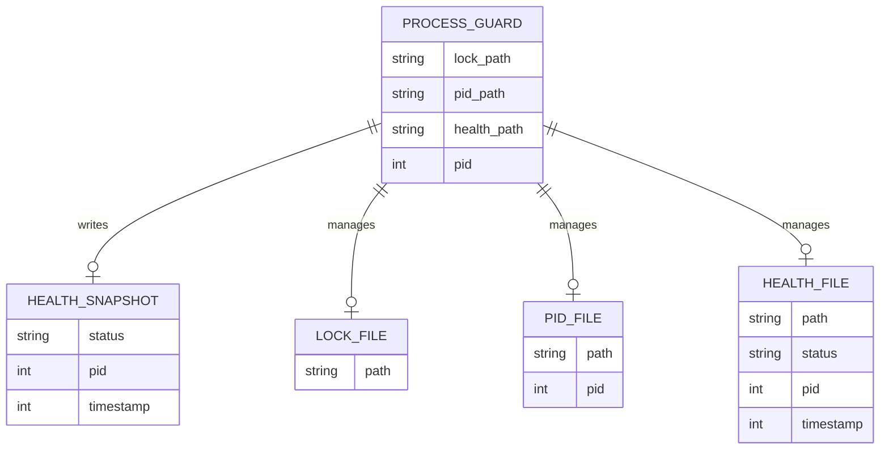

# Weaver: Final Design Document & Roadmap

## Executive Summary

This document presents the fourth-generation design and strategic roadmap for
`Weaver`, a semantics-aware command-line tool engineered for AI coding agents.
Moving beyond the initial proof-of-concept, this design solidifies `Weaver` as
a high-performance, secure, and composable tool built entirely in Rust. Its
core mission is to provide a robust, agent-friendly interface for understanding
and modifying codebases by orchestrating semantic operations across a wide
array of programming languages.

The architectural philosophy of `Weaver` represents a deliberate departure from
monolithic, integrated solutions like the Serena Model Context Protocol Server.
Instead, `Weaver` is conceived as a suite of composable UNIX-style primitives.
It leverages JSON Lines (JSONL) as its native protocol for input and output,
ensuring seamless integration with the rich ecosystem of existing command-line
utilities such as `jq`, `find`, and `xargs`. This approach treats semantic
operations not as features within a closed application, but as fundamental
verbs in the developer's shell.

The system's intelligence is derived from a layered "Semantic Fusion Engine"
that integrates data from three distinct sources: the Language Server Protocol
(LSP) for deep semantic understanding, Tree-sitter for fast and fault-tolerant
syntactic analysis, and a dedicated graph module for relational insights like
call graphs. This fusion of, at times, noisy and incomplete data streams allows
`Weaver` to construct a more accurate and resilient "world model" of the target
codebase.

A paramount design consideration is safety, especially in the context of AI
agent-driven execution. `Weaver` implements a zero-trust security model, where
all external tools---including LSP servers and specialized refactoring
plugins---are executed within a restrictive sandbox. All code modifications are
subjected to a novel "Double-Lock" safety harness, a two-phase verification
process that uses Tree-sitter for syntactic validation and LSP for semantic
integrity checks. This ensures that any proposed change is both syntactically
correct and does not introduce new compilation or type errors before it is
committed to the filesystem.

This document provides a comprehensive survey of the existing tooling and
academic literature that informs these design decisions. It details the refined
system architecture, presents a technical deep dive into each core component,
outlines the strategy for security and sandboxing, and describes advanced
capabilities tailored for AI agents, such as capability-aware orchestration and
project onboarding via Retrieval-Augmented Generation (RAG). The report
culminates in a revised, phased development roadmap that prioritizes safety,
incremental value delivery, and the progressive enhancement of the tool's
intelligence.

## 1. Vision and Strategic Positioning

This section establishes the foundational principles of `Weaver`, positioning
it not merely as a new tool, but as a proponent of a distinct architectural
paradigm for AI-driven software development. It contrasts this philosophy with
existing approaches to articulate its unique strategic value.

### 1.1. The Weaver Philosophy: Semantics as a Composable Primitive

The core vision of `Weaver` is rooted in the enduring principles of the UNIX
philosophy: build simple, single-purpose tools that interoperate
effectively.^1^ In an era of increasingly complex and integrated development
environments,

`Weaver` champions a return to this model of composability. Its central thesis
is that to effectively empower AI agents, semantic code operations should not
be locked away within monolithic applications or proprietary protocols.
Instead, they must be exposed as fundamental, composable primitives, accessible
directly from the command line.

The choice of JSON Lines (JSONL) as the native communication protocol is the
modern embodiment of this philosophy for structured data. Just as traditional
UNIX tools operate on streams of plain text, `Weaver` operates on streams of
structured JSON objects. This decision ensures immediate and universal
interoperability with a vast ecosystem of existing tools. An AI agent, or a
human user, can pipe the output of a `weaver` command directly into powerful
utilities like `jq` for filtering and transformation, `find` for file system
operations, and `xargs` for batch processing.^3^ This creates a powerful,
flexible, and extensible environment for scripting complex software engineering
tasks.

Within this paradigm, `Weaver` introduces a new vocabulary of semantic verbs to
the developer's shell. Commands are grouped into intuitive categories:

- **`observe`**: Commands for querying the state of the codebase (e.g.,
    `observe get-definition`, `observe find-references`, `observe grep`).

- **`act`**: Commands for modifying the codebase (e.g., `act rename-symbol`,
    `act apply-edits`, `act refactor`).

- **`verify`**: Commands for checking the integrity of the codebase (e.g.,
    `verify diagnostics`).

These commands are designed to be chained together, allowing agents to
construct sophisticated workflows. For example, an agent could find all
implementations of an interface, refactor each one, and then verify that no new
errors were introduced, all through a series of piped commands. This approach
transforms code semantics from a feature into a fundamental, scriptable
building block of the development environment.

### 1.2. Architectural Counterpoint: A Comparative Analysis of Weaver and Serena

To fully appreciate the strategic design of `Weaver`, it is instructive to
compare it with its primary inspiration, the Serena Model Context Protocol
(MCP) Server. While both tools aim to provide LLMs with semantic understanding
of code, they do so through fundamentally different architectural and
philosophical lenses. Serena represents a powerful, integrated, and
agent-centric approach, while Weaver champions a decoupled, composable, and
environment-centric model.

Serena is architected as a sophisticated MCP server, designed to integrate
tightly with MCP-compatible clients such as IDEs, local GUIs, and dedicated
command-line interfaces.^5^ It functions as a stateful intermediary, managing
project contexts, onboarding processes, and even a "memory" system to enhance
an LLM's understanding over a session.^5^ The primary interaction model is
conversational or tool-calling, mediated by the MCP specification and its
corresponding SDKs.^6^ This makes Serena a first-class citizen within the
burgeoning MCP ecosystem, offering a rich, out-of-the-box experience for
supported clients.^8^

`Weaver`, in contrast, is architected as a suite of command-line tools that
expose semantic operations directly to the shell environment. Its client-daemon
architecture is a performance optimization, but its public interface remains
the universal standard of STDIN and STDOUT, communicating via JSONL streams.
This design choice fundamentally decouples the "semantic engine" from any
specific LLM, agent framework, or client application.

This distinction is more than a technical preference; it dictates the nature of
each tool's ecosystem and its capacity for future evolution. Serena's ecosystem
is defined by the set of clients that explicitly implement the Model Context
Protocol. Its evolution is intertwined with the evolution of the MCP standard
itself. It operates within what can be considered a structured ecosystem of
tools that interoperate through a shared, high-level protocol.^2^

Weaver's ecosystem, by contrast, is the entire universe of past, present, and
future command-line utilities that can process structured text. Its potential
for integration is not predefined by a specific protocol but is emergent,
limited only by the user's ability to combine tools in novel ways. This
positions Weaver for a broader range of applications, including not just AI
agents but also CI/CD automation, custom developer scripts, and interactive
shell usage. While Serena is built for structured integration, Weaver is built
for emergent composition.

#### Table 1: Weaver vs. Serena: A Philosophical and Architectural Comparison

| Dimension             | Weaver                                                       | Serena MCP Server                                          |
| --------------------- | ------------------------------------------------------------ | ---------------------------------------------------------- |
| **Core Philosophy**   | Composable UNIX Primitive                                    | Integrated Agent Toolkit                                   |
| **Interaction Model** | Command-line (JSONL streams over STDIN/STDOUT)               | Model Context Protocol (RPC/Tool-Calling)                  |
| **Ecosystem**         | Universal (any shell tool: `jq`, `xargs`, `find`, etc.)      | Specific (MCP-compatible clients: IDEs, GUIs, etc.)        |
| **State Management**  | Primarily stateless commands; daemon amortizes startup cost  | Stateful session management (project onboarding, memories) |
| **Security Model**    | Process-level sandboxing (zero-trust for all external tools) | Application-level permissions (e.g., read-only mode)       |
| **Extensibility**     | Sandboxed plugins (isolated external processes)              | Internal tool adaptation and framework integration         |
| **Primary User**      | Shell environment (human or AI agent)                        | LLM via an MCP client                                      |

## 2. System Architecture: A Composable, Multi-Layered Approach

The architecture of `Weaver` is designed to be robust, performant, and
extensible, reflecting its core philosophy of composable, layered intelligence.
It separates the high-cost initialization of language analysis tools from the
rapid execution of commands, and it fuses multiple data sources to build a
comprehensive model of the codebase.

### 2.1. Client-Daemon Interaction: The UNIX Way with JSONL

The system is split into two primary components: `weaver`, a lightweight
command-line client, and `weaverd`, a long-running daemon process. This
separation is a pragmatic solution to the significant startup overhead
associated with language servers and other complex analysis tools. By
maintaining these tools in a persistent daemon process, `Weaver` can offer
near-instantaneous response times for subsequent commands, amortizing the
initial cost over the entire development session.

Crucially, this client-daemon model is implemented in a way that remains
faithful to the UNIX pipe-and-filter paradigm. The `weaver` client's sole
responsibilities are to:

1. Parse command-line arguments and flags using the `clap` library.

2. Serialize these arguments into a single JSONL object representing a command
    request.

3. Write this JSONL object to the standard input of the `weaverd` process.

4. Pipe the standard output and standard error from `weaverd` directly to the
    user's terminal.

The `weaverd` daemon, managed by libraries like `daemonize-me`, continuously
listens on its standard input for incoming JSONL request objects. Upon
receiving a request, it executes the corresponding operation and writes one or
more JSONL objects---representing either successful results or structured
errors---to its standard output.

This design ensures that while a daemon is used for performance, the
public-facing *interface* is indistinguishable from any other standard
command-line tool. A user or script could bypass the `weaver` client entirely
and interact with the daemon directly. For example:

```sh
echo '{"command": "observe", "subcommand": "get-definition"}' | weaverd
```

This strict adherence to the standard streams protocol preserves the tool's
composability and ensures it remains a well-behaved citizen of the shell
environment.^1^

#### 2.1.1. JSONL command envelope and capability probe

The initial CLI implementation serialises every invocation into a single JSONL
object. The object contains a `command` descriptor comprising the command
`domain` (such as `observe`) and `operation` (for example `get-definition`),
alongside an `arguments` array carrying the remaining tokens verbatim. This
mirrors the design table's two-level verb hierarchy while keeping the framing
explicit and stable for downstream tooling. A typical payload looks like the
following:

```json
{"command":{"domain":"observe","operation":"get-definition"},"arguments":["--symbol","main"]}
```

The CLI uses `clap`'s trailing argument capture to ensure any flag-like values
(`--uri`, `--range`, and similar) are forwarded without interpretation. Daemon
responses are consumed line by line, expecting each JSON object to specify the
target stream (`stdout` or `stderr`). The client writes the data to the
corresponding host stream and honours the terminal `exit` message to mirror the
daemon's status code. A connection timeout of five seconds prevents the CLI
from blocking indefinitely if the daemon is unreachable. Additionally, the
reader abandons the session after ten consecutive blank lines and treats the
absence of a terminating `exit` message as a failure. This ensures operators do
not mistake a partial or stalled response for a successful execution.

The capability probe specified in the roadmap is exposed as
`weaver --capabilities`. The command loads the shared configuration, renders
the negotiated capability matrix as pretty-printed JSON, and exits without
contacting the daemon. This keeps the probe side effect free and allows agents
to cache the matrix easily.

### 2.2. Semantic, Syntactic, and Relational Fusion

A core premise of `Weaver` is that a truly robust understanding of a codebase
cannot be derived from a single source of truth. The Language Server Protocol,
while powerful, is often inconsistent or incomplete. Raw text analysis is fast
but lacks structural awareness. Therefore, the heart of `weaverd` is the
"Semantic Fusion Engine," a system designed to integrate data from multiple,
imperfect sources to create a high-fidelity "world model" of the code. This
"sensor fusion" approach allows the system to cross-validate information and
provide more reliable results.

The engine is built on three distinct layers of analysis:

1. **The Semantic Foundation (LSP):** Managed by the `weaver-lsp-host` crate,
    this layer provides the primary source of deep semantic understanding. It
    leverages external Language Server Protocol servers to obtain information
    about definitions, references, type hierarchies, diagnostics, and other
    complex language constructs.^9^ This forms the bedrock of Weaver's
    intelligence.

2. **The Syntactic Scaffolding (Tree-sitter):** Managed by the `weaver-syntax`
    crate, this layer provides a fast, fault-tolerant, and universally
    available structural view of the code.^11^ Tree-sitter can build a concrete
    syntax tree even in the presence of errors, making it exceptionally robust.
    Its key roles are to provide syntactic guardrails for all edit operations,
    enable high-precision structural search and manipulation that LSP often
    lacks, and facilitate context-aware code slicing for prompt engineering.^13^

3. **Relational Insight (Call-Graph Analysis):** Managed by the `weaver-graph`
    crate, this layer builds a higher-level model of the program's control flow
    and component relationships. It is not limited to a single data source;
    instead, it fuses evidence from LSP's `callHierarchy` feature, dedicated
    static analysis plugins, and potentially the output of dynamic profiling
    tools to construct a more complete and accurate call graph.^15^

Each piece of information gathered by these layers---a symbol reference from
LSP, a potential call site identified by a Tree-sitter query, a dependency link
from a build file---is treated as an input to the fusion engine. The engine
annotates all data with its provenance and a confidence score, allowing the
agent to reason about the reliability of its world model.

### 2.3. Crate Structure and Responsibilities (Revised)

The project's crate structure is designed for clear separation of concerns,
modularity, and maintainability. Based on the expanded technical analysis, the
original structure is refined to better isolate complex functionalities and
elevate the importance of key components.

| Crate             | Purpose and Key Responsibilities                                                                                                                                                                                                                                |
| ----------------- | --------------------------------------------------------------------------------------------------------------------------------------------------------------------------------------------------------------------------------------------------------------- |
| `weaver-common`   | Defines core serializable types (using `serde`) and structured error enums (using `thiserror`). This includes critical types like `CapabilityError` and the request/response objects for the JSONL protocol.                                                    |
| `weaver-config`   | Manages hierarchical configuration using `ortho-config`. Defines the crucial **Language Capability Matrix**, allowing users to override or supplement the capabilities reported by LSP servers, thus hardening the system against buggy servers.                |
| `weaver-cli`      | The thin client executable (`weaver`). Uses `clap` for argument parsing and is responsible for serializing commands into JSONL and communicating with the `weaverd` daemon. Includes the `--capabilities` command for agent-side planning.                      |
| `weaverd`         | The main daemon executable. Acts as the central orchestrator and **broker process**. Manages the project registry, hosts the analysis backends, dispatches commands to the appropriate crates, and implements the "Double-Lock" verification logic.             |
| `weaver-lsp-host` | Manages the lifecycle of external LSP servers. Handles initialization, capability detection, request/response multiplexing, and enforces back-pressure on overloaded servers. Contains logic for language-specific workarounds.                                 |
| `weaver-syntax`   | The Tree-sitter powered syntax layer. Implements the `ast-grep` and `srgn`-inspired engine for structural search (`observe grep`) and rewriting (`act apply-rewrite`). Provides the "Syntactic Lock" for the safety harness and context-aware code slicing.     |
| `weaver-sandbox`  | A new, dedicated crate encapsulating all security and sandboxing logic. It is responsible for creating and managing the restrictive environments in which all external tools (LSPs, plugins) are executed, using OS primitives like namespaces and seccomp-bpf. |
| `weaver-graph`    | Implements the relational intelligence layer. Orchestrates multiple providers (LSP, static analysis plugins, dynamic profilers) to generate and fuse call graphs and other relational models of the codebase.                                                   |
| `weaver-plugins`  | Implements the plugin management and execution framework. Defines the IPC protocol between `weaverd` (as the broker) and sandboxed plugins, and manages the lifecycle of specialist tools.                                                                      |

#### 2.3.1. Configuration contract

`weaver-config` formalizes the shared configuration contract for the CLI and
daemon. The crate centralizes the capability overrides, socket defaults, and
logging format expectations so both binaries surface the same behaviour.
Configuration is layered with `ortho-config`, producing the precedence order
`defaults < files < environment < CLI`. File discovery honours `--config-path`
alongside the standard XDG locations, ensuring the CLI and daemon resolve
identical results regardless of which component loads the settings.

The daemon transport defaults to a Unix domain socket placed under
`$XDG_RUNTIME_DIR/weaver/weaverd.sock`. When the runtime directory is absent,
or otherwise unavailable, the path falls back to a per-user namespace under the
system temporary directory—for example, `/tmp/weaver/uid-1000/weaverd.sock`.
`weaverd` ensures the parent directory exists with restrictive permissions
before binding, reporting a descriptive error when creation fails. Non-Unix
targets cannot rely on domain sockets, so the default becomes a loopback TCP
listener on `127.0.0.1:9779`. These defaults are surfaced consistently via the
`--daemon-socket` CLI flag and the `WEAVER_DAEMON_SOCKET` environment variable.

Structured logging is configured through the `--log-filter` flag (or
`WEAVER_LOG_FILTER`) and the `--log-format` flag (`WEAVER_LOG_FORMAT`). Weaver
uses an `info` filter with JSON output by default, giving operators structured
events suitable for ingestion by observability stacks while keeping console
noise predictable.

The capability override matrix is expressed as a sequence of directives using
the syntax `language:capability=directive`. The directive may be `allow`,
`deny`, or `force`, letting the operator mask unreliable capabilities or force
a feature on when a server under-reports its support. Inputs are normalized by
lowercasing identifiers and trimming surrounding whitespace, while duplicate
entries are resolved by honouring the last directive supplied for a given
language and capability pair. These directives merge with the daemon's runtime
discovery to produce the negotiated capability surface exposed by
`weaver --capabilities`.

#### 2.3.2. Daemon bootstrap decisions

The initial daemon bootstrap focuses on observability and safety. The
implementation introduces a `ConfigLoader` trait so the production loader and
tests share a common interface while avoiding global environment mutation. The
bootstrap harness uses this trait to inject failing loaders in behavioural
tests, proving that configuration errors propagate as structured events.

Structured telemetry is configured through `tracing` and `tracing-subscriber`.
The daemon installs a global subscriber once per process using a `OnceCell`
guard. The log filter and format derive from the shared configuration, so the
CLI and daemon emit consistent JSON or compact output. Health reporting flows
through a `StructuredHealthReporter` that records `bootstrap_starting`,
`bootstrap_succeeded`, `bootstrap_failed`, and backend lifecycle events. These
events are logged as structured traces, matching the roadmap's requirement for
supervised backends.

Process supervision now enforces the singleton contract described in the
roadmap. A dedicated `ProcessGuard` claims a lock file (`weaverd.lock`) under
the runtime directory before any work begins. If the lock already exists the
guard first checks whether a PID file is present: the absence of `weaverd.pid`
is treated as "launch already in progress" so a second invocation refuses to
start rather than racing the first instance. When a PID is recorded the guard
probes the process using `kill(pid, 0)`. Live peers cause the launch to abort,
while stale artefacts are removed before retrying. Successful launches then
background the daemon via `daemonize-me`, write the current PID, and publish a
JSON health snapshot to `weaverd.health`. Both artefacts are written atomically
via a temporary file and rename so readers never observe a truncated payload.
The snapshot records the lifecycle state (`starting`, `ready`, `stopping`), the
PID, and a UNIX timestamp so external probes can consume the same readiness
signal as the CLI. A `SystemShutdownSignal` built on `signal-hook` listens for
`SIGTERM`, `SIGINT`, `SIGQUIT`, and `SIGHUP`, logging the event and giving the
runtime a ten-second budget to shut down gracefully. Developers can opt into a
foreground mode for debugging by setting the `WEAVER_FOREGROUND` environment
variable, which bypasses daemonisation while preserving the same
PID/lock/health choreography.



Semantic Fusion backends are modelled as a `FusionBackends` registry. Each
backend starts lazily via `ensure_backend`, keeping the process lightweight
until a command requires a specific capability. The supervisor records whether
a backend has already started and surfaces errors using a dedicated
`BackendStartupError`. Behavioural tests exercise both successful and failing
paths, ensuring that lazy initialisation and error propagation behave as
designed.

## 3. Core Components: A Technical Deep Dive

This section provides a detailed examination of the core technologies that
power the Weaver Intelligence Engine. It moves beyond a simple description of
their features to analyze their limitations and detail the specific strategies
`Weaver` will employ to harden its implementation and ensure robust, reliable
operation.

### 3.1. The Semantic Foundation: Harnessing and Hardening the Language Server Protocol

The Language Server Protocol (LSP) is the de facto industry standard for
decoupling language-specific intelligence from code editors and IDEs.^9^ By
leveraging LSP,

`Weaver` gains access to rich semantic analysis for a vast number of languages
without needing to implement a parser and type checker for each one. However, a
successful implementation requires a pragmatic and defensive posture, as the
protocol and its various server implementations are notoriously inconsistent
and contain fundamental design limitations. `Weaver` must therefore treat LSP
servers as powerful but untrusted and unreliable data sources, building a
robust hardening layer around them.

The primary value of LSP is its standardized set of JSON-RPC methods for common
developer tasks, such as `textDocument/definition` for "go to definition,"
`textDocument/references` for finding all references, and
`textDocument/publishDiagnostics` for reporting errors and warnings.^10^ This
provides the semantic bedrock for Weaver's

`observe` and `verify` commands.

However, the protocol's practical application is fraught with challenges. The
specification is vast, and server implementations vary widely in quality and
completeness.^19^ A server's self-reported

`ServerCapabilities` during the `initialize` handshake cannot always be
trusted. Some servers may claim to support a feature like `workspace/rename`
but have a buggy or incomplete implementation. To mitigate this, the "Language
Capability Matrix" defined in the `weaver-config` crate is an essential
hardening mechanism. It allows users and the system itself to maintain an
override file that can disable or modify the advertised capabilities for
specific language servers (e.g., `"csharp-ls": {"renameProvider": false}`).
This ensures that `Weaver` can work around known bugs and maintain stable
behavior even when interacting with non-compliant servers.

More problematic are the fundamental design flaws in the protocol itself,
particularly concerning causality and state synchronization.^19^ LSP operates
asynchronously. A client (like

`Weaver`) can send a `textDocument/didChange` notification to inform the server
of a file modification and immediately follow it with a
`textDocument/references` request. There is no protocol-level guarantee that
the server has fully processed the change before it responds to the reference
request. This can lead to the server operating on a stale version of the file,
returning incorrect or outdated information. For an automated agent performing
a sequence of edits, this lack of causal consistency is a critical
vulnerability that can lead to cascading failures.

This fundamental weakness in LSP is the primary driver for Weaver's two-pillar
architecture, where the syntactic layer is not merely an enhancement but a
co-equal partner required for correctness. `Weaver` cannot trust an LSP
server's response to a refactoring request or assume that the diagnostics it
provides immediately after an edit are valid. It must impose its own layer of
causal consistency. This is the role of the "Double-Lock" Safety Harness
(detailed in Section 4.2), which uses the fast and reliable Tree-sitter layer
to validate the syntactic state of the code before and after an operation, and
then explicitly requests a fresh set of diagnostics from the LSP server to
verify the semantic state. This approach makes `Weaver` resilient to the
inherent race conditions and state inconsistencies of the Language Server
Protocol.

### 3.2. The Syntactic Scaffolding: Precision and Safety with Tree-sitter

The `weaver-syntax` crate provides the second pillar of the intelligence
engine, offering a fast, robust, and precise understanding of the code's
structure. It is built upon Tree-sitter, a parser generator and incremental
parsing library designed to be general enough for any language, fast enough for
real-time use, and robust enough to handle syntax errors gracefully.^11^ These
properties make it the ideal foundation for the syntactic layer, which serves
several critical functions within the

`Weaver` architecture.

The design of this crate is heavily inspired by the capabilities of modern,
Tree-sitter-based command-line tools like `ast-grep` and `srgn`. The
`observe grep` command, Weaver's primary structural search tool, will emulate
the intuitive pattern language of `ast-grep`. Instead of complex regular
expressions, users and agents can provide code-like patterns with metavariables
(e.g., `console.log($ARG)`) to find and capture specific abstract syntax tree
(AST) nodes.^13^ This approach is more readable, less error-prone, and far more
powerful than text-based searching, as it understands concepts like scope,
nesting, and language grammar.

Similarly, the `act apply-rewrite` command will draw inspiration from the
rewriting capabilities of these tools. `srgn`, for example, demonstrates the
power of combining Tree-sitter queries for precise scoping with a set of
actions like `delete` or `replace`.^21^ Weaver will adopt this model, allowing
an agent to perform large-scale, structurally-aware refactoring. For example,
an agent could convert all instances of a legacy function call to a new format
across an entire codebase with a single, precise command.

The key responsibilities of the `weaver-syntax` crate are:

1. **High-Precision Search and Analysis:** Powering the `observe grep` command
    for structural queries and providing the raw data for advanced analysis,
    such as identifying all function definitions or generating a preliminary
    call graph based on call expressions.^12^

2. **Syntactic Guardrails:** Serving as the "Syntactic Lock" in the
    Double-Lock safety harness. Before any change is committed, this layer
    verifies that all modified files can be successfully parsed into a valid
    syntax tree. This is a fast, crucial first line of defense against
    corrupted code.

3. **Contextual Prompt Engineering:** Enabling agents to extract specific,
    contextually relevant code snippets for inclusion in prompts for Large
    Language Models. An agent can request "the body of the function named
    `calculate_total`" or "the class definition for `UserManager`" without
    needing to parse the file text itself.

4. **LSP Fallback Mechanism:** When an LSP server does not support a specific
    semantic operation (e.g., `rename`), the syntactic layer provides a robust
    fallback. The agent can be instructed to use `observe grep` to find all
    textual occurrences within the correct syntactic scope (e.g., not inside
    comments or strings) and then use `act apply-edits` to perform a safe,
    syntactic replacement.

### 3.3. Relational Insight: A Pragmatic Approach to Call Graph Generation

Understanding the relationships between different parts of a
codebase---particularly the call graph---is essential for tasks like impact
analysis, dependency management, and architectural comprehension. However,
generating a complete and perfectly accurate call graph is a notoriously
difficult problem, especially for dynamic languages like Python and TypeScript.
Static analysis struggles with dynamic dispatch, function pointers, and
higher-order functions, often leading to an overapproximation of possible calls
(including many that are infeasible in practice). Dynamic analysis, conversely,
produces an exact graph for a specific execution but provides an
underapproximation of all possible behaviors.^15^

Given this complexity, `Weaver` will not attempt to build a single, monolithic
call graph generator. Instead, the `weaver-graph` crate will adopt a pragmatic,
multi-provider, and progressive enhancement strategy. It will act as a fusion
engine, capable of consuming and merging graph data from various sources, each
with its own trade-offs in terms of speed, precision, and coverage.

The provider-based model will be implemented in phases, allowing the system to
deliver value incrementally while building towards a more comprehensive
solution.

#### Table 3: Phased Call Graph Provider Implementation

| Phase                   | Provider                   | Underlying Technology                                                | Pros                                                                                                            | Cons                                                                                                                  |
| ----------------------- | -------------------------- | -------------------------------------------------------------------- | --------------------------------------------------------------------------------------------------------------- | --------------------------------------------------------------------------------------------------------------------- |
| **1 (MVP)**             | LSP Provider               | LSP `textDocument/callHierarchy` request                             | Fast, deeply integrated with the existing semantic layer, requires no additional tool setup.                    | Inconsistent support across language servers, may be inaccurate or incomplete, limited to direct calls.               |
| **2 (Specialist)**      | Static Analysis Plugin     | Language-specific static analysis tools (e.g., PyCG for Python ^25^) | Higher accuracy and recall, better handling of language-specific dynamic features, more comprehensive analysis. | Requires installing and configuring external plugin tools, slower than LSP, implementation is language-specific.      |
| **3 (Execution-Aware)** | Dynamic Analysis Ingestion | Output from profilers (e.g., `gprof` ^27^, `callgrind` ^28^)         | Provides "ground truth" for a given execution, accurately captures dynamic dispatch and runtime behaviour.      | Incomplete coverage (only shows paths that were executed), requires the ability to run the code (e.g., a test suite). |

The `weaver-graph` engine will be responsible for merging the graphs produced
by these providers. When an agent requests a call graph, it can specify which
providers to use. The resulting graph will have its edges annotated with their
provenance (e.g., `{source: "lsp", confidence: 0.8}` or
`{source: "dynamic", execution_id: "test-run-123"}`). This allows the agent to
reason about the completeness and accuracy of the graph and to make more
informed decisions based on the available relational data.

## 4. The Actuation and Verification Layer

This section details the components of `Weaver` responsible for actively
modifying code. It outlines the strategy for orchestrating powerful external
tools and the critical safety mechanisms that ensure these operations can be
performed reliably and without risk to the integrity of the codebase.

### 4.1. The Plugin Ecosystem: Orchestrating Best-in-Class Tooling

A central tenet of the `Weaver` philosophy is to orchestrate, not reinvent. The
plugin system, managed by the `weaver-plugins` crate, is the primary embodiment
of this principle. Rather than attempting to re-implement complex,
language-specific refactoring logic, `Weaver` will delegate these tasks to
best-in-class, specialized tools developed by language experts. This allows
`Weaver` to provide a unified, safe, and consistent interface while leveraging
the deep capabilities of the broader open-source ecosystem.

Plugins are categorized based on their function, primarily as "sensors"
(providing data to the intelligence engine) or "actuators" (performing actions
on the codebase). The Python tooling landscape provides an excellent case study
for this model:

- **`jedi` as a Sensor Plugin:** `jedi` is a powerful static analysis library
    with a primary focus on autocompletion, goto definition, and finding
    references.^29^ While there is some overlap with LSP functionality,

    `jedi` can often provide supplementary or alternative analysis. It can be
    integrated as a sensor plugin, offering another data stream to the Semantic
    Fusion Engine, which can be particularly useful for cross-validation or
    when an LSP server is unavailable.

- **`rope` as an Actuator Plugin:** `rope` is a dedicated and mature Python
    refactoring library, recognized as being more powerful and comprehensive
    for refactoring tasks than `jedi`.^31^ It supports a wide range of complex
    operations, such as "Extract Method," "Change Signature," and "Move
    Method".^33^

    `rope` will be integrated as a primary actuator plugin for Python, callable
    via a command like
    `weaver act refactor --provider rope --refactoring extract_method...`. This
    allows an agent to perform sophisticated, language-aware refactorings
    through the standard `Weaver` interface.

This model extends to other domains as well. Tools like `srgn` and `ast-grep`,
which excel at high-speed, structural search and rewrite operations, can be
integrated as "precision editing" actuators.^13^ This gives agents a spectrum
of tools to choose from, ranging from fast, syntactic transformations to
slower, fully semantic-aware refactorings, all orchestrated and secured by the

`weaverd` daemon.

### 4.2. The "Double-Lock" Safety Harness: Ensuring Syntactic and Semantic Integrity

The "Double-Lock" safety harness is the single most critical feature for
ensuring the safety and reliability of AI agent-driven code modifications. It
addresses the fundamental problem that powerful external tools, while
effective, can sometimes produce incorrect results or have unintended side
effects. The harness wraps every action from an actuator plugin in a
verifiable, atomic transaction, guaranteeing that no change is committed to the
filesystem unless it is proven to be both syntactically and semantically sound.

The workflow for any modification command (e.g., `act refactor`) is as follows:

1. **Agent Request:** An agent issues a command such as:

    ```sh
    weaver act refactor --provider rope --refactoring rename \
      --path src/main.py --offset 123 --new-name new_function_name
    ```

2. **Sandboxed Execution:** The `weaverd` daemon invokes the specified plugin
    (`rope`) within the secure, resource-limited sandbox (detailed in Section
    5). The plugin is provided with the necessary context (e.g., file contents,
    arguments) via its standard input.

3. **Diff Capture:** The plugin executes the refactoring logic and, instead of
    writing directly to the filesystem, it outputs a set of proposed changes
    (e.g., a unified diff or a list of text edits) to its standard output.

4. **Pre-flight Verification (The Double Lock):** `weaverd` captures the
    proposed diff and applies it to an *in-memory* copy of the affected files.
    It then subjects these virtual file contents to a rigorous two-phase
    validation:

    - **Syntactic Lock:** The modified content of each affected file is
        passed to the `weaver-syntax` crate's Tree-sitter parser. If any file
        fails to parse into a valid, error-free syntax tree, the entire
        operation is immediately rejected. This is a fast, highly reliable
        check that catches syntax errors, unbalanced parentheses, and other
        structural problems.

    - **Semantic Lock:** If the syntactic lock passes, `weaverd` sends the
        full content of the modified files to the relevant LSP server (via a
        `textDocument/didChange` notification on the in-memory buffer) and then
        explicitly requests a full diagnostic report
        (`textDocument/publishDiagnostics`). It waits for the response and
        checks if any *new* errors or high-severity warnings have been
        introduced compared to the pre-edit state. If the semantic state of the
        project has degraded, the operation is rejected.

5. **Atomic Commit or Rollback:** Only if *both* the syntactic and semantic
    locks pass is the captured diff applied to the actual files on the
    filesystem. If either check fails, the filesystem is left untouched, and
    `weaverd` returns a detailed, structured error to the agent. For example:

    ```json
    {
      "status": "error",
      "type": "VerificationError",
      "details": {
        "phase": "SemanticLock",
        "diagnostics": [
          {
            "file": "src/main.py",
            "line": 42,
            "message": "Undefined variable 'new_function_name'"
          }
        ]
      }
    }
    ```

This model provides a powerful guarantee: it allows AI agents to confidently
leverage the most advanced and specialized refactoring tools available, knowing
that `Weaver` provides a safety net that protects the codebase from corruption
and regressions.

## 5. Security by Design: A Zero-Trust Sandboxing Model

Given that `Weaver` is designed to be programmatically controlled by AI agents
and to execute a variety of third-party tools, security is not an optional
feature but a foundational requirement. The system is architected on a
principle of zero trust, where the `weaverd` daemon is the only trusted
component, and all external processes it orchestrates are treated as
potentially malicious or buggy.

### 5.1. Principles and Threat Model for AI Agent Execution

The threat model for `Weaver` assumes that any external tool it
executes---including language servers, refactoring plugins, formatters, and
static analyzers---could attempt to perform unauthorized actions. The primary
threats are:

- **Unauthorized Filesystem Access:** Reading sensitive files (e.g.,
    `/etc/passwd`, SSH keys) or writing/deleting arbitrary files outside the
    project directory.

- **Unauthorized Network Access:** Making outbound network connections to
    exfiltrate data or download further malicious payloads.

- **Resource Exhaustion (Denial of Service):** Consuming excessive CPU or
    memory, either accidentally (due to a bug) or maliciously, thereby
    degrading or crashing the host system.

- **Process Spawning:** Launching additional, untrusted processes.

To counter these threats, `Weaver` will enforce a strict security policy where
all external tools are launched in a sandbox with the minimum possible
privileges required to perform their specific task.

### 5.2. Implementation Strategy: A Survey of Rust Sandboxing Libraries and Patterns

Implementing a robust, cross-platform sandbox is a complex systems engineering
challenge. The strategy for the `weaver-sandbox` crate will be to leverage
OS-native security primitives and build upon existing Rust libraries, while
recognizing that a fully mature solution requires a specific architectural
pattern.

On Linux, the foundational technologies for sandboxing are well-established.
`seccomp-bpf` allows for the creation of a syscall whitelist, preventing a
process from making any system calls not explicitly permitted (e.g., blocking
`socket` or `fork`). Linux namespaces provide isolation for filesystem mounts,
network stacks, process IDs, and other system resources.^35^ These primitives
provide a strong basis for process confinement.

A survey of existing Rust sandboxing libraries reveals several potential
starting points. The choice of which to use, or whether to build a custom
solution, depends on their maturity, feature set, and cross-platform
capabilities.

#### Table 2: Comparison of Rust Sandboxing Crates

| Crate      | Supported Platforms   | Mechanism                               | Key Features                                                         | Maturity/Status                                                                         | Recommendation for Weaver                                                                    |
| ---------- | --------------------- | --------------------------------------- | -------------------------------------------------------------------- | --------------------------------------------------------------------------------------- | -------------------------------------------------------------------------------------------- |
| `gaol`     | Linux, Windows, macOS | Namespaces, Job Objects, `sandbox_init` | Whitelist profiles, multiprocess model, designed for Servo.^36^      | Experimental and explicitly "not battle-tested" in the documentation.^36^               | Helpful reference for cross-platform techniques but too immature for production use.         |
| `birdcage` | Linux, macOS          | Namespaces, `sandbox_init`              | Focused on filesystem and network restrictions with native APIs.^35^ | Actively used in production by the Phylum CLI, offering a mature and focused scope.^35^ | **Recommended starting point.** Aligns with the primary filesystem and network threat model. |
| `bastille` | Linux                 | Namespaces, `pivot_root`                | Targets compatibility with the `std::process::Command` API.^37^      | Work in progress and limited to Linux.                                                  | Monitor for future development, but currently unsuitable for cross-platform goals.           |

While libraries like `birdcage` provide the necessary primitives, a truly
secure architecture requires more than just process isolation. The
documentation for `gaol` highlights a critical design pattern: the **broker
process**.^36^ In this model, the sandboxed child process has almost no
privileges itself. When it needs to perform a privileged operation (like
reading a specific file), it does not do so directly. Instead, it sends an
Inter-Process Communication (IPC) message to its trusted parent process (the
broker), requesting the operation. The broker can then validate the request and
perform the action on the child's behalf, for example, by opening the file and
passing back a file descriptor.

This pattern is central to Weaver's security design. The `weaverd` daemon will
act as the broker for all its plugins. A plugin will not be granted broad read
access to the project directory. Instead, when `weaverd` invokes it for a task
on `src/main.py`, it will open the file and pass the file descriptor to the
sandboxed plugin process. The plugin can read and write to that specific file
descriptor, but its `seccomp-bpf` filter will block any attempt to make its own
`open` syscalls. This architectural choice dramatically reduces the attack
surface and ensures that sandboxing is not just a library call, but a core
principle of the system's design.

## 6. Advanced Capabilities for AI Agents

Beyond core observation and action primitives, `Weaver` is designed with
specific features to enhance the planning and execution capabilities of
sophisticated AI agents. These features address the practical realities of the
software development toolchain and leverage modern AI techniques to provide
agents with superior context.

### 6.1. Capability-Aware Orchestration and Graceful Degradation

As established in Section 3.1, the LSP ecosystem is fragmented. A feature that
works perfectly for one language may be buggy or entirely absent for another.
An AI agent that assumes uniform capabilities will be brittle and ineffective.
`Weaver` addresses this head-on with its capability-aware orchestration layer.

On startup, `weaverd` performs a capability-discovery process. It queries each
configured LSP server for its `ServerCapabilities` and combines this
information with the user-defined override matrix from `weaver-config`.^10^
This fused data is stored in a Capability Registry. Before planning a complex
sequence of actions, an agent can query this registry via

`weaver --capabilities` to get a definitive, JSONL-formatted list of supported
features for the target language. This allows the agent to tailor its strategy
to the known strengths and weaknesses of the available tooling.

When an agent requests an operation that is not supported, `weaverd` does not
simply fail. It returns a structured `MissingCapability` error that is
machine-readable and actionable. Critically, this error response can include a
suggested fallback strategy. For example:

- **Request:** `act rename-symbol` for Swift, where LSP rename support is
    known to be limited.

- **Response:** `{"status": "error", "type": "MissingCapability", "details":
    {"language": "swift", "feature": "rename"}, "suggestion": "Use 'observe
    grep' to find occurrences and 'act apply-edits' for syntactic
    replacement."}`

This mechanism for graceful degradation transforms failures from dead ends into
decision points, enabling the agent to dynamically adapt its plan and still
make progress on its task.

### 6.2. Project Onboarding via Retrieval-Augmented Generation (RAG)

For an AI agent to perform non-trivial tasks on a large codebase, it needs a
high-level understanding of the project's architecture, key components, and
conventions. Simply feeding it a list of all files is inefficient and exceeds
the context limits of most models. The `onboard-project` command in `Weaver` is
designed to solve this problem by applying the principles of
Retrieval-Augmented Generation (RAG) to codebase analysis.

RAG is a technique that enhances the output of LLMs by grounding them in
relevant, externally retrieved information, which reduces hallucinations and
improves contextual accuracy.^38^ Research into RAG for code generation has
shown that retrieving relevant in-context code (like class definitions and API
documentation) is highly effective, whereas retrieving syntactically "similar"
but contextually irrelevant code can actually degrade performance.^40^

The `onboard-project` command implements a form of "Meta-RAG," a concept where
the retrieval process focuses on metadata and summaries *about* the code,
rather than the raw code itself.^41^ This creates a dense, token-efficient
summary of the project that is ideal for an LLM's initial planning phase. The
command will orchestrate a multi-step process to generate this summary, which
will be saved as a

`PROJECT.dna` file:

1. **Relational Scaffolding:** It will invoke `weaver-graph` to build a
    project-wide call graph and dependency graph, identifying key modules and
    their interconnections.

2. **API Surface Extraction:** It will use `weaver-syntax` to traverse the AST
    of all project files, extracting the public API surface: class definitions,
    function signatures, and their associated docstrings.

3. **Dependency Analysis:** It will parse project configuration files (e.g.,
    `pyproject.toml`, `package.json`, `Cargo.toml`) to identify and list all
    external dependencies.

4. **Synthesis:** It will synthesize these structured data points into a
    comprehensive yet concise Markdown or JSONL document. This `PROJECT.dna`
    file will contain sections on project structure, key modules, public APIs,
    and dependencies.

When an agent begins a task, this `PROJECT.dna` file serves as the primary
context document for its RAG system. This allows the agent to quickly gain a
high-level "map" of the codebase, enabling it to formulate more effective plans
and identify the specific files and symbols it needs to examine in more detail
using other `weaver` commands.

## 7. Development Roadmap (v4)

The development of `Weaver` will proceed in a series of phased milestones. This
revised roadmap prioritizes the establishment of core safety features early in
the development cycle and structures the implementation of advanced features in
a logical, incremental progression.

### Phase 0: Foundation & Tooling (Complete)

- **Goal:** Set up the project workspace, CI/CD pipeline, and core
    dependencies.

- **Status:** This foundational work is complete.

### Phase 1: Core MVP & Safety Harness Foundation

- **Goal:** Establish the core client/daemon architecture, basic LSP
    integration, and the foundational security and verification mechanisms. The
    MVP must be safe for write operations from day one.

- **Key Tasks:**

  - Implement the `weaver-cli` and `weaverd` crates with robust
        daemonization and process management.

  - Build the `weaver-lsp-host` crate with support for initialization,
        capability detection, and core LSP features (`definition`,
        `references`, `diagnostics`) for Rust, Python, and TypeScript.

  - Implement the initial version of the `weaver-sandbox` crate, using
        `birdcage` for its focused scope and production usage, prioritizing
        robust Linux support via namespaces and seccomp-bpf.

  - **Implement the full "Double-Lock" safety harness logic in `weaverd`.**
        This is a critical, non-negotiable feature for the MVP. All `act`
        commands must pass through this verification layer before committing to
        the filesystem.

  - Implement atomic edits to ensure that multi-file changes either succeed
        or fail as a single transaction.

### Phase 2: Syntactic & Relational Intelligence

- **Goal:** Add the Tree-sitter and call graph layers to provide deeper
    structural and relational understanding of code.

- **Key Tasks:**

  - Create the `weaver-syntax` crate and implement the structural search
        engine for `observe grep` and `act apply-rewrite`, drawing inspiration
        from `ast-grep`'s pattern language.

  - Integrate the "Syntactic Lock" from `weaver-syntax` into the
        "Double-Lock" harness.

  - Create the `weaver-graph` crate and implement the **LSP Provider** for
        call graph generation, using the `textDocument/callHierarchy` request
        as the initial data source.

### Phase 3: Plugin Ecosystem & Specialist Tools

- **Goal:** Build the plugin architecture to enable orchestration of
    best-in-class, language-specific tools.

- **Key Tasks:**

  - Design and implement the `weaver-plugins` crate, including the secure
        IPC protocol between the `weaverd` broker and sandboxed plugin
        processes.

  - Develop the first set of actuator plugins:

    - A plugin for `rope` to provide advanced Python refactoring.

    - A plugin for `srgn` to provide high-performance, precision
            syntactic editing.

  - Develop the first specialist sensor plugin:

    - A plugin for `jedi` to provide supplementary static analysis for
            Python.

  - Refine the graceful degradation logic to suggest specific plugin-based
        solutions when core LSP features are missing.

  - Implement the **Static Analysis Provider** for `weaver-graph` (e.g.,
        wrapping `PyCG`) as the first major graph plugin.

### Phase 4: Advanced Agent Support & RAG

- **Goal:** Introduce features specifically designed to support advanced
    agent planning and human-in-the-loop workflows.

- **Key Tasks:**

  - Implement the `onboard-project` command based on the "Meta-RAG" design,
        orchestrating other Weaver components to generate the `PROJECT.dna`
        summary file.

  - Implement a hybrid interactive mode (`--interactive`) that, in case of
        a "Double-Lock" verification failure, presents the proposed diff and
        the resulting errors to a human user for manual review, approval, or
        rejection.

  - Begin research and development for the **Dynamic Analysis Ingestion**
        provider for `weaver-graph`, allowing it to consume and merge profiling
        data from tools like `gprof` and `callgrind`.

## 8. Appendix

### A. Survey of Key Technologies and Prior Art

- **Language Server Protocol (LSP):** An open, JSON-RPC-based protocol that
    allows code editors and other tools to communicate with language-specific
    servers that provide features like code completion, diagnostics, and
    refactoring. While it has become the industry standard, its specification
    is large, implementations are inconsistent, and it has known design flaws
    related to state synchronization and causality, necessitating a defensive
    implementation strategy.^9^

- **Tree-sitter:** A parser generator tool and incremental parsing library.
    Its key advantages are speed, robustness in the face of syntax errors, and
    language agnosticism. It builds a concrete syntax tree, which is a more
    detailed representation than an abstract syntax tree, making it ideal for
    tools that perform structural search, analysis, and transformation. It is
    the core technology behind tools like `ast-grep` and is used for syntax
    highlighting in many modern editors.^11^

- **Structural Search & Rewrite Tools:** Tools like `ast-grep` and `srgn`
    represent the state-of-the-art in command-line code manipulation. They
    leverage Tree-sitter to allow users to specify patterns and transformations
    based on code structure rather than raw text. This provides a level of
    precision and safety that is impossible to achieve with regular
    expressions.^13^

    `Weaver`'s syntactic layer is directly inspired by their design.

- **Process Sandboxing:** A security mechanism for restricting the
    environment in which a program executes. On Linux, this is typically
    achieved using a combination of kernel features: namespaces (to isolate
    resources like filesystems, network, and process IDs) and seccomp-bpf (to
    whitelist allowed system calls). The "broker process" is a common
    architectural pattern where a sandboxed, low-privilege process communicates
    with a trusted, high-privilege parent to request specific, controlled
    operations.^36^

- **Call Graph Generation:** The process of creating a directed graph
    representing the calling relationships between subroutines in a program.
    **Static** call graphs are generated by analyzing source code and represent
    all possible calls, but may be imprecise for dynamic languages. **Dynamic**
    call graphs are generated by observing a program's execution (e.g., with a
    profiler) and are precise for that run but provide incomplete coverage.
    Generating a perfectly accurate static call graph is an undecidable
    problem.^15^

- **Retrieval-Augmented Generation (RAG):** An AI technique that enhances the
    output of a large language model by providing it with relevant information
    retrieved from an external knowledge source. In the context of code, this
    involves retrieving project-specific documentation, API definitions, or
    related code snippets to ground the model's responses, improving accuracy
    and contextual relevance.^38^

### B. References

- Lewis, P., et al. (2020). *Retrieval-Augmented Generation for
    Knowledge-Intensive NLP Tasks*. arXiv:2005.11401.

- Salis, V., et al. (2021). *PyCG: Practical Call Graph Generation in
    Python*. Proceedings of the 30th USENIX Security Symposium.

- GitHub Engineering. (2021). *Semantic Code Search at Scale*. GitHub Blog.

- Outflux. (2016). *Sandboxing in Linux with seccomp*.

- Go Project. (n.d.). `go/language-server`: Issue #39461.

- Swift Project. (n.d.). `swift/language-server`: SR-16104.

- Zig Project. (n.d.). `zig/language-server`: Issue #398.

- C# Project. (n.d.). `csharp/language-server`: Issue #2612.

### C. Design Decision Log

#### 2025-11-12: Adopt `rstest-bdd` 0.1.0 for scenario tests

We moved the workspace dependency on `rstest-bdd`/`rstest-bdd-macros` from
`0.1.0-alpha4` to the `0.1.0` stable release to reduce reliance on pre-release
behavioural testing tooling. The upgrade keeps the ergonomics of
`compile-time-validation` and `strict-compile-time-validation` features intact
while benefiting from upstream fixes (notably improved localisation support and
step registration diagnostics) that shipped with the stable tag. All crates
consuming the workspace dependency continue to share the same version through
`workspace.dependencies`, ensuring scenarios and supporting macros evolve in
lockstep. Upstream still ships the internal `rstest-bdd-patterns` crate as an
`alpha4` build, but it remains a purely transitive dependency bundled with the
stable API surface, so no additional action is required on our side.
