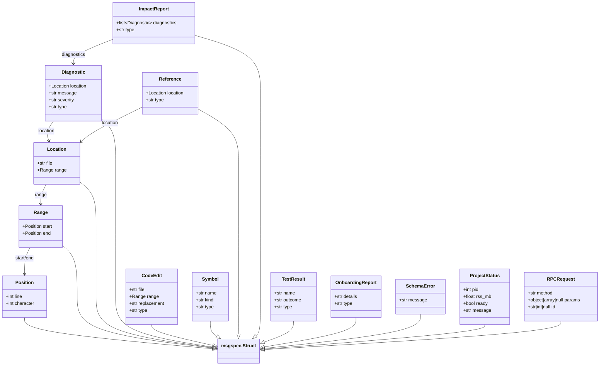

<!-- markdownlint-disable MD013 MD033 MD001 MD056 MD007 MD029 -->
# weaver: A Composable, Semantics‑Aware Interface for AI Coding Agents

*Tag‑line: Bridging the semantic gap between text‑only agents and real
codebases, one thread at a time.*

## Introduction: Why another tool?

Large‑language‑model (LLM) agents can already write and edit files, but they do
so blind to the structure that keeps real software alive. Without symbol
tables, call graphs, or project‑specific conventions, they hallucinate edits
that compile locally, break somewhere else, and leave humans to pick up the
pieces.

`weaver` is a command‑line interface (CLI) and long‑running daemon that lets an
agent work at the level of semantics instead of bytes. It sits on top of the
serena toolkit and its multi‑language LSP bridge, turning LSP spaghetti into a
crisp, UNIX-native interface.

This document synthesizes the original design sketch with subsequent reviews to
clarify the implementation path, rename the tool, and weave together a complete
specification.

### Guiding Philosophy: The Agent's OODA Loop

The design of `weaver` is framed by a coherent philosophy aimed at empowering
an agent's cognitive cycle. This cycle is modelled on the
Observe-Orient-Decide-Act (OODA) loop, a strategic framework for
decision-making in dynamic environments. This structure provides a clear
rationale for each command, aligning the toolset with the fundamental processes
of an intelligent agent's workflow.

| OODA Phase | CLI Verbs                                                                                                         | Purpose                                             |
| ---------- | ----------------------------------------------------------------------------------------------------------------- | --------------------------------------------------- |
| Observe    | project-status, list-diagnostics, onboard-project                                                                 | Sense the current workspace and its health.         |
| Orient     | find-symbol, get-definition, list-references, summarise-symbol, get-call-graph, get-type-hierarchy, list-memories | Build deep context.                                 |
| Decide     | analyse-impact, get-code-actions, test, build, with-transient-edit                                                | Simulate & verify changes before touching the disk. |
| Act        | rename-symbol, apply-edits, format-code, set-active-project, reload-workspace                                     | Execute changes safely and atomically.              |

All output is JSON Lines (JSONL) for true UNIX composability, streamability,
and fault containment.

## I. Core Architectural Principles

The foundation of `weaver` rests on architectural decisions designed to create
a tool that is not only powerful but also performant, robust, and
philosophically consistent with the UNIX environment in which the AI agent
operates.

### 1.1 The Client-Daemon Split

To address the prohibitive startup latency of language servers, `weaver`
employs a client-server model.

- **The** `weaverd` **Daemon:** This is a long-running background process, one
  per user, listening on a UNIX socket (e.g.,
  `$XDG_RUNTIME_DIR/weaverd-$USER.sock`).

  - Starts and supervises language servers via `multilspy`.

  - Maintains an in-memory semantic index, a file-content overlay cache for
    transient edits, and a msgspec-validated RPC dispatcher.

  - Enforces resource caps (e.g., `WEAVER_MAX_RAM_MB`, `WEAVER_MAX_CPUS`),
    returning structured errors when limits are reached.

  - Serializes concurrent requests using `asyncio` tasks, supporting
    cancellation of long-running jobs.

- **The** `weaver` **Client:** This is a lightweight, stateless, and
  fast-executing binary (e.g., a static executable built with PyOxidiser for a
  &lt;50ms cold start).

  - Discovers the daemon's socket, automatically launching `weaverd` if it is
    not already running.

  - Performs a version-handshake RPC to ensure compatibility.

  - Streams JSONL responses from the daemon directly to `stdout`.

  - Exits with a code of `0` on success, or a non-zero code plus a final
    `Error` JSON object on controlled failure.

### 1.2 Atomicity & Safety

- The `apply-edits` command ensures atomicity by first writing all changes to
  temporary files within the target directory and then, only upon successful
  completion of all writes, executing a batch of atomic `rename` operations. If
  any write fails, no files in the workspace are mutated.

- Every mutating command (e.g., `rename-symbol`, `format-code`) supports a
  `--dry-run` flag. When used, the command will output the `CodeEdit` objects
  to `stdout` without modifying the filesystem, enabling bespoke audit and
  verification pipelines.

### 1.3 Workspace & Multi-Project Support

`weaver` is designed to manage multiple projects seamlessly.

- `weaver list-projects`: Shows all projects registered in a central
  configuration file (e.g., `~/.config/weaver/projects.yml`).

- `weaver set-active-project <name>`: Switches the daemon's context to a
  different registered project.

- Each project can have a local `.weaver/project.yml` file specifying its
  unique configuration: required language servers, environment variables,
  custom `test` and `build` commands, and paths to memory bundles.

- `weaver reload-workspace`: Instructs the daemon to force a re-index of the
  active project. This is crucial after significant changes to dependency files
  like `pyproject.toml` or `Cargo.toml`.

### 1.4 Memories & Onboarding

To align an agent's behaviour with project-specific conventions, `weaver`
introduces a "memory" system.

- `weaver onboard-project`: Performs a first-time static analysis of a new
  project. It identifies conventions (e.g., coding style, testing patterns) and
  stores these findings as a "memory bundle" in `.weaver/memories/`.

- `weaver list-memories`: Streams the stored memory snippets as JSON objects.
  The agent can use this output to seed its prompt, ensuring its subsequent
  actions are consistent with the project's established patterns.

### 1.5 Transient Edits for Speculative Analysis

A cornerstone of the "Decide" phase is the ability to analyse changes without
committing them to disk.

- `weaver with-transient-edit --file <path> --stdin <command...>`: This
  meta-command pipes new file content from `stdin`, instructs the daemon to
  apply it as a temporary in-memory overlay, runs the specified inner `weaver`
  command against this speculative state, and finally discards the overlay.
  This is perfect for "what-if" scenarios, such as checking for compilation
  errors before saving a file.

## II. The `weaver` Command Suite

The command suite is the heart of `weaver`, providing the agent with the tools
necessary to execute its cognitive loop. Each command emits one or more JSON
objects conforming to the schemas defined in Appendix A.

### 2.1 Observe

| Command          | Synopsis                                                                        |
| ---------------- | ------------------------------------------------------------------------------- |
| project-status   | Health of daemon & language servers; RAM/CPU usage; protocol version.           |
| list-diagnostics | `[--severity S] [<files…>]` Stream Diagnostics for whole workspace or subset.   |
| onboard-project  | First-run analysis, populates memories & returns OnboardingReport.              |

The `project-status` handler inspects runtime health using `resource.getrusage`
and checks that the `serena` package imports successfully. Memory usage
requires a platform-specific conversion: `ru_maxrss` is measured in kilobytes
on Linux but bytes on macOS. The daemon normalises this value to megabytes in
the `rss_mb` field. The response reports the daemon process ID, resident memory
(`rss_mb`), a readiness boolean, and a short message.

### 2.2 Orient

| Command            | Synopsis                                                                                  |
| ------------------ | ----------------------------------------------------------------------------------------- |
| find-symbol        | `[--kind K] <pattern>` Search workspace symbols.                                          |
| get-definition     | `<file> <line> <char>` Locate definitive declaration.                                     |
| list-references    | `[--include-definition] <file> <line> <char>` All uses of symbol at cursor.               |
| summarise-symbol   | `<file> <line> <char>` Aggregate hover, docstring, type info.                             |
| get-call-graph     | `--direction <in|out> <file> <line> <char>` Show call graph with the chosen direction.    |
| get-type-hierarchy | `--direction <super|sub> <file> <line> <char>` Show type hierarchy for the symbol.        |
| list-memories      | Stream previously stored memory snippets.                                                 |

### 2.3 Decide

| Command             | Synopsis                                                                                |
| ------------------- | --------------------------------------------------------------------------------------- |
| analyse-impact      | `--edit <json>` Dry-run a single CodeEdit; returns ImpactReport.                        |
| get-code-actions    | `<file> <line> <char>` Available quick-fixes/refactors.                                 |
| test                | `[--changed-files | --all]` Wrapper for project test command; same output contract.     |
| build               | Wrapper for project build command; same output contract.                                |
| with-transient-edit | `--file <f> --stdin <cmd …>` Overlay speculative content, run another weaver command.   |

### 2.4 Act

| Command            | Synopsis                                                            |
| ------------------ | ------------------------------------------------------------------- |
| rename-symbol      | `<file> <line> <char> <new>` Generate safe rename plan.             |
| apply-edits        | `[--atomic]` Read CodeEdit stream from stdin, write to disk.        |
| format-code        | `[--stdin] [<files…>]` Emit formatting edits via language server.   |
| set-active-project | `<name>` Point daemon at another registered project.                |
| reload-workspace   | Force re-index after dependency file change.                        |

## III. Implementation Roadmap

1. **Phase 0 – Scaffolding**:

  - Define all I/O schemas as msgspec models (see Appendix A).
  - Use [uv](./monorepo-development-with-astral-uv.md) for environment and
     dependency management.

  - Implement the `asyncio` JSON-RPC router for `weaverd`.

  - Build the socket discovery and daemon auto-start logic in the `weaver`
     client.

2. **Phase 1 – Observe/Orient Verbs**:

  - Map commands directly onto existing `serena.tools` wrappers.

  - Validate functionality with a large, polyglot smoke-test repository.

3. **Phase 2 – Decide Verbs**:

  - Implement `analyse-impact` by replaying transient edits into the LSP and
     diffing the resulting diagnostics.

  - Implement `build` and `test` wrappers that parse tool output into the
     standard `Diagnostic` schema via regex patterns defined in `project.yml`.

4. **Phase 3 – Act Verbs**:

  - Implement atomized file writes for `apply-edits`.

  - Integrate with Git to ensure operations do not corrupt the work-tree.

  - Use the LSP `workspace/applyEdit` request to obtain the refactoring plan
     for `rename-symbol`.

5. **Phase 4 – Memories & Onboarding**:

  - Implement the persistence layer for memories as JSONL files under
     `.weaver/memories/`.

  - Develop the static analysis logic for `onboard-project`.

6. **Phase 5 – Polishing**:

  - Implement resource limit guardrails in `weaverd`.

  - Add cancellation support for long-running jobs.

  - Add a `weaver --json-schema` command to print the msgspec definitions, for
     embedding in agent prompts.

## Design Decisions

The project uses [uv](./monorepo-development-with-astral-uv.md) for dependency
management and virtual environment creation. The CLI is built with `typer`
because it offers a clean API and automatic help text generation. Communication

between the client and daemon will use `anyio` for async socket operations.
`msgspec` is employed for fast, schema‑validated JSON serialization.

All schemas reside in a dedicated `weaver_schemas` package. Models are grouped
into modules by feature (diagnostics, edits, reports, etc.) and each struct
explicitly defines a `type` discriminator field. This arrangement allows JSONL
streams to be parsed incrementally without external context and serves as the
single source of truth for the daemon and client API.

`can_connect` uses `anyio.fail_after` to avoid hanging on unresponsive sockets,
handling common connection errors. The CLI's `check-socket` command reports
availability of a specified path.

The client auto-starts `weaverd` when the socket is missing. It forks the
daemon in a detached `subprocess.Popen` call and waits for the socket to become
available before issuing the request. Set the environment variable
`WEAVER_DEBUG=1` to inherit the daemon's output streams when debugging startup
failures.

`onboard-project` uses Serena's `OnboardingTool` from
`serena.tools.workflow_tools` (see
`/root/git/serena-0.1.3/src/serena/tools/workflow_tools.py`). The daemon
creates a minimal agent with `SerenaPromptFactory` **each time** the RPC
handler is invoked to avoid leaking state between runs. Import failures surface
a clear runtime error instructing the user to install `serena-agent`. The tool
then generates an `OnboardingReport` returned to the client. In tests, the
creation function can be patched to raise a runtime error to simulate a missing
dependency.

`list-diagnostics` relies on Serena's `ListDiagnosticsTool`. The handler
initialises the tool with a new `SerenaPromptFactory`, invokes
`list_diagnostics` in a background thread and converts each dictionary in the
returned list to the internal `Diagnostic` model using `msgspec.convert`.
Optional `severity` and `files` parameters allow filtering of the resulting
diagnostics before they are returned to the client.

`weaverd` exposes a lightweight RPC interface over a UNIX domain socket. A
custom `RPCDispatcher` maps method names to coroutine handlers and uses
`msgspec` to validate requests and serialise responses. The default socket path
is `$XDG_RUNTIME_DIR/weaverd-$USER.sock`, falling back to the system temporary
directory if the environment variable is unset. Each connection reads requests
in a loop, returning structured `SchemaError` objects if JSON decoding or a
handler fails, so malformed input does not crash the daemon.

**Security Note:** `anyio` 4.9.0 currently has a high‑severity vulnerability.
Upstream releases will be monitored and an upgrade will be performed once a
patched version is available.

## IV. Advanced Workflows

The following examples demonstrate how the composable command set enables
resilient, multi-step agentic workflows.

### 4.1 Safe Project-Wide Rename (Python)

- **Task:** The agent receives the high-level instruction: "In the Python
  project, rename the function `calculate_total_price` found in `app/logic.py`
  to `compute_final_price`."

```shell
# 1. Orient - Locate the canonical symbol
DEF=$(weaver get-definition app/logic.py 15 8)

# 2. Decide - Analyse the impact of the rename
# Construct a CodeEdit object for just the definition site
EDIT=$(echo "$DEF" | jq '{file: .location.file, range: .location.range, new_text:"compute_final_price"}')
IMPACT=$(weaver analyse-impact --edit "$EDIT")

# Abort if the initial change introduces any new errors
[[ $(echo "$IMPACT" | jq '.diagnostics | length') -eq 0 ]] || exit 1

# 3. Act (Plan) - Generate the full set of edits
weaver rename-symbol app/logic.py 15 8 compute_final_price > edits.jsonl

# 4. Act (Execute) - Apply the plan atomically
cat edits.jsonl | weaver apply-edits --atomic

# 5. Decide (Verify) - Run tests against the changed files
# The agent checks for any objects with severity "Error" in the output stream
weaver test --changed-files | jq -e 'select(.severity=="Error")' || echo "All good!"
```

### 4.2 First-Time Project Onboarding

- **Task:** An agent is encountering a new codebase for the first time.

```shell
# 1. Observe & Orient - Run onboarding and capture the output
weaver onboard-project | tee onboarding.jsonl

# 2. Ingest - The agent parses onboarding.jsonl
# It extracts key conventions, test commands, and architectural notes
# to use in the context for all subsequent interactions with this project.
```

## V. Future Directions

### 5.1 Remote Mode

For scenarios where the agent's CLI and the codebase are on different hosts
(e.g., local VS Code to a remote build farm), `weaver` could expose its RPC
interface via gRPC over an SSH-tunnelled TCP connection, allowing for secure,
location-transparent operation.

### 5.2 Semantic Patch Review

A future command, `weaver diff --previous <rev>`, could use the semantic index
to compare two Git revisions. Instead of a textual diff, it would output a
stream of semantic changes: symbols added, functions whose signatures have
changed, classes removed. This would be a powerful tool for generating
automated, high-level pull request summaries.

### 5.3 AI-Assisted Human Prompts

A command like `weaver request-user-input <prompt>` could enable hybrid
human-in-the-loop workflows. It would write a JSON-formatted question to
`stdout` and pause execution, waiting for a corresponding JSON answer on
`stdin`. This allows an agent to request clarification or approval from a human
supervisor without breaking out of a scripted pipeline.

## Appendix A. Data Schemas (Excerpt)

The following msgspec types are the single source of truth for all JSONL I/O.
Each has a `type` discriminator for effortless streaming introspection.

```python
from typing import Literal, Optional
from msgspec import Struct

class Position(Struct):
    line: int  # 0-indexed
    character: int  # UTF-16 code units, 0-indexed

class Range(Struct):
    start: Position
    end: Position

class Location(Struct):
    file: str  # Absolute or workspace-relative path
    range: Range

class Diagnostic(Struct):
    type: Literal['diagnostic'] = 'diagnostic'
    location: Location
    severity: Literal['Error', 'Warning', 'Info', 'Hint']
    code: Optional[str]
    message: str

# ... and so on for Symbol, Reference, CodeEdit, ImpactReport,
# TestResult, OnboardingReport, Error, etc.

```


```mermaid
classDiagram
    class Position {
        +int line
        +int character
    }
    class Range {
        +Position start
        +Position end
    }
    class Location {
        +str file
        +Range range
    }
    class Diagnostic {
        +Location location
        +str message
        +str severity
        +str type
    }
    class CodeEdit {
        +str file
        +Range range
        +str replacement
        +str type
    }
    class Symbol {
        +str name
        +str kind
        +str type
    }
    class Reference {
        +Location location
        +str type
    }
    class ImpactReport {
        +list~Diagnostic~ diagnostics
        +str type
    }
    class TestResult {
        +str name
        +str outcome
        +str type
    }
    class OnboardingReport {
        +str details
        +str type
    }
    class SchemaError {
        +str message
    }
    class ProjectStatus {
        +int pid
        +float rss_mb
        +bool ready
        +str message
    }

    class RPCRequest {
        +str method
        +object|array|null params
        +str|int|null id
    }

    %% All classes now inherit from msgspec.Struct
    Position --|> msgspec.Struct
    Range --|> msgspec.Struct
    Location --|> msgspec.Struct
    Diagnostic --|> msgspec.Struct
    CodeEdit --|> msgspec.Struct
    Symbol --|> msgspec.Struct
    Reference --|> msgspec.Struct
    ImpactReport --|> msgspec.Struct
    TestResult --|> msgspec.Struct
    OnboardingReport --|> msgspec.Struct
    SchemaError --|> msgspec.Struct
    ProjectStatus --|> msgspec.Struct
    RPCRequest --|> msgspec.Struct

    %% Relationships
    Range --> Position : start/end
    Location --> Range : range
    Diagnostic --> Location : location
    Reference --> Location : location
    ImpactReport --> Diagnostic : diagnostics
```
